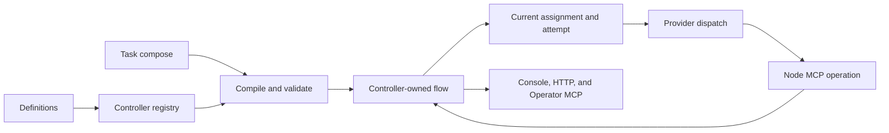

<p align="center"></p>

<h1 align="center">AutoClaw</h1>

<p align="center"><strong>Local-first orchestration for delegated AI work.</strong></p>

<p align="center"><a href="docs/start/getting-started.md">Get started</a> · <a href="docs/concepts/README.md">Concepts</a> · <a href="docs/guides/README.md">Guides</a> · <a href="docs/reference/README.md">Reference</a></p>

---

AutoClaw turns agent work into auditable workflow runs. The controller owns tasks, assignments, attempts, checkpoints, artifacts, waits, and dispatch history. Providers execute bounded turns, but their output and terminal status do not decide workflow truth.

> **Early development:** AutoClaw is not production-ready. Interfaces and schemas may change.

## What it provides

- reusable role, policy, workflow, and task-compose definitions
- controller-owned runtime state and immutable launch provenance
- explicit checkpoints, artifacts, boundaries, retries, and replans
- first-class human requests and long command runs
- a loopback web console, HTTP API, Operator MCP, and Node MCP
- SQLite by default, with PostgreSQL support for stronger concurrent use
- focused recovery through exact-source signals and a watchdog

AutoClaw is useful when work must remain inspectable across several agent turns. A one-off question or command usually does not need it.

## Quick start

Install AutoClaw in an isolated tool environment:

```bash
pipx install autoclaw
autoclaw init
```

Configure one provider. The first configured provider becomes the default:

```bash
autoclaw setup --provider codex
autoclaw providers check codex
```

Use `claude` or `openclaw` instead of `codex` when appropriate. AutoClaw never silently falls back to another provider.

Run the local server:

```bash
autoclaw serve
```

Open `http://127.0.0.1:18125/`. The supported browser lane is loopback and same-origin.

To run AutoClaw as a Linux user service:

```bash
autoclaw service install
autoclaw service status
```

## Start a task

You can start a task from the console or a local task-compose file. For example:

```yaml
task:
    key: first-research-brief
    title: My first task
    summary: Produce one concise research brief.
workflow:
    key: topic-research-brief
```

```bash
autoclaw task-compose start --file ./task-compose.yaml --json
```

Inspect the returned task in the console, through the control API, or with the Operator MCP tools.

## Provider boundary

Codex and Claude receive a managed, dispatch-scoped MCP connection. AutoClaw attaches only the Node tools allowed for that dispatch and does not write the connection into global or project provider configuration.

OpenClaw is an experimental compatibility provider. It remains selectable and may be the default, but the user owns the Gateway and `openclaw.json`. Its static compatibility MCP calls include full `task_id` and `dispatch_id` selectors; AutoClaw rereads controller truth and rejects stale or illegal operations.

For every provider:

- the controller commits the dispatch and request pair before provider start
- successor opening and provider start happen asynchronously after commit
- Node MCP operations are the runtime authority
- provider stdout, final responses, drain, and terminal success do not advance the task

## Runtime model



An accepted boundary returns independently from later work. After the source transaction commits, a thin asynchronous handler rereads the exact source and conditionally opens one successor. Duplicate or stale signals lose without changing state.

Human requests and command runs suspend ordinary dispatch progress while their controller-owned source remains active. The watchdog ignores those waits. Its default inactivity deadline is 15 minutes; a still-current stale dispatch may be atomically replaced, while duplicate or outdated watchdog signals lose.

Support files under the task root explain committed state. They can be rebuilt and never replace the database as runtime truth.

## Local security

The shipped console and control plane bind to loopback. AutoClaw validates expected loopback `Host` values and exact allowed browser origins. There is no global browser or Operator API key in this local lane. Do not expose it directly to another machine.

## Documentation

- [Install and set up AutoClaw](docs/start/getting-started.md)
- [Configuration and providers](docs/start/configuration-and-settings.md)
- [Start a task](docs/start/start-a-task.md)
- [Inspect a task](docs/start/inspect-a-task.md)
- [Core concepts](docs/concepts/core-concepts.md)
- [Runtime model](docs/concepts/runtime-model.md)
- [Write a workflow](docs/guides/write-a-workflow.md)
- [CLI reference](docs/reference/cli/README.md)
- [API reference](docs/reference/api/README.md)
- [Operator reference](docs/reference/operator/README.md)

## License

MIT. See [LICENSE](LICENSE).
