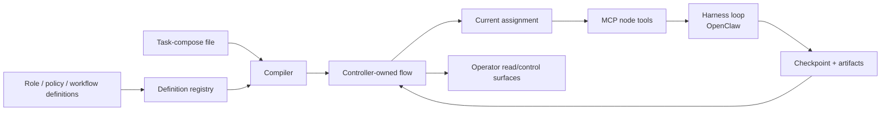

# AutoClaw

Local-first orchestration for delegated AI work.

AutoClaw turns agent work into auditable workflow runs. Define reusable roles, policies, and workflows; launch one task-compose file; then let the controller dispatch bounded assignments, collect checkpoints and artifacts, handle waits, and keep the run inspectable and recoverable.

[Get started](docs/start/getting-started.md) · [Concepts](docs/concepts/README.md) · [Guides](docs/guides/README.md) · [Reference](docs/reference/README.md)

## Why AutoClaw?

**Use AutoClaw when a task needs more than a chat transcript.**

- Assign work to root, parent, and worker nodes with explicit authority.
- Preserve durable evidence through assignments, checkpoints, and artifacts.
- Route long tasks through retry, replan, human waits, and command runs.
- Inspect and recover work from controller state instead of hidden provider memory.
- Keep the agent loop replaceable while AutoClaw owns workflow truth.

AutoClaw is not for every prompt. If the work is one short answer, one direct command, or one ad hoc assistant session, OpenClaw by itself is usually the better surface.

## AutoClaw and OpenClaw

**OpenClaw is the harness. AutoClaw is the orchestration tool.**

| Dimension                 | OpenClaw                                                | AutoClaw                                               |
| ------------------------- | ------------------------------------------------------- | ------------------------------------------------------ |
| Primary role              | Agent harness and assistant runtime                     | Workflow orchestration for delegated work              |
| User motion               | Ask an assistant                                        | Launch and supervise a structured task                 |
| Core loop                 | Context -> model -> tools -> stream -> transcript       | Assign -> execute -> checkpoint -> boundary -> advance |
| State owner               | Conversation, tools, skills, sessions, channels         | Task, flow, assignment, attempt, checkpoint, artifact  |
| Best fit                  | Personal assistance, local tool use, ad hoc coding/help | Long work with evidence, review, retry, replan, waits  |
| Failure mode if stretched | Long work becomes transcript-heavy                      | Small work becomes over-structured                     |

AutoClaw currently uses OpenClaw as its execution adapter, sits above that loop and decides what bounded assignment should run next.

## Recommended default flow

**Start with one supervised workflow, inspect the task root, then scale the pattern.**

1. Install and onboard AutoClaw.
2. Check the OpenClaw integration boundary.
3. Start one task from a task-compose file.
4. Inspect the workflow manifest, current assignment, checkpoint, and artifacts.
5. Write or adapt a workflow only after the first run is understandable.

## What AutoClaw is for

Good fits:

- feature delivery with implementation, verification, review, and closure
- bugfix pipelines with triage, patch, tests, and release evidence
- research briefs where sources, synthesis, and review must be inspectable
- delivery batches where a parent assigns one bounded scope at a time
- long-running verification where logs, cancellation, and continuation matter

Poor fits:

- "What does this error mean?"
- "Run this one command."
- "Summarize this page."
- unbounded background autonomy with no evidence contract

## Quickstart

Install the package and run the first checks:

```bash
pipx install autoclaw
autoclaw onboard
autoclaw doctor
autoclaw openclaw check
```

The shipped managed-service path is Linux-first with `systemd --user`. For local debugging, `autoclaw serve` can run the API in the foreground.

## A good first task

Create `task-compose.yaml` in an empty working directory:

```yaml
task:
    key: first-run
    title: First local AutoClaw run
    summary: Prove the seeded minimal workflow on a bounded local task.
    instruction: >-
        Use the shipped minimal workflow to prove local launch, task-root creation, and runtime materialization.
workflow:
    key: minimal-implement-change
roots:
    workspace:
        mode: ensure_task_default
    context:
        mode: ensure_task_default
```

Start it:

```bash
autoclaw task-compose start --file ./task-compose.yaml --json
```

Then inspect the task root:

```text
_runtime/workflow-manifest.md
_runtime/attempts/<attempt_id>/assignment.md
_runtime/attempts/<attempt_id>/latest-checkpoint.md
outputs/artifacts/
```

The first useful success is not just "the command returned." It is seeing the workflow, assignment, checkpoint, and artifacts line up with the task you launched.

## How AutoClaw works



AutoClaw's central design choice is that the controller owns runtime truth. Prompts and task-root files are generated interfaces over that truth; they are not the authority.

AutoClaw uses MCP tools as a provider-neutral control boundary. To a harness, `record_checkpoint`, `return_boundary`, `assign_child`, `open_human_request`, `start_command_run`, and release/replan tools are callable tools. To AutoClaw, those calls are validated state transitions against the current task, dispatch, assignment, attempt, and flow revision.

## Core concepts

Teach these four concepts first:

| Concept             | Plain meaning                                 |
| ------------------- | --------------------------------------------- |
| Workflow            | Reusable evidence path for a kind of work     |
| Task-compose        | One concrete launch request                   |
| Assignment          | The bounded mission for the current node      |
| Checkpoint/artifact | Durable proof of progress, handoff, or output |

After those make sense, learn roles, policies, nodes, attempts, dispatches, boundaries, waits, and replan in the concept docs.

## Compared with other agent systems

AutoClaw belongs near modern orchestration systems, but its emphasis is narrower: local-first delegated work with controller-owned evidence.

| System            | Strong at                                                         | AutoClaw contrast                                                                                     |
| ----------------- | ----------------------------------------------------------------- | ----------------------------------------------------------------------------------------------------- |
| LangGraph         | Low-level durable graph runtime for stateful agents               | AutoClaw packages a task-root evidence contract and operator workflow around delegated work           |
| CrewAI            | Role-based crews and approachable flow abstractions               | AutoClaw is stricter about controller truth, assignments, checkpoints, and artifacts                  |
| AutoGen / AG2     | Multi-agent conversation and group-chat patterns                  | AutoClaw is workflow/tree/evidence centered, not conversation centered                                |
| OpenAI Agents SDK | Lightweight agents, handoffs, guardrails, tracing, sandbox agents | AutoClaw externalizes assignment, evidence, and recovery outside one provider SDK                     |
| A2A               | Interop between independent opaque agents                         | AutoClaw uses MCP internally for controller-validated transitions; A2A fits external agent boundaries |

Do not position AutoClaw as a universal multi-agent standard. Its assumption is sharper: provider completion is not task completion; task completion requires controller-validated evidence.

## Documentation

- [Getting started](docs/start/getting-started.md)
- [Orchestration model](docs/concepts/orchestration-model.md)
- [Core concepts](docs/concepts/core-concepts.md)
- [Runtime model](docs/concepts/runtime-model.md)
- [Design workflows and instructions](docs/guides/design-workflows-and-instructions.md)
- [Write a policy](docs/guides/write-a-policy.md)
- [Write a workflow](docs/guides/write-a-workflow.md)
- [Inspect and control a task](docs/guides/inspect-and-control-a-task.md)
- [CLI reference](docs/reference/cli/README.md)

## Maturity

AutoClaw is early local-first orchestration software. The supported path is intentionally narrow: local runtime, packaged definitions, task-compose launch, OpenClaw integration, and inspectable task roots. Expect the public surface to grow around workflows, operator UI, and additional execution adapters without changing the core controller-owned truth model.

## License

MIT. See [LICENSE](LICENSE).
