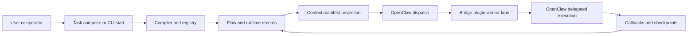

# Current architecture at a glance

Status: Current

Last verified: 2026-05-12

This page gives the shortest safe architectural picture of the current system.

The following diagram shows the current baseline: AutoClaw owns control truth, while OpenClaw handles delegated execution.

Figure: Current AutoClaw flow from launch to delegated execution and callback-based control updates.

## What this diagram is good for

- It shows that compile, runtime truth, and manifests stay inside AutoClaw.
- It shows that delegated execution and plugin/tool use happen on the OpenClaw side.
- It shows the callback loop back into controller-owned records.

## What it does not show

- exact route surfaces
- exact worker-lane lineage fields
- target design contracts such as bounded work packages and packetized completion

For those, use the current reference pages or the design reference surface.

## Evidence

- inspected code in `apps/api/src/autoclaw/interfaces/cli/__init__.py`
- inspected code in `apps/api/src/autoclaw/definitions/registry/current.py`
- inspected code in `apps/api/src/autoclaw/runtime/launch/service.py`
- inspected code in `apps/api/src/autoclaw/runtime/dispatch/opening.py`
- inspected code in `apps/api/src/autoclaw/runtime/projection/dispatch/prompt.py`
- inspected code in `apps/api/src/autoclaw/interfaces/http/routers/callback.py`
- inspected tests in `apps/api/tests/integration/definition_registry/test_launch_snapshot.py`
- inspected tests in `apps/api/tests/integration/bootstrap/test_dispatch.py`
- inspected tests in `apps/api/tests/integration/runtime/routes/test_surface_contract.py`
- did not execute tests for this page
