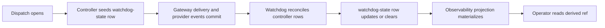

# Current watchdog and OpenClaw bridge

Status: Current

Last verified: 2026-06-28

This page explains the current repo-visible watchdog and OpenClaw recovery boundary.

The shipped tree has a controller-owned watchdog loop under `apps/api/src/autoclaw/runtime/watchdog/**`. It reconciles dispatch, delivery, continuity, checkpoint, provider-event, and source-row truth into `DispatchWatchdogStateModel` rows and downstream observability projections.

Support files and observability refs are still projections. Controller-owned database rows remain runtime truth.

Figure: Current watchdog behavior is a controller reconciliation loop over committed runtime rows, followed by derived observability projection.

## Current behavior

- each dispatch gets a controller-owned `DispatchWatchdogStateModel` row
- `runtime/watchdog/service.py` reconciles stale, ambiguous, delivery-rebound, and terminal-provider cases over committed controller rows
- `runtime/watchdog/task_rows.py` loads the dispatch-local row family needed for classification
- `runtime/watchdog/classification.py` decides whether to leave the dispatch clear, classify it, redispatch the same attempt, or escalate
- dispatch materialization writes `_runtime/dispatch/<dispatch_id>/watchdog-state.json` as a readback projection
- operator observability reads surface that file as a ref, not as runtime truth

## External-wait boundary rule

Human requests and command runs create legal external-wait boundaries directly from node MCP actions.

Current watchdog classification must treat a dispatch that owns a `pending_human_requests` or `command_runs` source row as an external-wait source dispatch. That applies both while the source row is open or running and after it reaches a terminal state that will drive continuation.

Rules:

- watchdog classification keys off committed `pending_human_requests.dispatch_id` and `command_runs.dispatch_id` source rows
- it must not key this decision off `control_state_reason`, provider event labels, prompt text, or UI-visible wording
- it must skip or clear the source dispatch instead of classifying it as `bootstrap_pending_callback.terminal_provider_without_first_callback`
- terminal provider shape is still classified for ordinary dispatches that do not own a human-request or command-run source row

This keeps external waits from becoming false-positive watchdog escalations while preserving the watchdog's normal terminal-provider failure detection for non-wait dispatches.

## Why this matters

OpenClaw provider terminal success does not equal assignment success, but human-request and command-run source rows are controller-owned wait truth.

The watchdog must therefore distinguish:

- an ordinary provider turn that reached terminal state before controller progress, which can indicate an unsafe lineage
- a dispatch whose lawful node action opened a controller-owned external wait, which is the expected terminal boundary for that dispatch

For the target model, see `../../../design/v2/architecture/controller-contract-and-resumable-execution.md`, `../../../design/v2/interfaces/human-request-and-approval-contract.md`, and `../../../design/v2/architecture/command-run-and-long-running-boundary.md`.

## Evidence

- inspected code in `apps/api/src/autoclaw/runtime/watchdog/service.py`
- inspected code in `apps/api/src/autoclaw/runtime/watchdog/task_rows.py`
- inspected code in `apps/api/src/autoclaw/runtime/watchdog/classification.py`
- inspected code in `apps/api/src/autoclaw/runtime/watchdog/recovery.py`
- inspected code in `apps/api/src/autoclaw/runtime/dispatch/opening.py`
- inspected code in `apps/api/src/autoclaw/runtime/projection/dispatch/materialization.py`
- inspected code in `apps/api/src/autoclaw/runtime/observability/__init__.py`
- inspected code in `apps/api/src/autoclaw/persistence/models/runtime/dispatch/states.py`
- inspected code in `apps/api/src/autoclaw/persistence/models/runtime/human_requests.py`
- inspected code in `apps/api/src/autoclaw/persistence/models/runtime/command_runs.py`
- inspected code in `apps/api/src/autoclaw/persistence/models/runtime/waiting.py`
- inspected tests in `apps/api/tests/integration/watchdog/test_stale_classification.py`
- inspected tests in `apps/api/tests/integration/watchdog/test_recovery_actions.py`
- inspected tests in `apps/api/tests/integration/runtime/routes/test_human_request_continuation.py`
- inspected tests in `apps/api/tests/integration/runtime/routes/test_command_run_control_api.py`
