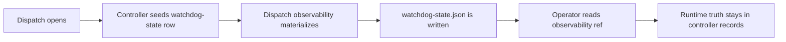

# How the current watchdog and OpenClaw bridge work

Status: Current

Last verified: 2026-05-12

This page explains the current repo-visible watchdog and OpenClaw recovery boundary.

The shipped tree no longer contains the older dedicated watchdog service or bridge adapter modules this page used to cite. What remains locally is the controller-owned watchdog-state record family plus its observability materialization.

The following diagram shows the current watchdog path.

Figure: Current repo-visible watchdog behavior is controller-owned dispatch state plus observability projection, not a repo-local watchdog worker loop.

## Current behavior

- each dispatch gets a controller-owned `DispatchWatchdogStateModel` row
- dispatch materialization writes `_runtime/dispatch/<dispatch_id>/watchdog-state.json`
- operator observability reads surface that file as a ref, not as runtime truth
- prompt and observability docs still treat watchdog files as controller-made projections only

The current repo therefore proves watchdog observability state and dispatch lineage, not a separate repo-local watchdog worker loop.

## Why this matters

This is one of the key migration boundaries between the current implementation and the target design.

For the target model, see `../../../design/v1/architecture/watchdog-and-recovery-contract.md`.

## Evidence

- inspected code in `apps/api/src/autoclaw/runtime/dispatch/opening.py`
- inspected code in `apps/api/src/autoclaw/runtime/projection/dispatch/materialization.py`
- inspected code in `apps/api/src/autoclaw/runtime/observability/__init__.py`
- inspected code in `apps/api/src/autoclaw/persistence/models/runtime/dispatch/states.py`
- inspected code in `apps/api/src/autoclaw/interfaces/http/routers/observability.py`
- inspected tests in `apps/api/tests/integration/bootstrap/test_dispatch.py`
- inspected tests in `apps/api/tests/integration/runtime/routes/test_surface_contract.py`
- inspected source-pack docs in `../../../archive/source-packs/old_version_docs/architecture/06-openclaw-runtime-bridge.md` and `../../../archive/source-packs/old_version_docs/flows/04-approval-and-watchdog.md`
- did not execute tests for this page
