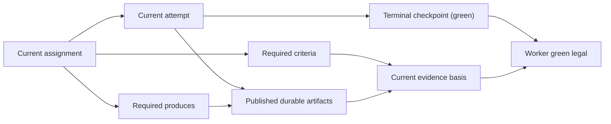
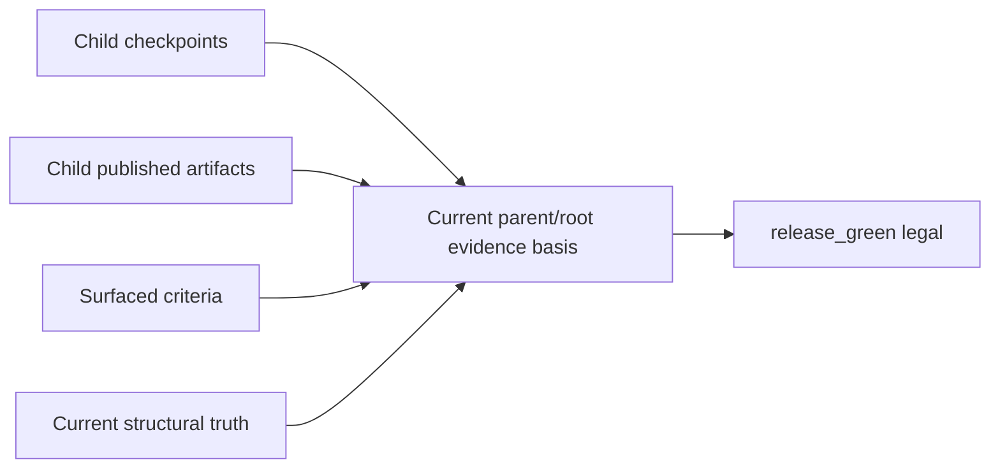

# Completion, Checkpoint, And Evidence

Status: Target

Start at the [Architecture front door](README.md) if you are routing from stale packetized completion wording.

This page explains why the live v1 model does not use packet families, completion bundles, or handoff bundles as the gate for success. Completion and release legality come from committed controller truth over:

- the current assignment
- the current attempt
- the terminal checkpoint
- required durable published produces
- the current criteria and evidence basis

Exact assignment field ownership lives in [Assignment contract](assignment-contract.md). Exact checkpoint field ownership lives in [Checkpoint contract](checkpoint-contract.md).

## Core rule

`green` is not unlocked by a packet family.

The live v1 model uses:

- one current assignment
- one current attempt
- one terminal checkpoint for that attempt
- required durable artifact publication for declared `produces`
- explicit criteria and evidence freshness rules

It does not use:

- `HandoffPacket`
- `ParentEvidenceBundle`
- `RootReleaseBundle`
- completion bundle families
- dossier-style closure packets

## Why checkpoint alone is not enough

A checkpoint is the durable summary of what happened and what should happen next. It is not the durable body of the evidence.

A terminal `green` checkpoint is necessary, but it is not sufficient by itself.

The controller still needs current truth showing:

- every required `produces` slot for that assignment was published durably
- the checkpoint points at the exact versioned artifact paths later readers should inspect
- the evidence basis is valid against the surfaced criteria and current structural subject
- older pinned artifact refs are not rejected solely because the slot's current pointer later advanced

That is why the v1 model uses checkpoint plus durable artifacts plus criteria, not checkpoint-only closure and not packet-family closure.

## Worker `green` legality

Worker/leaf `green` is legal only when all of the following are true:

1. the current attempt has one terminal checkpoint with `outcome: green`
2. every required `produces` slot for the current assignment was published as a durable artifact version
3. the terminal checkpoint references the exact published artifact paths that matter for later review or consumption
4. the current evidence basis is valid against:
    - the current assignment
    - current surfaced `criteria`
    - current structural subject
5. every surfaced artifact path used as evidence still exists, without requiring that it equal the latest current pointer for its slot

Figure: worker `green` depends on terminal checkpoint plus published produces plus current evidence basis.

## Parent/root `release_green` legality

Parent/root do not consume a special controller-assembled packet family in the live model.

Instead, parent/root reason from:

- child checkpoints
- child published artifacts
- surfaced criteria
- any explicit review or audit artifacts
- current structural truth

`release_green` is legal only when the current evidence basis for the parent/root decision is present and current. A packet family is not the controller's legality basis.

Figure: parent/root release depends on current surfaced evidence, not on a bundle contract.

## What later agents actually reread

Later agents should reread:

- `_runtime/workflow-manifest.*`
- `_runtime/attempts/<attempt_id>/assignment.*`
- `_runtime/attempts/<attempt_id>/latest-checkpoint.*`
- surfaced durable artifact refs
- surfaced criteria refs
- optional `transient_refs`
- optional `task_memory_search_hints`

This is the real handoff model:

- assignment is the forward-looking mission contract
- checkpoint is the backward-looking summary and next-step handoff
- durable artifacts are the durable evidence bodies
- criteria define what counts as acceptable

## Review and audit consequence

Review/QA/audit work still uses the ordinary assignment/checkpoint/artifact model.

That means:

- review `green` means the review assignment completed
- negative findings may still be carried in a `green` review checkpoint and review artifact
- those findings may still make downstream `release_green` illegal because the evidence basis is not yet sufficient

So `green` is not a packet verdict. It is assignment-result legality for one node attempt.

## Removed from the live v1 model

Do not use this page to teach any of the following as live runtime concepts:

- packetized completion
- evidence bundle families
- release bundle families
- handoff packet families
- checkpoint-only success
- dossier-style closure semantics

The current v1 legality model is:

- checkpoint for summary
- durable artifact publication for produced evidence
- criteria and evidence-currentness validation for legality
- controller-owned truth for the final decision

## Related contracts

- [Runtime boundary and controller loop contract](runtime-boundary-and-controller-loop-contract.md)
- [Runtime records and lifecycle](runtime-records-and-lifecycle.md)
- [Artifact ref and storage contract](artifact-ref-and-storage-contract.md)
- [Manifest contract](manifest-contract.md)
- [Worker context contract](worker-context-contract.md)
