# Design overview

Status: Target

This page gives the shortest high-level explanation of the target runtime model.

Start at [README.md](README.md) for the layer-first map.

## Core change

The design makes controller/DB state the only runtime truth owner and turns node work into explicit bounded assignments plus explicit boundary returns.

## Runtime model

- The controller dispatches exactly one current node at a time with `dispatch`.
- Nodes return control with one of:
  - `yield` for non-terminal parent/root closure
  - `green`, `retry`, or `blocked` for terminal attempt closure
- Parent/root coordination uses explicit tools:
  - `assign_child`
  - `add_child`
  - `update_child`
  - `remove_child`
  - `release_green`
  - `release_blocked`
- Each assignment surfaces `criteria`, `consumes`, and `produces` as the live contract family.
- There is no live `parent_gate` runtime surface in the target model.

## Worked miniature flow

```mermaid
flowchart LR
    A["Controller selects current root/parent node"] --> B["dispatch"]
    B --> C["Parent/root may add/update/remove child or assign_child"]
    C --> D["assign_child commits child assignment + first attempt"]
    D --> E["Parent/root records progress checkpoint if later readers need context"]
    E --> F["Parent/root closes with yield"]
    F --> G["Controller accepts yield but does not dispatch child yet"]
    G --> H["Parent/root run becomes terminal or fenced"]
    H --> I["dispatch child"]
    I --> J["Child publishes terminal checkpoint + green/retry/blocked"]
    J --> K["Child run becomes terminal or fenced"]
    K --> L["Controller advances truth and wakes next relevant parent/root"]
```

Concrete example:

- parent dispatch reads `_runtime/workflow-manifest.md`
- parent stages one child assignment for `implement_fix`
- `assign_child` already commits that child assignment and first attempt before `yield`
- runtime materializes `C:/tasks/task_2026_0042/_runtime/attempts/attempt.implement_fix.01/assignment.md`
- after `yield`, the controller still waits for the parent run to be naturally terminal or fenced before opening the child dispatch
- child later publishes `C:/tasks/task_2026_0042/_runtime/attempts/attempt.implement_fix.01/latest-checkpoint.md`
- parent/root does not infer that result from provider logs; it rereads the checkpoint and referenced durable artifact paths

## Shared surfaces

- `workflow-manifest.*` gives the whole-workflow picture.
- `assignment.*` gives the current mission contract, including `criteria`, `consumes`, and `produces`.
- `latest-checkpoint.*` tells later nodes what happened and what should happen next.
- published artifacts and criteria files carry durable evidence and acceptance context.
- optional transient refs carry bounded non-durable handover.
- `context/wiki/` and curated docs under `context/` provide task memory.

All surfaced refs are path-only in v1. Runtime localizes external material into the task root before surfacing it.

Typical surfaced paths look like:

- `C:/tasks/task_2026_0042/_runtime/workflow-manifest.md`
- `C:/tasks/task_2026_0042/_runtime/attempts/attempt.review_findings.01/assignment.md`
- `C:/tasks/task_2026_0042/context/criteria/review_findings_delivery_criteria.v01.md`
- `C:/tasks/task_2026_0042/outputs/artifacts/review_findings/findings_report/findings_report.v02.md`

## Truth and monitoring split

- Generated files are shared projections, not the source of runtime truth.
- Controller/DB state remains authoritative when projections disagree.
- Watchdog, continuity, and provider-monitoring files under `_runtime/dispatch/` are support and debugging surfaces, not normal task truth.
- OpenClaw is documented as an adapter-specific normalization layer over the canonical runtime model.

## Naming rule

- `tool` is the canonical runtime term.
- `plugin` is used only when discussing adapter-specific surfaces.
