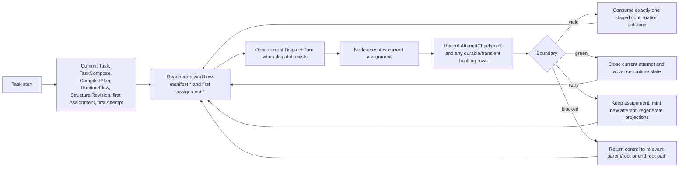
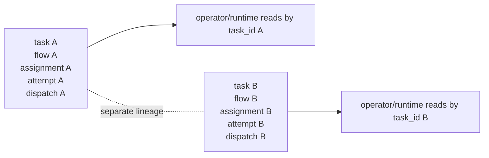
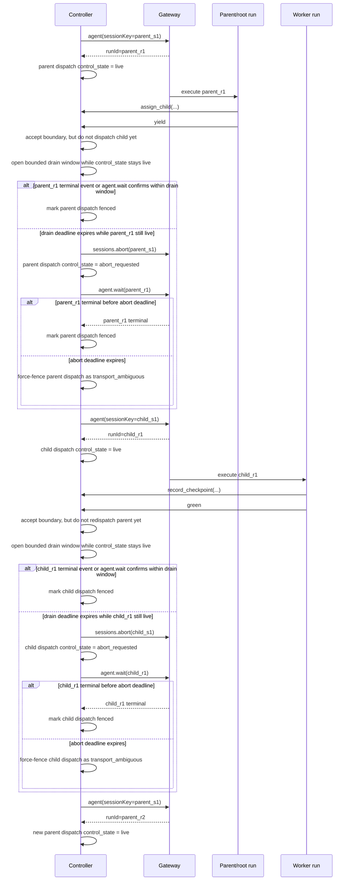

# Runtime Records And Lifecycle

Status: Target

This page defines the canonical v1 runtime lifecycle around controller-owned truth, assignment and attempt lineage, explicit currentness owners, and deterministic regeneration of shared projections.

The controller owns runtime truth. Generated manifests, assignments, checkpoints, artifact pointers, and dispatch observability files are persisted projections over that truth, not competing authorities.

It does not own route exposure or public definition-upload response carriers. It also does not promote `ContextManifest` into a public runtime carrier; `ContextManifest`, if retained at all, is transitional and private only.

## `RuntimeCurrentnessClosure`

The runtime must maintain these exact currentness facts:

- one immutable `TaskCompose` row per task run
- one active structural revision per flow
- one current assignment per current runtime node
- one current attempt per current assignment
- one latest recorded checkpoint pointer per attempt
- one explicit current durable artifact pointer per `(owner_node_key, slot)` pair
- at most one open dispatch turn per flow at a time in v1

### Currentness owner matrix

| Currentness fact                                               | Canonical owner                                                                              |
| -------------------------------------------------------------- | -------------------------------------------------------------------------------------------- |
| active structural revision                                     | `flows.active_flow_revision_id`                                                              |
| current assignment for one current runtime node                | `flow_nodes.current_assignment_id`                                                           |
| current attempt for one current assignment                     | `assignments.current_attempt_id`                                                             |
| latest recorded checkpoint for one attempt                     | `attempts.latest_checkpoint_id`                                                              |
| current durable artifact for one `(owner_node_key, slot)` pair | one mutable `artifact_current_pointers` row keyed by `(owner_node_key, slot)`                |
| current open dispatch turn for one flow                        | `flows.current_open_dispatch_id` or an equivalent explicit one-open-dispatch uniqueness rule |

Rules:

- `_runtime/workflow-manifest.*` is a required projection, not a currentness family of its own
- `latest-checkpoint.*` is derived from `attempts.latest_checkpoint_id`; it does not own checkpoint currentness
- `delivery-state.json`, `continuity-state.json`, `watchdog-state.json`, and `provider-events.ndjson` do not own assignment, attempt, checkpoint, or artifact currentness
- currentness never comes from transcript memory, prompt prose, lexical filename ordering, newest mtime, or provider callback implication

## Lifecycle overview



Global controller law for every mutating runtime algorithm:

1. parse the request into canonical schema objects
2. reread authoritative controller truth under the current lock/currentness
3. derive a candidate next state without mutating truth in place
4. validate authority, currentness, legality, and budget/recovery rules
5. atomically commit authoritative rows only
6. reread committed truth
7. regenerate every required projection from committed truth
8. return canonical readback carriers from committed truth

No generated file, prompt artifact, support snapshot, or raw provider stream replaces that sequence.

Short form:

- semantic facts
- controller validates
- runtime truth rows commit
- projections regenerate

## Launch and adopt-then-regenerate flow

### Task start

`POST /tasks/start` commits launch truth before it returns.

Before success is returned, launch must have committed:

- `Task`
- one immutable `TaskCompose`
- `roots` path bindings
- one launch-time `CompiledPlan`
- one initial active structural revision/runtime graph
- first current `Assignment`
- first current `Attempt`

After commit, the controller regenerates:

- `_runtime/workflow-manifest.json`
- `_runtime/workflow-manifest.md`
- `_runtime/attempts/<attempt_id>/assignment.json`
- `_runtime/attempts/<attempt_id>/assignment.md`

Bootstrap rules:

- `latest-checkpoint.*` does not exist until the first real checkpoint is recorded
- dispatch-local observability files do not exist until a real `dispatch_id` exists
- eager empty `artifact-index.json` and `transient-index.json` remain secondary implementation policy, not lifecycle truth

### Structural adopt

Runtime structural CRUD acts on running controller truth. It does not ask the launch compiler to reinterpret current runtime state.

Controller sequence:

1. reread the active structural revision and current node/assignment truth
2. build the candidate graph without mutating the active graph
3. validate authority, currentness, role/policy compatibility, and dependency legality
4. atomically adopt a new structural revision plus new runtime node/edge rows
5. reread the newly active structural revision
6. regenerate `_runtime/workflow-manifest.*`
7. regenerate only the other projections whose backing rows changed in that same commit

Important consequence:

- runtime truth is adopted first
- projections are regenerated after adoption
- generated files are not proposals waiting to be accepted

## Assignment, attempt, and dispatch lineage

Assignment, attempt, and dispatch are different lifecycle layers.

Gateway session and Gateway run are support/control layers below those runtime truth layers.

### Assignment

An assignment is the forward-looking mission contract for one node.

Rules:

- parent/root -> child context comes from `Assignment`
- successful fresh `assign_child` always stages a fresh child assignment
- fresh child assignment creation mints a new `assignment_key`
- the child definition owns baseline durable `criteria`, `consumes`, and `produces` semantics
- parent/root may add only supplemental durable artifact/criteria slot selectors plus explicit transient surfacing
- runtime resolves `consumes` and projects `produces` as requirements only
- once minted, an assignment pins exact consumed refs for that attempt lineage
- assignment currentness, not a mutable prompt file, says which mission is live

### Attempt

An attempt is one execution try of one assignment.

Rules:

- one current attempt exists for one current assignment
- checkpoints, artifact publications, and terminal outcomes belong to the attempt
- progress checkpoints may be recorded while the attempt remains open
- the latest terminal checkpoint plus the matching terminal boundary closes the attempt
- before boundary closure, a newer terminal checkpoint may supersede an earlier terminal checkpoint while keeping the earlier row as audit history

### Dispatch turn

`DispatchTurn` is one controller -> node ingress turn plus its closure.

Rules:

- callback routes are semantic action lanes only; `DispatchTurn` is the authoritative ingress/egress lineage row
- one open parent/root dispatch may stage at most one continuation outcome
- a child `dispatch_id` does not exist before the later parent/root `yield` consumption
- no child checkpoint or dispatch observability projection is fabricated pre-`yield`

### Gateway session

Gateway `sessionKey` is the adapter-private durable internal context lane used for one current execution or continuity context when reuse is legal.

Rules:

- parent/root same-attempt redispatch reuses the same `sessionKey` when continuity reuse remains lawful and otherwise falls back to a fresh `sessionKey` on the same attempt
- worker retry and new attempt use a new `sessionKey`
- fresh child assignment uses a new `sessionKey`
- session continuity is explicit controller-owned recovery behavior, not an adapter-private guess
- session reuse means durable transcript/context reuse only
- session reuse never implies live-run reuse

### Gateway run

Gateway `runId` is one live execution inside one Gateway session.

Rules:

- each dispatch sends a fresh launch request and accepts a fresh returned `runId`
- same-attempt redispatch uses a fresh returned `runId`
- new attempt uses a fresh returned `runId`
- one current execution slot must never have more than one live `runId`

### Multi-task concurrency model

V1 supports many concurrent task runs.

Rules:

- different `task_id`s may be launched, dispatched, and observed concurrently
- external runtime, operator, and observability routes stay partitioned by `task_id`
- internal currentness and stale-write protection still rely on `flow_id`, `assignment_id`, `attempt_id`, and `dispatch_id`
- parallelism is supported across tasks, not as arbitrary sibling-parallel execution inside one task flow

Concurrent task example:



Figure: different tasks may execute concurrently, but each task keeps its own internal flow/assignment/attempt/dispatch lineage.

### Foreground control state

`DispatchTurn.control_state` is the small persisted controller-side fence for start/abort ambiguity.

Rules:

- foreground control owns transitions into:
    - `launching`
    - `live`
    - `abort_requested`
    - `ambiguous`
    - `fenced`
- start/open flow:
    - create dispatch in `launching`
    - move to `live` only after run creation is confirmed
- abort flow:
    - move to `abort_requested` when abort is sent
    - move to `fenced` only after the old run is proven terminal or otherwise incapable of producing live work
    - if the abort/stop deadline expires without proof, force-fence with `delivery_status = transport_ambiguous`
- local foreground control may short-circuit directly to `fenced` only when the same action already proves no live work can continue
- launch/start uncertainty may still move to `ambiguous`; close lifecycle timeout does not
- replacement dispatch is forbidden while the previous dispatch remains `launching`, `live`, `abort_requested`, or `ambiguous`
- watchdog may inspect stale or ambiguous control state later, but it does not replace foreground ownership of the initial start/abort handshake
- if same-session continuity preservation is still desired, foreground control may place the dispatch into a bounded drain window before abort
- that drain window is a foreground subphase of `live`, not a second persisted enum in this lock
- represent that drain subphase through `control_state = live` plus `control_deadline_at`
- default drain timeout is `30` seconds through target runtime config
- default abort/stop timeout is the same `30` seconds through target runtime config
- terminal lifecycle confirmation short-circuits that drain window immediately
- while either close deadline remains open, replacement dispatch remains forbidden

### Session-rooted node authority

Node/callback write authority is private per trusted `sessionKey`.

Rules:

- v1 static node-MCP tool calls carry `task_id` and `session_key` explicitly
- trusted `sessionKey` still resolves privately to the current node session, `dispatch_id`, `attempt_id`, `assignment_id`, and `task_id`
- node/callback authority is prompt-visible only through dispatch-local tool-call context, not through stable `_runtime` projections
- callback authority is not authored in stable callback/checkpoint body shapes
- stale, revoked, closed, superseded, or non-current session authority must be rejected before write commit
- because trusted generic `runId` exposure is not assumed for every tool runtime, v1 uses one trusted `sessionKey` as the safety fallback for node/callback authority

### Step-by-step runtime sequence



Figure: accepted parent `yield` or child `green` closes the runtime boundary, but replacement dispatch still waits for the previous run to be proven inactive.

If drain-window waiting or abort never proves the old run inactive, the controller must still avoid opening a second live run on the same slot. Close lifecycle cleanup therefore uses one global sequence for boundary progression, watchdog recovery, and operator close: wait up to the drain deadline, request abort/stop, wait up to the abort deadline, then force-fence with `delivery_status = transport_ambiguous` before opening a legal replacement run. Cases that never reached a persisted live close lifecycle, such as launch/start transport ambiguity, may still be recorded as `ambiguous` and escalated.

## Retry, redispatch, and recovery

Retry is node-self only. Same-attempt redispatch is controller recovery on the same current attempt. Those are different lifecycle paths.

### Retry lineage

Rules:

- retry keeps the same assignment
- retry mints a new attempt
- retry never reuses the old `attempt_id`
- retry prepares the next dispatch using canonical `full_prompt`
- the fresh retry attempt has no checkpoint until it records one

Concrete retry example:

- `attempt.review_findings.01` closes with terminal checkpoint `outcome: retry`
- controller mints `attempt.review_findings.02` on the same `assignment_key: review_findings.assign-01`
- controller regenerates a new `_runtime/attempts/attempt.review_findings.02/assignment.*`
- any later dispatch for that attempt is a new attempt lineage, not same-session continuation

### Same-attempt redispatch

`redispatch_same_attempt` is legal only when:

1. the assignment is still current
2. the attempt is still current
3. no terminal checkpoint requires new-attempt retry lineage
4. the structural revision and assignment basis used by the attempt are still current
5. no superseding dispatch/attempt already owns current delivery attention
6. bounded automatic recovery permits another same-attempt dispatch
7. the controller can still hand the node the same assignment truth without rewriting history

Any retained provider-native `same_session_continue` optimization is adapter-private only. It never changes the current assignment or attempt lineage, and it never replaces the Gateway full-resend rule for parent/root redispatch, whether that redispatch reuses the prior lawful `sessionKey` or falls back to a fresh `sessionKey`, nor the fresh-session rules for worker retry and semantic new attempts.

Redispatch sequencing rule:

- the older dispatch must stop being current before the newer dispatch is created
- session or lease invalidation for the older dispatch basis commits before the newer dispatch is allowed to run
- a dispatch row with no successful real delivery is tolerable when it truthfully records `prepared`, `provider_failed`, `transport_failed`, force-fenced `transport_ambiguous`, or launch-ambiguous delivery state
- two live agents on the same current execution slot are not tolerable
- parent/root same-attempt redispatch should reuse the same `sessionKey` when the continuity basis remains lawful; if that reuse is unavailable or invalid but the same attempt is still current and safe to redispatch, the controller may fall back to a fresh `sessionKey` without changing assignment or attempt lineage

## Checkpoint, artifact, and transient lifecycle

### Checkpoint lifecycle

Checkpoint is the durable attempt handoff surface for later parent, root, reviewer, and agent context.

Rules:

- checkpoints are written through `record_checkpoint`
- child-authored handoff carries prose plus reduced `produced_artifacts` artifact claims (`kind`, `slot`, `path`) and explicit transient surfacing
- runtime validates those claims against assignment/attempt/artifact truth before writing checkpoint rows
- `checkpoint_kind: progress | terminal` remains explicit
- progress checkpoints use `outcome: null`
- terminal checkpoints use `outcome: green | retry | blocked`
- terminal `green` checkpoints must satisfy the non-pointer preflight needed by the matching `green` boundary before they are accepted
- `yield` is boundary-only and never a checkpoint outcome
- `_runtime/attempts/<attempt_id>/latest-checkpoint.*` is derived from the latest checkpoint row for that attempt only

### Durable artifact lifecycle

Rules:

- durable outputs live under `outputs/artifacts/<owner_node_key>/<slot>/`
- each durable publish creates one immutable new version
- controller advances one explicit current pointer only after durable publication commit
- once authoritative artifact/currentness rows commit, durable versioned files and transient copies materialize before projection regeneration
- `current.json` is the authoritative projection of explicit slot currentness
- `artifact-index.json` is attempt-local publication history only
- currentness does not mean approval, release readiness, or criteria satisfaction

### Transient lifecycle

Rules:

- `transient_refs` remain explicit carryover only
- they are not durable truth
- they may assist parent/child or retry handoff
- they never replace assignment, checkpoint, or durable artifact publication
- there is no transient current-pointer family
- an omitted or empty `transient_refs` set means no transient carryover is surfaced; readers must not scan `tmp/transfers/` opportunistically

## Dispatch observability lifecycle

The dispatch observability families are authoritative controller rows first:

- `provider_event_records`
- `dispatch_delivery_states`
- `dispatch_continuity_states`
- `dispatch_watchdog_states`

The corresponding files are observability-only projections:

```text
_runtime/
  dispatch/
    <dispatch_id>/
      delivery-state.json
      continuity-state.json
      watchdog-state.json
      provider-events.ndjson
```

Rules:

- watchdog reads controller/DB truth directly
- if controller rows and generated observability files disagree, controller rows win
- provider terminal success does not imply assignment success
- provider events, delivery state, continuity state, and watchdog state do not own checkpoint or artifact currentness
- if a transport incident matters durably to later work, bridge it into a checkpoint, durable artifact, or surfaced transient handoff rather than making later readers discover it by scanning `_runtime/dispatch/`

### Observability-only ref family

Observability file refs use the shared `support_runtime_file_ref` family:

```yaml
support_runtime_file_ref:
    kind: delivery_state | continuity_state | watchdog_state | provider_events
    path: string
    description: string
```

Rules:

- these refs are observability-only
- they are legal on observability/operator carriers only
- node-visible manifest, assignment, checkpoint, and ordinary prompt context do not surface them

## Deterministic runtime projections

The controller/materializer generates stable read surfaces from authoritative truth.

### Whole-workflow projection

- `_runtime/workflow-manifest.json`
- `_runtime/workflow-manifest.md`

These files are the shared generated workflow picture. They are required after launch/adopt commit, but they do not become a new currentness family.

### Attempt-local projections

```text
_runtime/
  attempts/
    <attempt_id>/
      assignment.json
      assignment.md
      latest-checkpoint.json
      latest-checkpoint.md
      artifact-index.json
      transient-index.json
```

Meaning:

- `assignment.*` = current mission contract for that attempt
- `latest-checkpoint.*` = latest durable "what happened / what next" handoff
- `artifact-index.json` = attempt-local durable publication ledger
- `transient-index.json` = attempt-local surfaced transient-ref ledger

Bootstrap rule:

- a fresh attempt may legitimately have no `latest-checkpoint.*` yet

### Dispatch-local projections

The dispatch-local files above remain observability and recovery projections only. They never become ordinary node-visible truth.

## Read precedence and bootstrap/nullability

Question-routed read order matters.

For "what should the current node do now?" read:

1. current `Assignment`
2. workflow manifest orientation
3. latest relevant checkpoint
4. surfaced durable refs and curated context
5. explicit surfaced transient handoff

For "what happened to delivery/session/watchdog state?" read:

1. authoritative dispatch-state rows
2. dispatch observability projections
3. checkpoint summary only when it intentionally cites the incident

Bootstrap/nullability rules:

- before the first checkpoint, `latest-checkpoint.*` stays absent
- before a dispatch exists, dispatch observability projections stay absent
- if authoritative rows exist but a projection is stale or missing, the rows win and the projection must be regenerated
- do not substitute a prior attempt checkpoint, sibling artifact, or example file for a missing current surfaced path unless the owning current surface explicitly surfaced it

## `MutationRule`

The runtime mutates authoritative truth only by:

- creating a new authoritative row
- superseding a prior authoritative row
- advancing one explicit currentness pointer
- closing or superseding a prior assignment, attempt, or dispatch status
- committing a validated structural revision

The runtime does not mutate authoritative truth by:

- transcript memory
- prompt text
- inferred gate-era callback meaning
- provider delivery events alone
- generated observability files
- `ContextManifest`

## Removed from the core lifecycle narrative

This page no longer treats the following as core runtime lifecycle owners:

- `parent_gate`
- bundle-first or handoff-packet-first runtime narrative
- replan-scope / scope-key runtime narrative
- flow/scope manifest split as the main shared workflow picture
- public child retry or reassignment control
- retry as same-session continuation
- `ContextManifest` as a node-visible workflow or currentness surface

## Related contracts

- [Runtime boundary and controller loop contract](runtime-boundary-and-controller-loop-contract.md)
- [Runtime database and object contract](runtime-database-and-object-contract.md)
- [Assignment contract](assignment-contract.md)
- [Checkpoint contract](checkpoint-contract.md)
- [Task root layout and generated files](task-root-layout-and-generated-files.md)
- [Worker context contract](worker-context-contract.md)
- [Watchdog and recovery contract](watchdog-and-recovery-contract.md)
- [Artifact ref and storage contract](artifact-ref-and-storage-contract.md)
