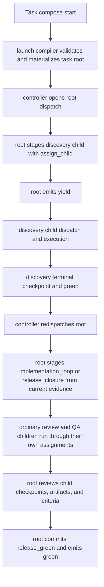

# End-to-end design walkthrough

Status: Target

This walkthrough shows the detailed staged flow from launch to final closure under the live runtime model.

It mirrors the canonical authored and runtime shapes in `../workflows/examples/maximal.md`.

Figure: The current model uses dispatch, explicit parent/root tools, child checkpoints, durable artifacts, and root-owned final closure.

## Walkthrough

### Stage 1: launch

1. A task starts from task compose plus the current workflow revision selected at launch.
2. The launch compiler validates the authored workflow, role/policy definitions, and task-compose input.
3. The controller materializes the task root, initial runtime graph, stable `_runtime/workflow-manifest.*`, and the first current assignment/attempt.
4. The controller opens the first `dispatch`, usually at root.

### Stage 2: root stages discovery

1. Root reads:
    - the current manifest
    - its current assignment
    - any already-surfaced checkpoints or artifacts
    - current root criteria
2. Root stages `discovery` with `assign_child`.
3. Root emits `yield` after exactly one continuation outcome is staged.

### Stage 3: discovery publishes findings

1. `gather_evidence` runs inside `discovery`.
2. It publishes:
    - terminal checkpoint
    - `findings_report`
    - optional `discovery_notes`
3. `discovery` then decides whether its subtree is complete enough to end `green`.

### Stage 4: implementation loop consumes findings

1. Root is redispatched and stages `implementation_loop`.
2. `implementation_loop` stages:
    - `plan_iteration`
    - `implement_change`
    - `review_change`
    - optionally `qa_sweep`
3. Each child publishes ordinary checkpoints and durable artifacts.

### Stage 5: root verifies current whole-flow evidence

1. Root rereads current child checkpoints, current artifacts, and current criteria after each redispatch.
2. If the structure is wrong, root or the owning parent can apply legal structural CRUD and then reread the regenerated manifest.
3. If the structure is right but more bounded work is needed, root stages another child assignment and later emits `yield`.

### Stage 6: bounded release then final closure

1. If the workflow authors a bounded `release_closure` child, root stages it only after the current implementation evidence is sufficient for release work.
2. `release_closure` publishes `closure_report` and a terminal checkpoint.
3. Root reaches final closure only after current whole-flow evidence is sufficient, `release_green` is committed, and root emits `green`.

## Concrete file-reading order

When you replay a real task by hand, inspect files in this order:

1. `_runtime/workflow-manifest.md`
2. current `assignment.md`
3. current `latest-checkpoint.md`
4. referenced artifacts under `outputs/artifacts/...`
5. optional `tmp/transfers/...` only when surfaced through `transient_refs`
