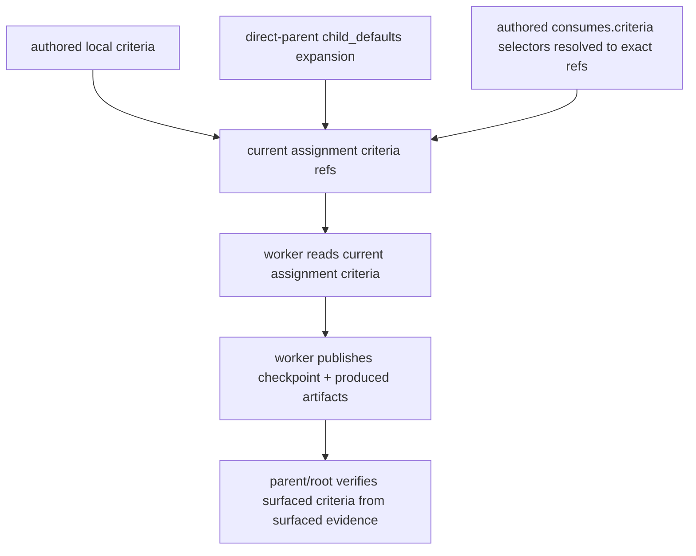

# Criteria and parent verification

Status: Target

This page defines authored criteria declarations, the current-assignment criteria surface, and the summary-first parent/root verification model.

## Authored criteria declarations

Criteria declarations use this exact authored shape:

```yaml
slot: slot_id
description: string
criteria:
  - string
```

Authored criteria stay in workflow YAML as durable contracts. `child_defaults.criteria` may reference those authored slots, but that shorthand expands only onto direct children at compile time. Workers do not read hidden ancestor layers at runtime. The node that declares a criteria slot owns that durable criteria contract. Downstream consumers get that contract only through surfaced exact criteria refs. Parent/root may merge supplemental current criteria sharing for one attempt, but it does not silently rewrite the authored slot.

Phase 1 normalized compiler output must therefore preserve the declaring node as criteria owner even when direct-parent `child_defaults.criteria` expands that slot onto a child node. That ownership marker is compiler-only in this phase. It does not add a new authored field and it does not yet widen assignment or manifest runtime carriers in this slice.

## `AssignmentCriteriaSurfaceRule`

The only live criteria contract for one node attempt is the current assignment `criteria` section.

Each surfaced criteria entry carries:

```yaml
kind: criteria
slot: slot_id
path: string
description: string
```

Rules:

- parent/root or runtime may assemble assignment `criteria` from:
  - the node's local authored `criteria`
  - direct-parent `child_defaults.criteria` expansion
  - authored `consumes.criteria` selectors
- runtime may also surface intentionally shared supplemental current criteria refs for that attempt
- every criterion that is in force for the current attempt must be surfaced explicitly in assignment `criteria` as an exact current ref, not as a slot-only selector
- if a criterion is not surfaced on the current assignment, workers must not infer it from ancestor structure, role names, old prompts, or prior attempts
- assignment `summary` and `instruction` may explain how to apply the surfaced criteria, but they do not silently add, remove, or rewrite criteria



Figure: criteria become runtime-visible only through the current assignment and come back upward through checkpoints plus referenced evidence.

## `AssignmentCriteriaProjectionRule`

Parent/root may derive assignment-local wording from authored criteria when minting an assignment, but runtime delivery still stays on explicit surfaces.

Projection is rendered only as:

- assignment `criteria`
- assignment `summary`
- assignment `instruction`

Workers may add clarification in checkpoints or produced artifacts, but they do not mutate canonical authored criteria by default.

### Worked assignment surface example

```yaml
summary: Review the current patch and verification evidence.
instruction: Decide whether the current implementation evidence satisfies the surfaced review criteria.
criteria:
  - slot: implementation_review_criteria
    path: C:/tasks/task_2026_0042/context/criteria/implementation_review_criteria.v01.md
    description: Review criteria for the current implementation evidence.
consumes:
  - kind: artifact
    slot: change_patch
    version: 2
    path: C:/tasks/task_2026_0042/outputs/artifacts/implement_change/change_patch/change_patch.v02.diff
    description: Current patch under review.
  - kind: artifact
    slot: verification_report
    version: 3
    path: C:/tasks/task_2026_0042/outputs/artifacts/implement_change/verification_report/verification_report.v03.md
    description: Current verification evidence for the patch.
produces:
  - slot: review_report
    description: Review findings for parent and root verification.
```

The worker reads the surfaced `criteria` as the must-satisfy rule set and the surfaced `consumes` refs as the evidence set to inspect. Those `criteria` and `consumes` entries are already exact current refs. `produces` is requirement-only: it says what the attempt must publish, not which refs already exist. No hidden parent/root criteria layer remains at read time.

## `CriteriaConsumptionRule`

Criteria are considered consumed only when:

1. the current assignment surfaces the exact criteria refs in `criteria`
2. the attempt reads those surfaced criteria refs together with the surfaced `consumes` evidence
3. the attempt's terminal checkpoint and referenced produced artifacts explain how the current evidence satisfies or blocks those surfaced criteria

## `ParentVerificationRule`

Parent/root verification is summary-first with conditional drilldown.

Parent/root should begin from:

- the current assignment `criteria` refs
- child latest checkpoints
- current surfaced evidence refs resolved from authored selectors
- optional surfaced `transient_refs`
- optional `task_memory_search_hints` when curated docs or wiki pages are needed for drilldown

Parent/root should:

- inspect child checkpoint summaries first
- inspect referenced artifacts when summaries are insufficient
- inspect raw workspace state only when surfaced durable or transient refs still leave a material evidence gap
- verify the current surfaced criteria from current evidence before `release_green`

There is no live `ParentEvidenceBundle` owner surface in v1.

### Worked parent verification example

Suppose parent `implementation_subtree` is redispatched after `review_change` publishes:

- checkpoint summary: "Patch matches the findings report, but one retry path is still unverified."
- surfaced refs:

```yaml
artifacts:
  - kind: artifact
    slot: change_patch
    version: 2
    path: C:/tasks/task_2026_0042/outputs/artifacts/implement_change/change_patch/change_patch.v02.diff
    description: Current patch under review.
  - kind: artifact
    slot: verification_report
    version: 3
    path: C:/tasks/task_2026_0042/outputs/artifacts/implement_change/verification_report/verification_report.v03.md
    description: Current verification evidence for the patch.
  - kind: artifact
    slot: review_report
    version: 1
    path: C:/tasks/task_2026_0042/outputs/artifacts/review_change/review_report/review_report.v01.md
    description: Current review findings for the subtree.
criteria:
  - slot: implementation_review_criteria
    path: C:/tasks/task_2026_0042/context/criteria/implementation_review_criteria.v01.md
    description: Review criteria for the current implementation evidence.
```

Parent/root should then:

1. read the checkpoint summary first
2. open `review_report` because the summary still names one evidence gap
3. verify whether the missing retry-path evidence is required by the current surfaced criteria
4. either stage another bounded child assignment or keep the subtree blocked

Parent/root should not skip straight to raw workspace files if the surfaced checkpoint and artifact refs already contain enough evidence to decide.

## `CriteriaInvalidationRule`

Earlier acceptance claims may become stale when any of these change:

- a relied-on artifact is republished to a newer current version
- the current surfaced criteria set changes
- current structure changes through `add_child`, `update_child`, or `remove_child`
- the current assignment basis changes
- later review or audit artifacts supersede older claims

Parent/root must reason from current checkpoints, current artifacts, and the current surfaced criteria, not from historical green status alone.

## Related contracts

- [Workflow definition schema](workflow-definition-schema.md)
- [Typed dependency selectors and produce slots](typed-dependency-selectors-and-produce-slots.md)
- [Review findings contract](review-findings-contract.md)
- [Parent/root release and closure](parent-root-release-and-closure.md)
- [Runtime boundary and controller loop contract](../architecture/runtime-boundary-and-controller-loop-contract.md)
- [Artifact ref and storage contract](../architecture/artifact-ref-and-storage-contract.md)
