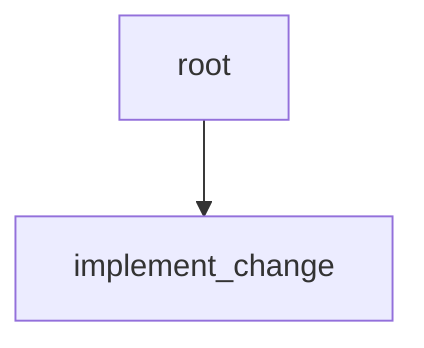

# Bounded change workflow reference

Status: Target

This page is the canonical smallest teaching example for the frozen v1 contract.



Figure: `bounded-change` is one root and one worker child for small scoped work.

The YAML below is shown in canonical file form for CLI scan/import.

In this repo, the packaged seed under `apps/api/src/autoclaw/definitions/seeds/workflows/bounded_change.yaml` is the committed authored and shipped seed source for this example. A caller may select an explicit `definitions_root` override tree for import or seed work, but no repo-root workflow fixture mirror is required by shipped paths. After seed or import, later compile and runtime paths follow the registry current revision rather than rereading seed or override files.

```yaml
kind: workflow
id: bounded-change
description: Execute one small scoped change with one worker and root-owned evidence review.
root:
    id: root
    role: planning_lead
    policy: standard-root
    description: Preserve task purpose, delegate one bounded change, and close only after current evidence satisfies criteria.
    instruction: >-
      Read manifest, assignment, checkpoint, surfaced refs, and criteria before assigning or closing. Keep the run to one worker unless current evidence proves the shape is wrong. Verify worker evidence instead of trusting green alone.
    criteria:
        - slot: implementation_rules
          description: Root acceptance criteria for the bounded worker.
          criteria:
              - the worker stays inside the current bounded assignment
              - publish patch and verification evidence only through declared produce slots
              - root verifies current patch and verification evidence before release
    children:
        - id: implement_change
          role: engineer
          policy: standard-worker
          description: Understand the scope, implement the bounded change, and publish patch plus verification evidence.
          instruction: >-
            Read current criteria and surfaced refs before editing. Keep the patch scoped, verify the intended behavior, and checkpoint reasoning plus criteria status.
          criteria:
              - slot: implement_change_delivery_criteria
                description: Delivery criteria for the bounded change.
                criteria:
                    - patch is limited to the assigned path
                    - verification evidence demonstrates the intended fix
                    - checkpoint explains evidence read, changed files, test or review evidence, and residual risk
          produces:
              artifacts:
                  - slot: change_patch
                    file_hint: change_patch.diff
                    description: Patch for the bounded change.
                  - slot: verification_report
                    file_hint: verification_report.md
                    description: Verification evidence for the bounded change.

```

## Why this example matters

This example teaches the smallest complete contract:

- root owns final acceptance
- worker owns one bounded assignment
- worker publishes durable outputs through declared `produces`
- root later decides whether that evidence is enough for closure

There is no review child, no structural replan, and no release-only child.

## Likely runtime flow

1. compiler materializes one root and one worker
2. root receives the first `dispatch`
3. root stages `implement_change` with `assign_child`
4. root emits `yield`
5. `implement_change` publishes `change_patch` and `verification_report`
6. `implement_change` records a terminal checkpoint and emits `green`
7. root is redispatched, rereads the checkpoint and artifact refs, and decides whether to `release_green`
