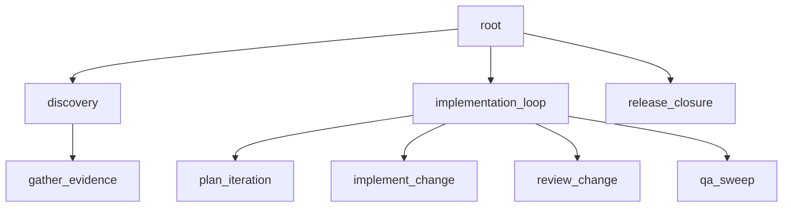

# Maximal workflow reference

Status: Target

This page is the canonical richer staged reference flow for the live v1 contract.



Figure: the maximal example shows two parent subtrees plus a bounded release child under one root.

The YAML below is shown in canonical file form for CLI scan/import.

In this repo, the packaged seed under `apps/api/src/autoclaw/definitions/seeds/workflows/maximal_parent_first_release.yaml` is the committed authored and shipped seed source for this example. A caller may select an explicit `definitions_root` override tree for import or seed work, but no repo-root workflow fixture mirror is required by shipped paths. After seed or import, later compile and runtime paths follow the registry current revision rather than rereading seed or override files.

```yaml
kind: workflow
id: maximal-parent-first-release
description: Execute staged discovery, planning, implementation, review, QA, and release work for the authentication overhaul.
root:
  id: root
  role: root_planning_lead
  policy: standard-root-planning
  description: Coordinate the whole authentication overhaul and decide final bounded closure from current evidence.
  criteria:
    - slot: root_delivery_rules
      description: Shared delivery rules before final closure.
      criteria:
        - unresolved high-risk issues block green
        - final release evidence cites the exact current refs consumed
    - slot: root_closure_criteria
      description: Final release criteria.
      criteria:
        - release work uses only surfaced release evidence and current criteria
        - release work does not reopen planning or implementation scope
  children:
    - id: discovery
      role: planning_lead
      policy: standard-parent-planning
      description: Coordinate discovery work and verify discovery outputs before downstream use.
      criteria:
        - slot: discovery_requirements
          description: Shared discovery requirements.
          criteria:
            - findings are internally consistent
            - findings are specific enough for downstream planning
      child_defaults:
        criteria:
          - discovery_requirements
      children:
        - id: gather_evidence
          role: researcher
          description: Gather discovery evidence and publish a findings report.
          produces:
            artifacts:
              - slot: findings_report
                file_hint: findings_report.md
                description: Discovery findings for downstream planning and implementation.
              - slot: discovery_notes
                file_hint: discovery_notes.md
                description: Raw discovery notes for the subtree.
    - id: implementation_loop
      role: planning_lead
      policy: standard-parent-planning
      description: Coordinate planning, implementation, review, and QA from current surfaced discovery outputs.
      criteria:
        - slot: implementation_loop_requirements
          description: Shared implementation requirements.
          criteria:
            - implementation stays inside the assigned subtree
            - verification and review evidence must be mutually consistent before green
        - slot: implementation_review_criteria
          description: Review criteria for implementation verification.
          criteria:
            - patch and verification evidence are mutually consistent
            - open risks are either closed or explicitly documented
      child_defaults:
        criteria:
          - implementation_loop_requirements
      children:
        - id: plan_iteration
          role: planner
          description: Publish the current delivery plan.
          consumes:
            artifacts:
              - slot: findings_report
          produces:
            artifacts:
              - slot: delivery_plan
                file_hint: delivery_plan.md
                description: Current implementation plan for the subtree.
        - id: implement_change
          role: engineer
          policy: standard-worker
          description: Implement the scoped change and publish patch plus verification evidence.
          consumes:
            artifacts:
              - slot: findings_report
              - slot: delivery_plan
          criteria:
            - slot: implement_change_delivery_criteria
              description: Delivery criteria for engineering.
              criteria:
                - patch matches the scoped assignment
                - verification evidence supports the claimed fix
          produces:
            artifacts:
              - slot: change_patch
                file_hint: change_patch.diff
                description: Patch for the scoped change.
              - slot: verification_report
                file_hint: verification_report.md
                description: Verification evidence for the scoped change.
        - id: review_change
          role: reviewer
          policy: standard-review
          description: Review the implementation evidence and publish an ordinary review report.
          consumes:
            artifacts:
              - slot: change_patch
              - slot: verification_report
            criteria:
              - slot: implementation_review_criteria
          produces:
            artifacts:
              - slot: review_report
                file_hint: review_report.md
                description: Review findings and disposition for the subtree.
        - id: qa_sweep
          role: architect
          description: Run a bounded QA or architecture sweep over current implementation evidence.
          consumes:
            artifacts:
              - slot: change_patch
              - slot: verification_report
              - slot: review_report
          produces:
            artifacts:
              - slot: qa_report
                file_hint: qa_report.md
                description: QA and architecture sweep findings for the subtree.
    - id: release_closure
      role: release_operator
      policy: standard-release
      description: Perform the final bounded release work from current surfaced evidence.
      consumes:
        artifacts:
          - slot: findings_report
          - slot: delivery_plan
          - slot: change_patch
          - slot: verification_report
          - slot: review_report
          - slot: qa_report
        criteria:
          - slot: root_closure_criteria
      produces:
        artifacts:
          - slot: closure_report
            file_hint: closure_report.md
            description: Final bounded release or closure report.
```

## Why this example is maximal

This example demonstrates the full v1 authored vocabulary without reintroducing removed concepts:

- multiple parent nodes
- `child_defaults`
- typed `consumes`
- multiple criteria layers
- ordinary review and QA workers
- one bounded release child

It still does **not** introduce:

- authored runtime boundaries
- handoff families
- bundle families
- hidden review or closure gate types
