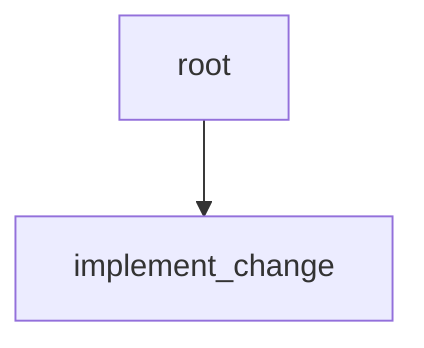

# Minimal parent-owned subgraph reference

Status: Target

This page is the canonical minimal teaching example for the frozen v1 contract.



Figure: the smallest useful parent-owned workflow is still a tree with one root and one worker child.

The YAML below is shown in canonical file form for CLI scan/import.

In this repo, the packaged seed under `apps/api/src/autoclaw/definitions/seeds/workflows/minimal_implement_change.yaml` is the committed authored and shipped seed source for this example. A caller may select an explicit `definitions_root` override tree for import or seed work, but no repo-root workflow fixture mirror is required by shipped paths. After seed or import, later compile and runtime paths follow the registry current revision rather than rereading seed or override files.

```yaml
kind: workflow
id: minimal-implement-change
description: Execute one bounded engineering change under parent ownership.
root:
  id: root
  role: planning_lead
  description: Verify one bounded engineering worker and release only when current evidence is sufficient.
  criteria:
    - slot: implementation_rules
      description: Parent acceptance criteria for the bounded engineering child.
      criteria:
        - keep the child inside the current bounded assignment
        - publish patch and verification evidence only through declared produce slots
  children:
    - id: implement_change
      role: engineer
      policy: standard-worker
      description: Implement the change and publish patch plus verification evidence only for the current bounded assignment.
      criteria:
        - slot: implement_change_delivery_criteria
          description: Delivery criteria for the bounded engineering change.
          criteria:
            - patch is limited to the assigned path
            - verification evidence demonstrates the intended fix
      produces:
        artifacts:
          - slot: change_patch
            file_hint: change_patch.diff
            description: Patch for the bounded change.
          - slot: verification_report
            file_hint: verification_report.md
            description: Verification evidence for the bounded change.
```

## Why this example matters

This example teaches the smallest complete contract:

- root owns final acceptance
- worker owns one bounded assignment
- worker publishes durable outputs through declared `produces`
- root later decides whether that evidence is enough for closure

There is no review child, no structural replan, and no release-only child.

## Likely runtime flow

1. compiler materializes one root and one worker
2. root receives the first `dispatch`
3. root stages `implement_change` with `assign_child`
4. root emits `yield`
5. `implement_change` publishes `change_patch` and `verification_report`
6. `implement_change` records a terminal checkpoint and emits `green`
7. root is redispatched, rereads the checkpoint and artifact refs, and decides whether to `release_green`
