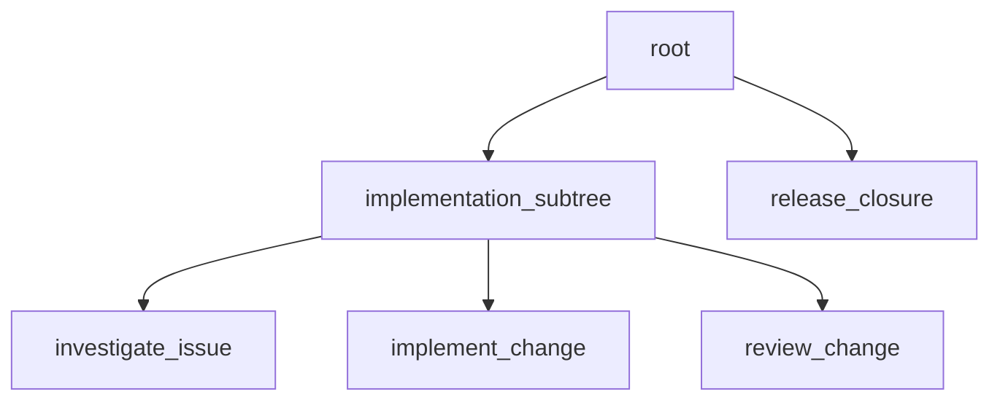

# Normal workflow reference

Status: Target

This page provides the canonical normal workflow example for the live v1 contract.



Figure: the normal example adds one parent subtree and one ordinary release child, while keeping review and release as ordinary authored work.

The YAML below is shown in canonical file form for CLI scan/import.

In this repo, the packaged seed under `apps/api/src/autoclaw/definitions/seeds/workflows/normal_parent_first_release.yaml` is the committed authored and shipped seed source for this example. A caller may select an explicit `definitions_root` override tree for import or seed work, but no repo-root workflow fixture mirror is required by shipped paths. After seed or import, later compile and runtime paths follow the registry current revision rather than rereading seed or override files.

```yaml
kind: workflow
id: normal-parent-first-release
description: Execute one implementation subtree, review it through ordinary child work, and release only after root verifies current purpose, criteria, and evidence.
root:
    id: root
    role: root_planning_lead
    policy: standard-root-planning
    description: Preserve the whole-task purpose, verify implementation and release evidence, and close only from current controller truth.
    instruction: >-
      Read manifest, assignment, child checkpoints, surfaced refs, criteria, and task-memory hints before release. Treat child green as evidence, not proof.
    criteria:
        - slot: root_delivery_rules
          description: Root acceptance criteria.
          criteria:
              - final closure happens only after root verifies current code, review, and test evidence
              - broad or weak evidence is routed to review, verification, fix, or replan instead of release
        - slot: root_closure_criteria
          description: Final release criteria.
          criteria:
              - release work uses only surfaced evidence and current criteria
              - release work does not reopen implementation scope
    children:
        - id: implementation_subtree
          role: planning_lead
          policy: standard-parent-planning
          description: Coordinate investigation, implementation, and ordinary review work inside the bounded subtree from current evidence.
          instruction: >-
            Prepare mission packets for children: purpose, mode, refs to read first, constraints, criteria, required outputs, known failures, and untouched areas.
          criteria:
              - slot: implementation_subtree_requirements
                description: Local execution requirements for this implementation subtree.
                criteria:
                    - findings and implementation stay inside the current subtree
                    - each child checkpoint explains evidence read, reasoning, criteria status, and next action
                    - review evidence must address the current patch and verification evidence
          child_defaults:
              criteria:
                  - implementation_subtree_requirements
          children:
              - id: investigate_issue
                role: researcher
                description: Inspect the issue purpose, constraints, and evidence, then publish findings for downstream implementation.
                instruction: >-
                  Publish findings, uncertainties, rejected leads, and implementation implications needed by downstream work only.
                produces:
                    artifacts:
                        - slot: findings_report
                          file_hint: findings_report.md
                          description: Findings needed by downstream implementation.
              - id: implement_change
                role: engineer
                policy: standard-worker
                description: Implement the bounded change from current findings and publish patch plus verification evidence.
                instruction: >-
                  Read findings and criteria before editing. Keep patch and verification scoped, and checkpoint residual risks.
                consumes:
                    artifacts:
                        - slot: findings_report
                criteria:
                    - slot: implement_change_delivery_criteria
                      description: Delivery criteria for the implementation step.
                      criteria:
                          - patch matches the scoped assignment
                          - verification evidence supports the claimed fix
                          - checkpoint names evidence read, commands or checks run, and any residual risk
                produces:
                    artifacts:
                        - slot: change_patch
                          file_hint: change_patch.diff
                          description: Patch for the scoped change.
                        - slot: verification_report
                          file_hint: verification_report.md
                          description: Verification evidence for the scoped change.
              - id: review_change
                role: reviewer
                policy: standard-review
                description: Critically review current implementation evidence and publish a bounded review report.
                instruction: >-
                  Review current patch, verification evidence, and criteria. Record approval, rejection, evidence gaps, and residual risk.
                consumes:
                    artifacts:
                        - slot: change_patch
                        - slot: verification_report
                    criteria:
                        - slot: implementation_subtree_requirements
                produces:
                    artifacts:
                        - slot: review_report
                          file_hint: review_report.md
                          description: Review findings and review disposition for the subtree.
        - id: release_closure
          role: release_operator
          policy: standard-release
          description: Perform final bounded release work from current surfaced implementation and review evidence.
          instruction: >-
            Use only surfaced implementation, verification, review evidence, and closure criteria. Report release gaps instead of reopening scope.
          consumes:
              artifacts:
                  - slot: change_patch
                  - slot: verification_report
                  - slot: review_report
              criteria:
                  - slot: root_closure_criteria
          produces:
              artifacts:
                  - slot: closure_report
                    file_hint: closure_report.md
                    description: Final bounded release or closure report.
```

## Expected runtime path

Typical execution order is:

1. root dispatch
2. `implementation_subtree` assignment
3. `investigate_issue`
4. `implement_change`
5. `review_change`
6. root review of current subtree evidence
7. `release_closure`
8. root final release decision

The authored tree does not force that exact order, but it gives runtime enough structure to make each step explicit through assignments, checkpoints, and durable artifact refs.
