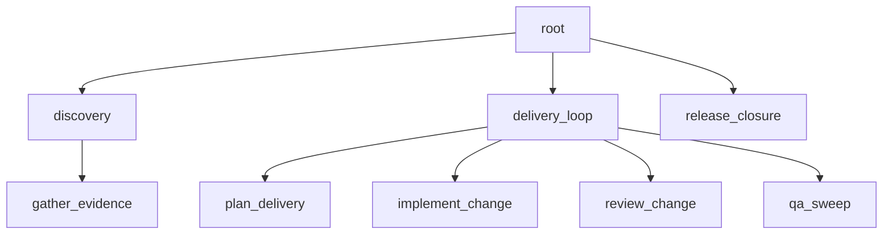

# Staged delivery release workflow reference

Status: Target

This page is the canonical richer staged reference flow for the live v1 contract.



Figure: `staged-delivery-release` shows two parent subtrees plus a bounded release child under one root.

The YAML below is shown in canonical file form for CLI scan/import.

In this repo, the packaged seed under `apps/api/src/autoclaw/definitions/seeds/workflows/staged_delivery_release.yaml` is the committed authored and shipped seed source for this example. A caller may select an explicit `definitions_root` override tree for import or seed work, but no repo-root workflow fixture mirror is required by shipped paths. After seed or import, later compile and runtime paths follow the registry current revision rather than rereading seed or override files.

```yaml
kind: workflow
id: staged-delivery-release
description: Discover, plan, implement, review, QA, and close a larger change through staged parent-owned evidence gates.
root:
    id: root
    role: root_planning_lead
    policy: standard-root
    description: Preserve the task purpose, coordinate staged delivery work, and decide final closure from current evidence.
    instruction: >-
      Read manifest, root assignment, child checkpoints, surfaced refs, criteria, and task-memory hints. Assign one stage at a time and challenge weak evidence before release.
    criteria:
        - slot: root_delivery_rules
          description: Shared delivery rules before final closure.
          criteria:
              - unresolved high-risk issues block green
              - final release evidence cites the exact current refs consumed
              - root routes weak evidence to review, verification, failure analysis, or replan before release
        - slot: root_closure_criteria
          description: Final release criteria.
          criteria:
              - release work uses only surfaced release evidence and current criteria
              - release work does not reopen planning or implementation scope
    children:
        - id: discovery
          role: planning_lead
          policy: standard-parent
          description: Coordinate discovery work and verify that the outputs are useful before downstream delivery planning.
          instruction: >-
            Keep discovery scoped to evidence needed for downstream planning and implementation. Preserve rejected leads and uncertainty in checkpoints.
          criteria:
              - slot: discovery_requirements
                description: Shared discovery requirements.
                criteria:
                    - discovery evidence is internally consistent
                    - discovery evidence is specific enough for downstream planning
                    - open uncertainties are named before downstream assignment
          child_defaults:
              criteria:
                  - discovery_requirements
          children:
              - id: gather_evidence
                role: researcher
                policy: standard-worker
                description: Gather discovery evidence and publish findings plus notes needed by downstream stages.
                instruction: >-
                  Publish discovery findings, raw notes, uncertainties, and next-decision implications only.
                produces:
                    artifacts:
                        - slot: discovery_brief
                          file_hint: discovery_brief.md
                          description: Discovery findings for downstream planning and implementation.
                        - slot: discovery_notes
                          file_hint: discovery_notes.md
                          description: Raw discovery notes for the subtree.
        - id: delivery_loop
          role: planning_lead
          policy: standard-parent
          description: Coordinate planning, implementation, review, and QA from surfaced discovery outputs.
          instruction: >-
            Prepare child mission packets with purpose, mode, refs, criteria, required outputs, known failures, and untouched scope.
          criteria:
              - slot: delivery_loop_requirements
                description: Shared delivery requirements.
                criteria:
                    - planning and implementation stay inside the assigned subtree
                    - verification and review evidence must be mutually consistent before green
                    - child checkpoints explain evidence read, reasoning, criteria status, and next action
              - slot: delivery_review_criteria
                description: Review criteria for delivery verification.
                criteria:
                    - patch and verification evidence are mutually consistent
                    - open risks are either closed or explicitly documented
          child_defaults:
              criteria:
                  - delivery_loop_requirements
          children:
              - id: plan_delivery
                role: planner
                policy: standard-worker
                description: Publish the current delivery plan from surfaced discovery evidence.
                instruction: >-
                  Convert discovery findings into bounded sequencing, dependencies, criteria, risks, and verification gates. Do not implement the plan.
                consumes:
                    artifacts:
                        - slot: discovery_brief
                produces:
                    artifacts:
                        - slot: delivery_plan
                          file_hint: delivery_plan.md
                          description: Current implementation plan for the subtree.
              - id: implement_change
                role: engineer
                policy: standard-worker
                description: Implement the scoped change and publish patch plus verification evidence.
                instruction: >-
                  Read findings, plan, and criteria before editing. Keep patch scoped, verify behavior, and checkpoint residual risks.
                consumes:
                    artifacts:
                        - slot: discovery_brief
                        - slot: delivery_plan
                criteria:
                    - slot: implement_change_delivery_criteria
                      description: Delivery criteria for engineering.
                      criteria:
                          - patch matches the scoped assignment
                          - verification evidence supports the claimed fix
                          - checkpoint names evidence read, checks run, and any residual risk
                produces:
                    artifacts:
                        - slot: change_patch
                          file_hint: change_patch.diff
                          description: Patch for the scoped change.
                        - slot: verification_report
                          file_hint: verification_report.md
                          description: Verification evidence for the scoped change.
              - id: review_change
                role: reviewer
                policy: standard-worker
                description: Critically review implementation evidence and publish an ordinary review report.
                instruction: >-
                  Review current patch, verification evidence, and criteria. Record approval, rejection, evidence gaps, and residual risk.
                consumes:
                    artifacts:
                        - slot: change_patch
                        - slot: verification_report
                    criteria:
                        - slot: delivery_review_criteria
                produces:
                    artifacts:
                        - slot: review_report
                          file_hint: review_report.md
                          description: Review findings and disposition for the subtree.
              - id: qa_sweep
                role: architect
                policy: standard-worker
                description: Run a bounded QA or architecture sweep over current implementation evidence.
                instruction: >-
                  Inspect current implementation, verification, review evidence, and criteria only. Publish risk tradeoffs and pass/fail reasoning.
                consumes:
                    artifacts:
                        - slot: delivery_plan
                        - slot: change_patch
                        - slot: verification_report
                        - slot: review_report
                produces:
                    artifacts:
                        - slot: qa_report
                          file_hint: qa_report.md
                          description: QA and architecture sweep findings for the subtree.
        - id: release_closure
          role: release_operator
          policy: standard-worker
          description: Perform final bounded release work from current surfaced evidence.
          instruction: >-
            Use only surfaced discovery, delivery, review, QA, and closure criteria. Report release gaps instead of reopening planning or implementation scope.
          consumes:
              artifacts:
                  - slot: discovery_brief
                  - slot: delivery_plan
                  - slot: change_patch
                  - slot: verification_report
                  - slot: review_report
                  - slot: qa_report
              criteria:
                  - slot: root_closure_criteria
          produces:
              artifacts:
                  - slot: closure_report
                    file_hint: closure_report.md
                    description: Final bounded release or closure report.

```

## Why This Example Is Richer

This example demonstrates the full v1 authored vocabulary without reintroducing removed concepts:

- multiple parent nodes
- `child_defaults`
- typed `consumes`
- multiple criteria layers
- ordinary review and QA workers
- one bounded release child

It still does **not** introduce:

- authored runtime boundaries
- handoff families
- bundle families
- hidden review or closure gate types
