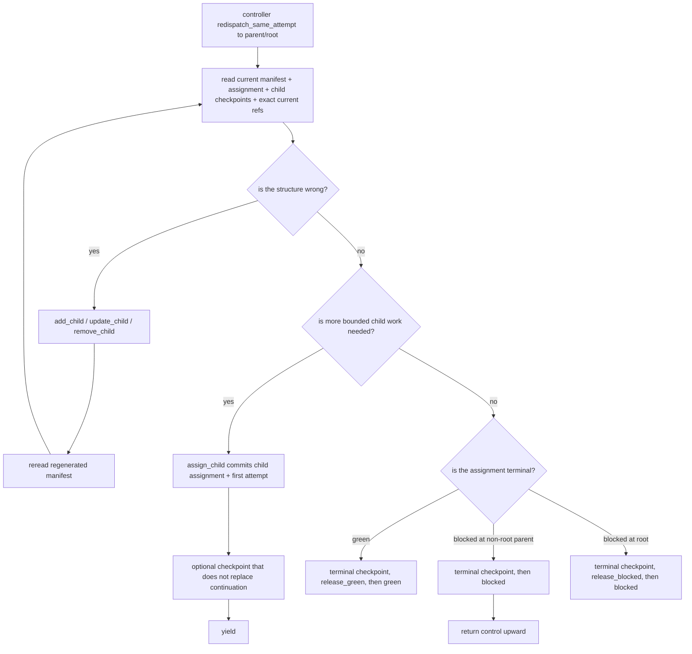

# Parent Review And Replan

Status: Target

This page explains the ordinary parent/root operating loop in the live v1 model.

Parent/root review and replan are not special boundary families. They happen during an ordinary open `dispatch` using explicit tools, explicit checkpoints, and current durable evidence.

Figure: parent/root first decides whether the structure is still right, then whether more bounded child work is needed inside that structure, and only then chooses a non-terminal or terminal close.

## Dispatch entry rule

The normal later-turn path for a parent/root is `redispatch_same_attempt` on the same assignment.

That later turn commonly happens after:

- a child closed `green`
- a child closed `blocked`
- review or release evidence changed and the parent/root must decide again

Parent/root semantic self-retry is illegal. Semantic `create_new_attempt` is reserved for legal worker retry lineage on the same assignment, and `escalate` is the controller/operator path when safe automatic redispatch is not legal.

## Parent/root read surface

When a parent/root is dispatched, it starts from:

- `_runtime/workflow-manifest.*`
- its current `assignment.*`, including exact current `criteria` refs, exact current `consumes` refs, and requirement-only `produces`
- the latest relevant child checkpoints
- any surfaced transient refs that still matter

Parent/root should not rely on:

- hidden subtree visibility
- packet/bundle families
- transcript-only memory
- provider or watchdog files as task truth

## Baseline contract rule

For any node inside the current parent/root's owned subtree, the baseline durable contract comes from that node's authored definition plus any legal direct-parent `child_defaults` expansion. During assignment, runtime may merge supplemental current durable sharing into surfaced `consumes` or `criteria`, but parent/root does not rewrite the node's authored `consume_selector`, `produce_slot`, or criteria ownership by assignment.

## Parent/root decision algorithm

During one open dispatch, parent/root should reason in this exact order:

1. reread the current manifest, current assignment, latest relevant child checkpoints, and the exact current refs surfaced on that assignment
2. decide whether the current owned-subtree structure is wrong
3. if the structure is wrong:
    - use `add_child`, `update_child`, or `remove_child`
    - reread the regenerated manifest
    - loop back to step 1 while no continuation outcome is staged
4. if the structure is right but more bounded child work is needed:
    - call `assign_child`
    - let the controller commit the child assignment, first child attempt, and one staged `child_assignment`
    - reread the returned child assignment/attempt facts
    - publish an optional checkpoint only if it does not replace the staged continuation
    - close with `yield`
5. if the current assignment is terminal and evidence is current:
    - use `release_green` then `green`, or
    - use `blocked` for a non-root parent assignment that cannot proceed, or
    - root-only `release_blocked` then `blocked` for whole-flow blocked closure

The parent/root must not skip from "structure changed" directly to `yield`. `yield` is legal only after exactly one staged `child_assignment` exists.

## One-continuation rule

For an open parent/root dispatch, the only continuation outcome is one staged `child_assignment`.

That means:

- `assign_child` stages the continuation basis
- structural CRUD is not a continuation outcome
- checkpoint publication is not a continuation outcome
- `release_green` and `release_blocked` are terminal release preconditions, not continuation outcomes

Consequences:

- zero staged child assignments makes `yield` illegal
- more than one staged child assignment makes `yield` illegal
- once one child assignment is staged, no second `assign_child` or structural CRUD operation may commit on that same open dispatch
- terminal release and `yield` are alternative close paths for the dispatch, not stackable outcomes

## `assign_child` commit and yield rule

`assign_child` is a commit step, not a hint.

On success, the controller:

1. validates current caller authority, `assign_child` direct-child target scope, continuation-slot availability, and overwrite rules
2. mints a fresh child `assignment_key`
3. mints the first child `attempt_id`
4. atomically commits the child assignment, first child attempt, and the one staged continuation outcome
5. rereads committed truth
6. regenerates child `assignment.*`
7. does not create child `dispatch_id`, child `latest-checkpoint.*`, or child dispatch-local monitoring files yet

The child is dispatched only after accepted `yield` consumes that committed continuation basis.

The returned child assignment is already runtime-wrapped:

- `consumes` carries exact current checkpoint/evidence refs resolved for that child attempt
- `criteria` carries exact current criteria refs
- `produces` stays requirement-only; realized refs appear only after publication

## Summary-first review rule

Parent/root review should proceed in this order:

1. read child checkpoint summaries
2. inspect referenced artifacts and current criteria
3. inspect explicitly surfaced supporting docs only when the current refs still leave a gap
4. inspect raw workspace state only when surfaced evidence still cannot justify the decision

If later agents need to know why a decision was made, parent/root should record that in checkpoint plus referenced files rather than only in tool-ack prose.

### Worked review-first example

Parent `implementation_subtree` sees:

- child checkpoint summary: "verification passed, but review not yet run"
- surfaced criteria ref:
    - `slot: implementation_review_criteria`
    - `path: C:/tasks/task_2026_0042/_runtime/criteria/implementation_review_criteria.v01.md`
- surfaced artifact refs:
    - `kind: artifact`, `slot: change_patch`, `version: 2`, `path: C:/tasks/task_2026_0042/outputs/artifacts/implement_change/change_patch/change_patch.v02.diff`
    - `kind: artifact`, `slot: verification_report`, `version: 3`, `path: C:/tasks/task_2026_0042/outputs/artifacts/implement_change/verification_report/verification_report.v03.md`

The right next action is not structural replan. It is:

1. keep the same structure
2. `assign_child` for the review child
3. let that commit create the new child assignment and first attempt
4. `yield`

### Worked replan-first example

Parent `implementation_subtree` sees:

- child checkpoint summary: "review finished, but the current subtree has no QA worker and new criteria now require one"
- surfaced criteria ref:
    - `slot: implementation_subtree_requirements`
    - `path: C:/tasks/task_2026_0042/_runtime/criteria/implementation_subtree_requirements.v02.md`
- surfaced artifact ref:
    - `kind: artifact`, `slot: review_report`, `version: 1`, `path: C:/tasks/task_2026_0042/outputs/artifacts/review_change/review_report/review_report.v01.md`

The right next action is structural replan:

1. `add_child` for `qa_sweep`
2. reread the regenerated manifest
3. `assign_child` for `qa_sweep`
4. `yield`

## Review versus replan

Use ordinary review when the current structure is still right and the question is what to do next with that structure.

Use local replan when the structure itself is wrong.

### Review-driven next steps

Typical cases:

- a child produced incomplete evidence, so stage another child assignment
- a review worker finished and published findings, so stage follow-up work
- all evidence is current and criteria are satisfied, so release upward

### Replan-driven next steps

Typical cases:

- the current owned subtree is missing a needed worker
- one descendant contract needs an identity-preserving structural rewrite
- one descendant subtree is obsolete and must be removed

Successful structural edits adopt a new structural revision and regenerate the stable workflow manifest before the parent/root decides the next continuation.

## Controller advance after child results

After a child closes and the controller advances:

- ordinary parent/root follow-up happens by `redispatch_same_attempt` on the same parent/root assignment
- legal worker retry may use semantic `create_new_attempt` on that worker's assignment; watchdog stability recovery preserves lineage and otherwise escalates
- `escalate` is used only when the controller cannot safely redispatch the same attempt or create a new one from current authoritative truth

These are controller actions, not extra parent/root boundary families. There is no public parent/root `retry`, no separate child-reassignment operation, and no public retry-child family; another bounded assignment for the same terminal child uses `assign_child` while no downstream artifact consumer has current work.

## No public escalation boundary

There is no live public `replan_escalation` boundary.

If the current parent/root cannot legally apply the needed change inside its authority:

- it should record the gap in checkpoint/evidence surfaces
- it should not invent a fake local success
- the higher parent/root later receives that context through ordinary upward flow and decides the next assignment or structural change

## Decision matrix

| Situation                                                     | Parent/root action                                                   |
| ------------------------------------------------------------- | -------------------------------------------------------------------- |
| same structure, more bounded work needed                      | `assign_child` for a fresh child assignment, then `yield`            |
| current owned-subtree structure or contract is wrong          | `add_child`, `update_child`, or `remove_child`, then reread manifest |
| current assignment is complete and evidence is current        | terminal green checkpoint, `release_green`, then `green`             |
| current non-root parent assignment cannot proceed as assigned | terminal blocked checkpoint, then `blocked`                          |
| root determines the whole flow is terminally blocked          | terminal blocked checkpoint, `release_blocked`, then `blocked`       |

## Related contracts

- [Parent/root release and closure](parent-root-release-and-closure.md)
- [Runtime structural replan](runtime-structural-replan.md)
- [Review findings contract](review-findings-contract.md)
