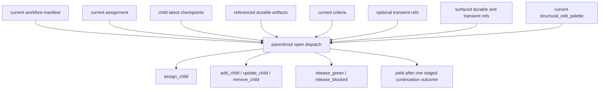

# Parent/root planning surface

Status: Target

This page explains the live parent/root planning surface without relying on assembled gate bundles.

## Why this surface is enough

- the manifest provides whole-workflow structure, including the current parent/root's owned subtree
- child checkpoints provide summary-first history and next-step handover
- durable artifacts provide drilldown evidence
- criteria provide the current acceptance contract
- the surfaced current `structural_edit_palette` provides the legal current role/policy choices for structural edits without turning generic registry browsing into the normal live node surface

There is no separate assembled planning-snapshot family in v1.

## Worked planning example

Assume the current parent/root has just been redispatched after `implement_change` finished. The surfaced evidence now includes:

- checkpoint summary: "Patch implemented; verification report still lacks one retry-path case."
- artifact refs:
    - `change_patch` version `2`
    - `verification_report` version `3`
- current subtree criteria

The planning surface is enough to choose the next action:

1. the checkpoint summary says what changed
2. the artifact refs show exactly where to drill down
3. the current criteria explain whether the missing retry-path case still matters
4. parent/root can now choose either:
    - `assign_child` for follow-up engineering work
    - `add_child` for a new QA worker if the current owned-subtree shape is wrong and the needed role/policy pair is already surfaced in the current `structural_edit_palette`
    - `release_green` only if the evidence and criteria already justify closure

No hidden gate summary, bundle, or callback envelope is needed to make that decision.

## Planning rule

Parent/root should:

- start from checkpoint summaries and current criteria
- drill into referenced artifacts only when summaries are insufficient
- use the surfaced current `structural_edit_palette` when structural edits need role/policy choices
- do not treat generic registry reads or revision-history reads as the normal live parent/root input surface
- use structural edits only inside the current owned subtree: `add_child` under self or a descendant parent, and `update_child`/`remove_child` on explicit descendants
- stage exactly one continuation outcome before `yield`
- explain later-sensitive decisions in checkpoints rather than hidden controller prose

## What the parent/root does not need

The live planning surface does not require historical gate-era callback machinery, packet/bundle-first planning surfaces, or direct revision-history browsing as an ordinary parent/root planning input.
