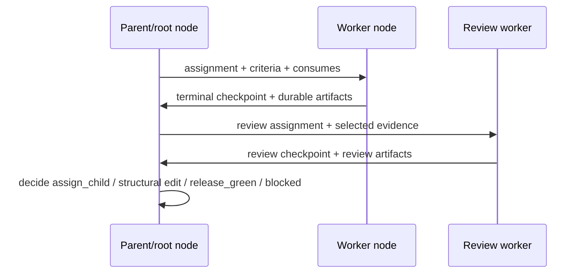

# Parent, worker, and review model

Status: Target

This page explains why the live v1 model splits parent/root coordination, worker execution, and ordinary review work explicitly.

## Why this split matters

- parent/root nodes supervise and coordinate; they do not hide work inside callback-era gate stages
- worker nodes execute one bounded assignment at a time
- review workers perform deeper validation through ordinary child execution
- structural replan stays with the parent/root that owns the current subtree context

## Parent/root responsibilities

Parent/root uses its open dispatch to:

- read current manifest, assignment, child checkpoints, referenced artifacts, and current criteria
- stage the next bounded child assignment with `assign_child`
- apply legal structural edits with `add_child`, `update_child`, or `remove_child`
- record checkpoints when later agents must understand the decision basis
- publish the matching terminal checkpoint, then commit `release_green` or root-only `release_blocked`
- close with `blocked` when the current parent/root assignment cannot proceed as assigned

## Worker responsibilities

Workers:

- read only the surfaced assignment, criteria, consumes, and optional `transient_refs`
- publish required durable outputs
- record progress or terminal checkpoints
- close with `green`, `retry`, or `blocked` only for their own current assignment

## Review responsibilities

Review is ordinary child work, not a hidden parent-only phase.

Review workers:

- consume explicitly surfaced evidence only
- publish ordinary review artifacts and checkpoints
- may report negative findings while still ending `green` because the review assignment itself completed
- do not force parent/root closure by themselves

## Worked review loop

One common path is:

1. `implement_change` publishes `change_patch` and `verification_report`
2. parent stages `review_change`
3. `review_change` reads only the surfaced evidence in its assignment
4. `review_change` publishes:
    - terminal checkpoint summary
    - `review_report`
5. the checkpoint may say "review completed; one regression case still needs follow-up"
6. review still ends `green` because the review assignment completed
7. parent/root then decides whether to:
    - stage another engineering child assignment
    - add a QA child
    - keep the subtree blocked from release

The review worker reports evidence and judgment. Parent/root still owns the next control action.
