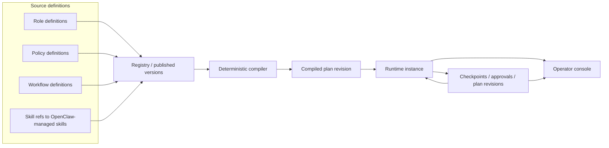
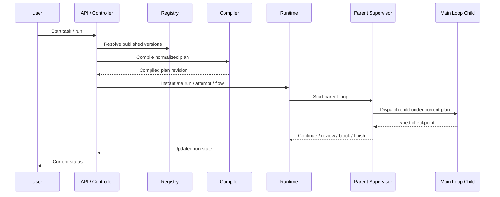
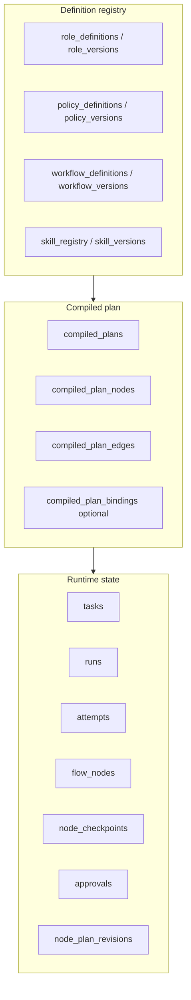
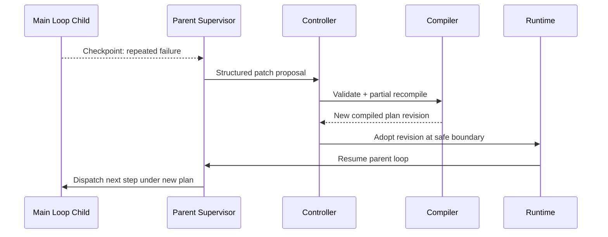
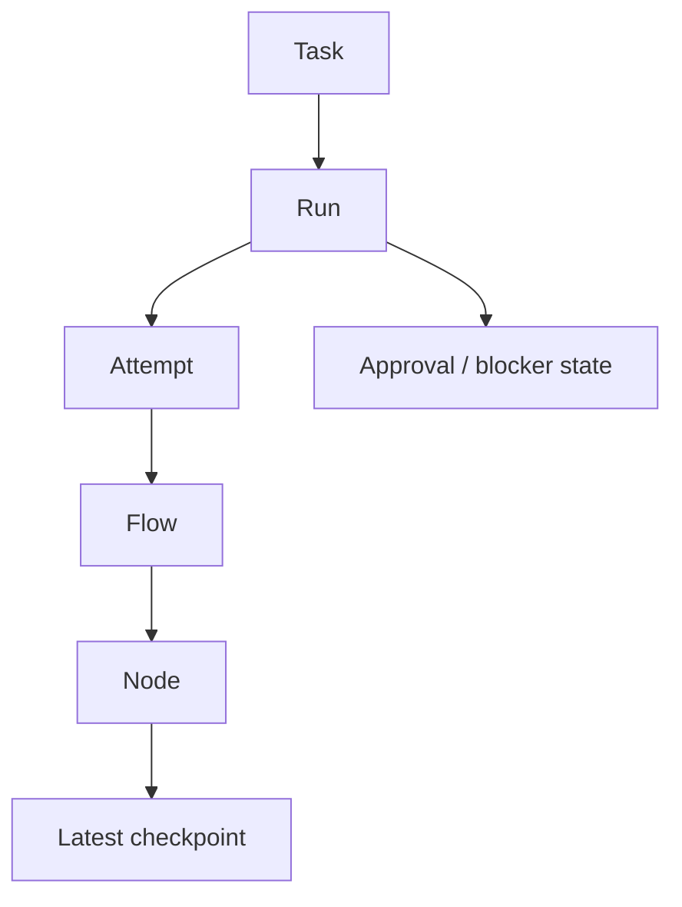
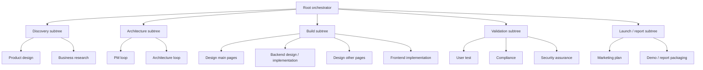
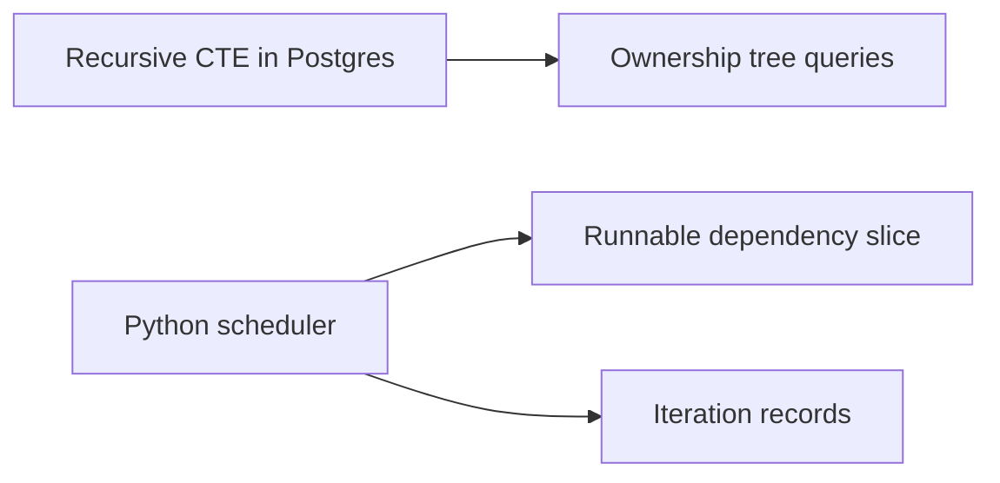

# Diagrams and Mermaid

This file collects repo-local Mermaid diagrams for the current AutoClaw V2.1 design.

Use these as **communication aids**, not as the sole source of truth.
When a diagram and the architecture/ADR docs drift, update both.

## 1. System map

## 2. Default end-to-end runtime path

## 3. Control-plane storage layers

## 4. Plan patch and safe recompile

## 5. Operator console hierarchy

## 6. MVP builder workflow pack

## 7. Querying and scheduling split

## Notes

- Ownership is primarily a **tree**.
- Dependency edges are optional and should stay secondary.
- Loops should be modeled as **iteration state**, not raw cyclic graph edges.
- The default homepage/view should show the **simple truth first**; the full graph is an inspect view.
