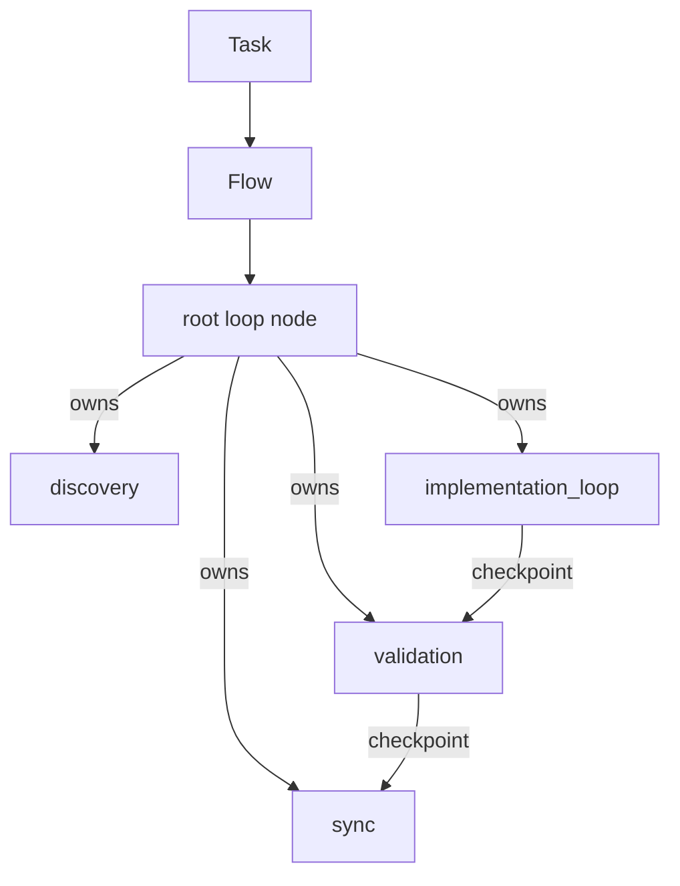
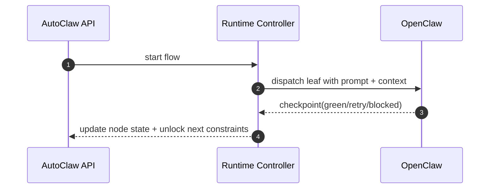

# Diagrams and Mermaid

## 1) Default flow shape (small kernel)



## 2) OpenClaw delegation boundary



## 3) Full target graph — max-complexity (exact reference)

```mermaid
flowchart TD
  ROOT[root] -->|owns| DISC[root.discovery]
  ROOT -->|owns| PROD[root.product]
  ROOT -->|owns| IMPL[root.implementation_loop]
  ROOT -->|owns| VAL[root.validation]
  ROOT -->|owns| SYNC[root.sync]
  PROD -->|owns| ARCH[root.product.architecture]
  PROD -->|owns| PMAT[root.product.product_plan]
  IMPL -->|owns| CYCLE[root.implementation_loop.cycle]
  IMPL -->|owns| BUGFIX[root.implementation_loop.bugfix]
  ROOT -->|owns| REV[root.review_and_governance]
  REV -->|owns| SEC[root.review_and_governance.security]
  REV -->|owns| RISK[root.review_and_governance.risk]

  DISC --> PROD
  DISC --> IMPL
  PROD --> IMPL
  IMPL --> VAL
  VAL --> REV
  REV -->|approved| SYNC
  REV -->|escalate| ROOT

  DISC -->|dispatch| O_DISC[[OpenClaw session\n(root.discovery)]]
  ARCH -->|dispatch| O_ARCH[[OpenClaw session\n(root.product.architecture)]]
  PMAT -->|dispatch| O_PMAT[[OpenClaw session\n(root.product.product_plan)]]
  CYCLE -->|dispatch| O_CYCLE[[OpenClaw session\n(root.implementation_loop.cycle)]]
  BUGFIX -->|dispatch| O_BUGFIX[[OpenClaw session\n(root.implementation_loop.bugfix)]]
  VAL -->|dispatch| O_VAL[[OpenClaw session\n(root.validation)]]
  SEC -->|dispatch| O_SEC[[OpenClaw session\n(root.review_and_governance.security)]]
  RISK -->|dispatch| O_RISK[[OpenClaw session\n(root.review_and_governance.risk)]]

  classDef owner fill:#eef,stroke:#515,stroke-width:1px
  classDef ocl fill:#f4f4f4,stroke:#666,stroke-dasharray:3 3
  class ROOT,PROD,IMPL,ARCH,PMAT,CYCLE,BUGFIX,REV,SEC,RISK,VAL,SYNC,DISC owner
  class O_DISC,O_ARCH,O_PMAT,O_CYCLE,O_BUGFIX,O_VAL,O_SEC,O_RISK ocl
```

## 4) Legend

- **Solid `owns` edges** = ownership tree (`parent_node_id`)
- **Solid direct edges** = dependency/order constraints (`flow_edges`)
- **Dashed boxes on right** = delegated OpenClaw execution context for leaf nodes
- **Checkpoint arrows** = control transitions only after checkpoint ingestion

## 5) Detailed target walk-through

For the full, explicit step-by-step narrative and transition map, use:

- `docs/flows/06b-max-complexity-workflow-full.md`
