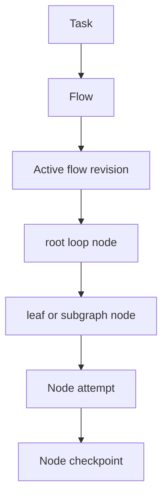
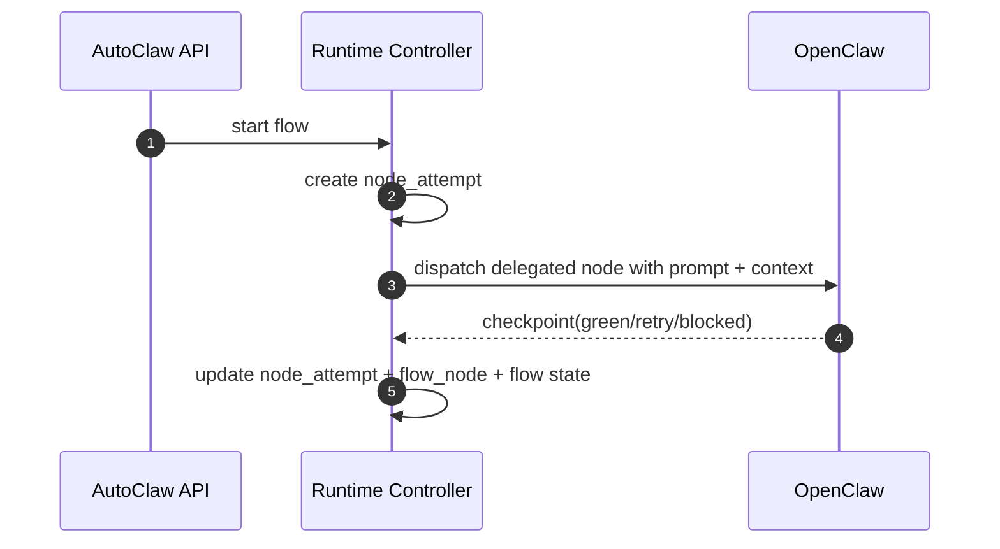
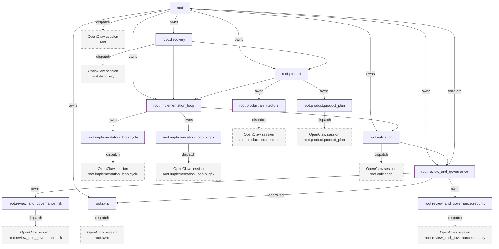

# Diagrams and Mermaid

## 1) Canonical execution identity

## 2) OpenClaw delegation boundary

## 3) Full target graph — max-complexity (exact reference)

## 4) Legend

- **Solid `owns` edges** = ownership tree (`parent_flow_node_id`)
- **Solid direct edges** = runtime dependency/order constraints (`flow_edges`)
- **Dashed boxes** = delegated OpenClaw execution context for delegated nodes (not necessarily leaves)
- **Node attempt / checkpoint lifecycle** = execution history, not topology

## 5) Detailed target walk-through

For the full explicit step-by-step narrative, use:

- `../../../../flows/06b-max-complexity-workflow-full.md`
