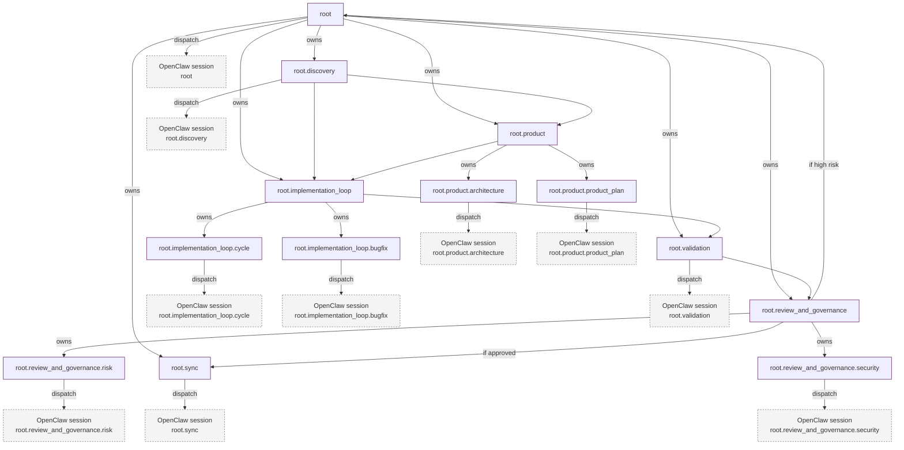

# Flow 06b — Max-Complexity Target (Exact Workflow Reference)

Use this when you need the full target shape instead of the compact 06 overview.

It describes the phase-6 target, not the current implementation baseline.

## Scope and status

- scope: nested loop/subgraph owners, cross-branch joins, review committees, checkpoint-driven replans
- boundary: source of truth for target semantics while implementation catches up

## Legend

- **Loop/Subgraph Node**: owns child nodes and manages local control (`can_spawn_children = true`, `can_loop = true`)
- **Delegated Node**: any node whose work is executed via OpenClaw through `node_sessions`; not limited to leaves
- **Constraint edge**: explicit dependency edge (`flow_edges`) when ownership is not enough
- **Node attempt**: one execution slice for a node

Delegation is orthogonal to ownership: a node can own children or act as a pivot and still dispatch to OpenClaw when its work is planner/synthesis-heavy.

## Target behavior

1. Root owns operational branches and acts as control boundary; when it performs planner/synthesis work, it may also dispatch to OpenClaw.
2. Product and implementation are explicit subgraphs.
3. Implementation retries are represented as new `node_attempts`, not graph rewrites.
4. Validation routes through `review_and_governance` before sync or escalation.
5. `root.sync` is a pivot/output node and may also dispatch to OpenClaw when merge/publish reasoning is required.
6. Structural adaptation creates new `flow_revisions`.

## Checkpoint map

At each checkpoint:

- `green`: continue to next dependency slice
- `retry`: create a new `node_attempt`
- `needs_approval`: create approval row and block the flow
- `blocked`: wait for operator/watchdog action

## Replan entry points

- `root.product` can request replan after repeated failed cycles
- `root.implementation_loop` can request inserted checks or branches
- `root.validation` can request specialist review routes
- replan is adoptable only through proposal -> validate -> compile -> adopt

## Data mapping (target)

- ownership structure: `flow_nodes.parent_flow_node_id`, `node_path`
- execution ordering: runtime `flow_edges`
- execution history: `node_attempts`, `node_checkpoints`, `approvals`
- revision history: `node_plan_revisions`, `flow_revisions`
- context continuity: `node_sessions`
- version provenance: `flow_revision.compiled_plan_id -> compiled_plan_nodes.role_version_id/policy_version_id/skill_bindings[*].skill_version_id`
