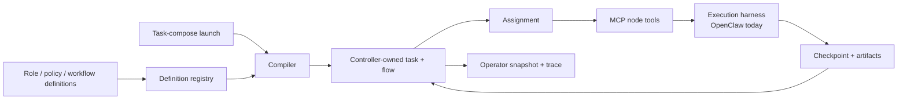

# Orchestration model

AutoClaw is an orchestration tool for delegated AI work. It decides what bounded work should run next, what authority that work has, what evidence it must leave behind, and how the task can be inspected, retried, replanned, or closed.

## What orchestration means

A chat assistant is optimized for conversation. An agent harness is optimized for running an agent loop with tools, sessions, providers, and context. An orchestration tool is optimized for delegated work that must survive more than one turn.

Orchestration answers questions a transcript cannot answer reliably:

- Who owns the current piece of work?
- What is this node allowed to do?
- What evidence must exist before work advances?
- What happens if the assignment fails, blocks, or needs a human?
- How can an operator recover the run without reconstructing hidden model context?

AutoClaw treats a task as a controller-owned workflow run, not as a long chat.

## AutoClaw and OpenClaw

OpenClaw is the harness. AutoClaw is the orchestration tool.

| Dimension | OpenClaw | AutoClaw |
| --- | --- | --- |
| Category | agent harness and assistant runtime | workflow orchestration for delegated work |
| Owns | chat, tools, skills, sessions, channels, provider loop | tasks, flows, assignments, checkpoints, artifacts, recovery |
| User motion | ask the assistant | launch and supervise a structured task |
| State shape | conversation/session state | controller-owned workflow state |
| Best fit | ad hoc help, tool use, personal assistant work | longer work with evidence, review, retry, replan, waits |

OpenClaw executes agent turns. AutoClaw decides which bounded assignment should run and whether the evidence is good enough to advance.

The key separation is orchestration versus harness. AutoClaw should be able to integrate with any capable agent product that can accept a generated assignment prompt, expose the required working tools, and call the AutoClaw runtime tools. OpenClaw is the first adapter because it already provides local sessions, tools, skills, channels, workspace policy, and provider events.

## How AutoClaw works

The sequence is:

1. Author roles, policies, and workflows as reusable definitions.
2. Launch one concrete task with task-compose.
3. Compile the selected workflow and pinned definition revisions into a runtime flow.
4. Open the current assignment for a root, parent, or worker node.
5. Let the harness run the agent turn with the node's prompt and tools.
6. Commit progress through checkpoints, artifacts, boundaries, waits, or structural changes.
7. Inspect and recover the run from controller state and generated task-root files.

## Why the layers exist

AutoClaw separates controller truth, generated files, and prompts on purpose.

| Layer | Owns | Why it exists |
| --- | --- | --- |
| Controller | task, flow, assignment, attempt, dispatch, budgets, waits, replan, release legality | state changes need validation and recovery |
| Files | manifest, assignment, latest checkpoint, artifacts, trace/support refs | humans and agents need stable inspectable projections |
| Prompt | current node mission, allowed tools, current context, legal next moves | the model needs a narrow operational contract |

The controller is the source of truth. Files are the shared workbench. Prompts are dispatch-specific instructions. Keeping those separate lets AutoClaw scale up without turning every agent into a free-form peer with hidden authority.

## MCP boundary

AutoClaw uses MCP tools as the control boundary between harness loop and orchestration runtime.

To the harness, tools such as `record_checkpoint`, `return_boundary`, `assign_child`, `open_human_request`, and `start_command_run` are ordinary callable tools. To AutoClaw, those calls are validated runtime transitions against the current task, session key, dispatch, assignment, attempt, and flow revision.

That design makes the execution loop replaceable. OpenClaw is the current adapter. Other capable harnesses can participate later if they can receive assignments and call the runtime tools correctly.

This is different from building another all-in-one agent framework. AutoClaw adds a real orchestration layer above a harness: the harness runs model/tool loops, while AutoClaw owns assignment legality, evidence, waits, replan, and closure.

## A2A boundary

A2A is complementary, not the internal AutoClaw runtime protocol.

A2A is designed for independent, potentially opaque agents to discover each other, exchange messages and artifacts, and manage collaborative tasks without exposing internal state, memory, or tools. That is useful at external agent boundaries.

AutoClaw's internal lane has a different problem: controller authority. A node is not a free peer agent; it is a bounded runtime actor with a current assignment, dispatch, attempt, budget, and flow revision. AutoClaw therefore uses its own runtime contract through MCP tools internally, while A2A can fit future external delegation to independent remote agents.

## Replan as a product feature

Many graph systems define a graph and execute it. AutoClaw treats replan as a first-class runtime operation: when the current shape cannot honestly complete the task, a parent or root can move through controller-validated structural change and flow revision adoption.

Retry keeps the same assignment shape and opens another attempt. Replan changes the shape.

## Design philosophy

AutoClaw makes a few strong assumptions:

- provider run success is not task success
- transcript memory is useful but not authoritative
- assignments should be bounded
- parent/root nodes route work instead of every agent talking to every other agent
- evidence must be durable enough for another node or operator to inspect
- human waits and long commands are explicit runtime states
- structural change should be revisioned, not improvised in a prompt

The result is less magical than a free-form swarm, deliberately. AutoClaw trades some spontaneity for inspectable delegated work.

## Compared with other systems

| System | Strong at | AutoClaw difference |
| --- | --- | --- |
| LangGraph | low-level durable graph runtime for stateful agents | AutoClaw adds a task-root evidence model and operator-oriented assignment/checkpoint surfaces |
| CrewAI | role-based crews and approachable flow design | AutoClaw emphasizes controller truth, assignment lineage, checkpoint evidence, and recovery |
| AutoGen / AG2 | multi-agent conversation, teams, and selector/group-chat patterns | AutoClaw is tree/runtime/evidence centered rather than conversation centered |
| OpenAI Agents SDK | agent loop, tools, handoffs, guardrails, tracing, sandbox agents | AutoClaw keeps workflow authority and evidence outside one provider SDK |
| A2A | cross-agent interoperability between independent agents | AutoClaw uses MCP internally for controller-validated node operations and can use A2A at external opaque-agent boundaries |
| OpenClaw | local agent harness, tools, skills, sessions, and channels | AutoClaw adds orchestration above OpenClaw instead of replacing the harness |

## Next

- [Core concepts](core-concepts.md)
- [Authoring model](authoring-model.md)
- [Runtime model](runtime-model.md)
- [Design workflows and instructions](../guides/design-workflows-and-instructions.md)
