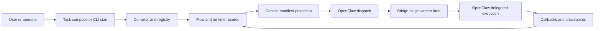

# Current architecture at a glance

Status: Current

Last verified: 2026-04-24

This page gives the shortest safe architectural picture of the current system.

The following diagram shows the current baseline: AutoClaw owns control truth, while OpenClaw handles delegated execution.

Figure: Current AutoClaw flow from launch to delegated execution and callback-based control updates.

## What this diagram is good for

- It shows that compile, runtime truth, and manifests stay inside AutoClaw.
- It shows that delegated execution and plugin/tool use happen on the OpenClaw side.
- It shows the callback loop back into controller-owned records.

## What it does not show

- exact route surfaces
- exact worker-lane lineage fields
- target redesign contracts such as bounded work packages and packetized completion

For those, use the current reference pages or the redesign reference surface.

## Evidence

- inspected code in `autoclaw-main/apps/api/app/services/compiler_service.py`, `autoclaw-main/apps/api/app/runtime/runner.py`, `apps/api/app/runtime/launch/service.py`, `apps/api/app/runtime/control/release.py`, `autoclaw-main/apps/api/app/services/openclaw_bridge.py`, and `autoclaw-main/apps/api/app/integrations/openclaw.py`
- inspected source-pack docs in `../../archive/source-packs/old_version_docs/architecture/01-system-overview.md` and `../../archive/source-packs/old_version_docs/flows/02-default-runtime-lifecycle.md`
- did not execute tests for this page
