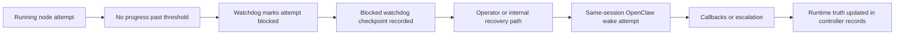

# How the current watchdog and OpenClaw bridge work

Status: Current

Last verified: 2026-04-24

This page explains the current watchdog and delegated recovery model as it exists today.

The following diagram shows the current watchdog path.

Figure: Current watchdog behavior blocks stale attempts, records a checkpoint, and uses same-session OpenClaw wake behavior rather than the redesign's newer recovery ladder.

## Current behavior

- watchdog classification and recovery are still coupled to the current OpenClaw transport
- wake behavior is same-session rather than a generic provider recovery ladder
- runtime truth remains controller-owned even though recovery uses OpenClaw-specific dispatch

## Why this matters

This is one of the key migration boundaries between the current implementation and the target redesign.

For the target model, see `../../redesign/architecture/watchdog-and-recovery-contract.md`.

## Evidence

- inspected code in `autoclaw-main/apps/api/app/runtime/watchdog.py`, `watchdog_queries.py`, `watchdog_service.py`, `autoclaw-main/apps/api/app/services/openclaw_bridge.py`, and `autoclaw-main/apps/api/app/integrations/openclaw.py`
- inspected source-pack docs in `../../archive/source-packs/old_version_docs/architecture/06-openclaw-runtime-bridge.md` and `../../archive/source-packs/old_version_docs/flows/04-approval-and-watchdog.md`
- did not execute tests for this page
