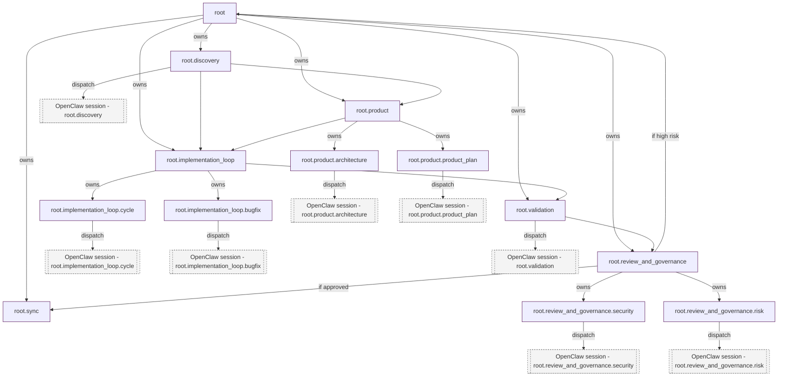

# Flow 06b — Max-Complexity Target (Exact Workflow Reference)

Use this when you need the **full target shape** instead of the compact 06 overview.

It describes the upper-bound control flow we target for phase-6 implementation.
This is a design artifact, not a statement that everything below is already in code.

## Scope and status

- **Scope:** nested loop/subgraph owners, cross-branch joins, review committees, checkpoint-driven replans.
- **Boundary:** only this file defines the target graph semantics; runtime implementation may lag.

## Legend

- **Loop/Subgraph Node**: owns child nodes and manages local control (`can_spawn_children = true`, `can_loop = true`).
- **Leaf Node**: delegated to OpenClaw via `node_sessions` (`leaf = true`).
- **Join / constraint edge**: explicit dependency edge (`flow_edges`) needed when ownership alone is not enough.
- **Review branch**: optional specialist path requiring operator-visible approval.

## Why this shape

The target behavior is:

1. **Root owns operational branches** and acts as the control boundary.
2. **Product and implementation are explicit subgraphs** (not one flat sequence).
3. **Implementation loop iterates** via per-node attempts, not graph rewrites.
4. **Validation** funnels into review/committee or sync path.
5. **Committee outcomes are explicit state transitions**, not implicit interpretation.

## Checkpoint-state map

At each checkpoint, controller evaluates next action:

- `green`: continue to the next dependency slice.
- `retry`: rerun the same leaf path in a new attempt.
- `needs_approval`: pause and await operator decision.
- `blocked`: hold execution for manual intervention.

## Replan entry points in this target

- `root.product` branch can request replan after repeated failed cycles.
- `root.implementation_loop` can request additional branch insertion (tests, contracts, safety checks).
- `root.validation` can request specialist routes.
- Replan can be adopted only through revision proposal + compiler validation.

## Data mapping (target)

- **Ownership structure:** `flow_nodes.parent_node_id`, `node_path`.
- **Execution ordering:** sparse `flow_edges`.
- **Loop semantics:** `node_iterations` / `node_attempts`.
- **Execution history:** per-node checkpoints.
- **Context continuity:** `node_sessions`.

---

For a compact operator summary, use `docs/flows/06-max-complexity-workflow.md`.
