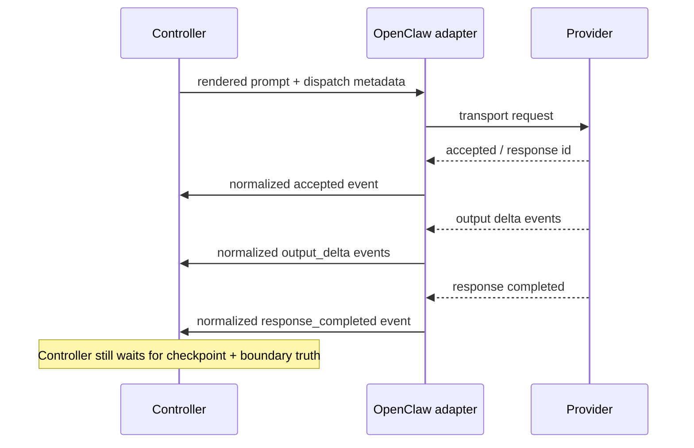

# OpenClaw Worker And Gateway Contract

Status: Target

## Purpose

This page freezes the v1 OpenClaw adapter contract as a transport adapter and provider-event normalization surface, not as canonical runtime truth or the owner of observability projections.

## Need To Lock

1. OpenClaw adapter responsibilities.
2. Normalized provider-event mapping.
3. Transport success versus assignment success.
4. Controller-owned observability projection boundary.
5. Two-MCP surface attachment and trust split.
6. Tool versus plugin or bundle naming split.
7. Removed callback and gate-era vocabulary.
8. Exact Gateway RPC subset and compatibility proof.

## Core Rule

OpenClaw Gateway WS RPC is the canonical v1 machine control path for OpenClaw-backed dispatch, wait, and abort behavior. The controller remains the owner of runtime truth and the writer of dispatch observability projections.

Consequences:

- controller decides dispatch, legality, assignment and attempt lineage, checkpoint recording, release, and recovery action
- controller opens a Gateway run through `agent`, waits through `agent.wait`, and aborts through `sessions.abort`
- the exact handshake and machine-control payload subset lives on
  [OpenClaw Gateway RPC subset](openclaw-gateway-rpc-subset.md)
- OpenClaw sends prompts and reports normalized provider events and optional continuity hints
- provider transport success does not equal assignment success
- HTTP `POST /v1/responses` is compatibility transport only; it is not the canonical controlled-runtime dispatch path

## Adapter Responsibilities

OpenClaw adapter is responsible for:

- creating or targeting the Gateway `sessionKey` used as the durable internal context lane for one execution slot
- opening a fresh Gateway `runId` for each dispatch
- sending controller-generated prompts to the provider
- tracking transport acceptance, response ids, session keys, and continuity hints
- normalizing raw provider events into canonical monitoring enums
- reporting those normalized events to controller-owned observability truth
- preserving raw provider event names only as debug detail
- exposing trusted session context that AutoClaw can validate server-side for callback writes

Implementation-ownership rule:

- the live OpenClaw dispatch, wait, and abort path belongs to runtime-owned
  adapter services under `apps/api/app/runtime/*`
- package, wrapper, setup, onboard, and configure surfaces may install
  config, workspaces, or MCP definitions, but they do not own live dispatch
  semantics

OpenClaw adapter is not responsible for:

- writing `delivery-state.json`, `continuity-state.json`, `watchdog-state.json`, or `provider-events.ndjson` as source-of-truth files
- inventing new runtime boundaries or recovery families
- publishing durable checkpoint truth on its own
- defining parent/root control flow
- reviving `parent_gate` or callback-era decision envelopes
- letting durable session reuse imply live-run reuse

## MCP attachment and packaging boundary

When OpenClaw carries AutoClaw tools, it does so through exactly two canonical
MCP surfaces:

1. `operator MCP`
2. `node MCP`

Rules:

- `operator MCP` is the standard external parity surface
- `node MCP` is private, internal, dispatch-bound, and canonically carried over
  private HTTP or `streamable-http`
- one OpenClaw package or parity wrapper may carry either or both surfaces
- if one package carries both, canon still keeps them as separate trust
  boundaries rather than one mixed shared MCP catalog or session
- config writes alone are not proof of correct attachment
- runtime proof must show that operator-facing profiles or sessions expose only
  `operator MCP` and node-bound execution contexts expose only `node MCP`,
  using `tools.effective` or an equivalent runtime inventory read
- OpenClaw agent/profile attachment belongs to package/bootstrap config, not
  to controller runtime truth
- operator identity also remains external authority, not runtime DB truth

## Callback authorization boundary

If OpenClaw owns `node MCP` execution, callback separation should come from
task-scoped routes plus trusted session context.

Rules:

- AutoClaw should not rely on local subprocess env separation or callback auth files as the canonical v1 proof model
- callback writes should be authorized server-side from trusted OpenClaw session context
- because trusted generic `runId` exposure is not assumed for every tool runtime, v1 uses one `sessionKey` per dispatch as the safety fallback
- prompt-visible context must not carry callback token values, env var names, or auth-file paths
- one dispatch maps to one trusted execution context keyed privately by
  `sessionKey` and correlated by the current `runId`

## Observability Projection Consequence

When controller truth is surfaced as files, the shared ref family is:

```yaml
support_runtime_file_ref:
  kind: delivery_state | continuity_state | watchdog_state | provider_events
  path: string
  description: string
```

Rules:

- these refs are observability-only
- they are legal on observability/operator carriers only
- nodes do not receive them as ordinary manifest, assignment, checkpoint, or prompt context

## Canonical Normalized Event Kinds

Canonical monitoring event kinds are:

- `accepted`
- `first_data`
- `output_delta`
- `tool_event`
- `response_completed`
- `response_failed`
- `transport_timeout`
- `transport_failed`

Raw OpenClaw or provider event names may be preserved only in debug detail such as `provider_event_name`.

## Exact Interpretation Rules

- `accepted` means the provider stream started.
- `first_data` means meaningful provider data arrived.
- `response_completed` means provider transport ended normally.
- `response_failed` means provider transport ended with provider-reported failure.
- none of those prove assignment `green`, `retry`, or `blocked`
- durable assignment meaning still comes from checkpoint and boundary truth

## Recovery And Send-Mode Boundary

- controller recovery actions are `redispatch_same_attempt`, `create_new_attempt`, and `escalate`
- canonical same-attempt recovery opens a fresh Gateway `sessionKey` and a fresh Gateway `runId` on the replacement dispatch
- canonical new-attempt recovery starts a new `sessionKey` and a new `runId`
- any retained provider-native `same_session_continue` optimization is strictly adapter-internal and never the core runtime recovery contract
- `create_new_attempt` always dispatches with `full_prompt`

## Worked Dispatch Through OpenClaw



Concrete implication:

- a `response_completed` provider event may still be followed by controller rejection, retry, or blocked handling if the node never published the required checkpoint and boundary
- operator/public investigation starts from `task_id`; internal support tooling may resolve the relevant dispatch and attempt chronology afterward, but it still does not treat provider completion as assignment result

## Example Normalized Event Line

```yaml
provider_event_record:
  dispatch_id: dispatch.review_findings.02
  attempt_id: attempt.review_findings.02
  event_no: 7
  event_source: provider
  event_kind: response_completed
  provider_event_name: response.completed
  summary: Provider transport ended normally for the current dispatch path.
  observed_at: 2026-05-01T10:15:22Z
```

## Tool Versus Plugin Naming

- `tool` is the canonical core-runtime term
- `MCP surface` is the canonical tool-exposure term
- `plugin` and `bundle` are packaging or parity-wrapper terminology only
- OpenClaw may still be described as a plugin, bundle, or adapter package in
  packaging or parity docs, but that is not the runtime semantic contract
- do not teach one shared mixed MCP catalog or session as the canonical model
- configurable transport or recovery knobs belong in the canonical AutoClaw
  `config.toml` families, not as hardcoded wrapper literals

## Removed From The Live Adapter Model

- `get_worker_context(binding_id)`
- `post_worker_callback(binding_id, node_attempt_id, event)`
- `parent_decision` callback surface
- `replan_request` callback surface
- `parent_gate` return path
- bundle and handoff callback families as the live worker lane

## Related Contracts

- [Runtime boundary and controller loop contract](runtime-boundary-and-controller-loop-contract.md)
- [OpenClaw Gateway RPC subset](openclaw-gateway-rpc-subset.md)
- [Runtime monitoring and watchdog automation](runtime-monitoring-and-watchdog-automation.md)
- [OpenClaw continuity and send modes](openclaw-continuity-and-send-modes.md)
- [Watchdog and recovery contract](watchdog-and-recovery-contract.md)
- [Install and onboard](../how-to/install-and-onboard.md)
- [MCP, plugin, and CLI boundary](../interfaces/mcp-plugin-and-cli-boundary.md)
