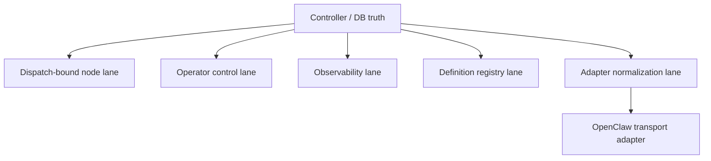

# Provider Worker And Operator Boundary

Status: Target

## Purpose

This page freezes the lane split between controller-owned runtime truth,
dispatch-bound node work, operator-safe control, observability reads,
definition discovery, OpenClaw transport normalization, and the two canonical
MCP tool surfaces.

## Core Rule

The controller owns runtime truth. OpenClaw is the primary v1 transport adapter, not the control plane and not the owner of assignment meaning.

## Canonical Lane Split

## Lane Meanings

### Dispatch-bound node lane

- controller emits `dispatch`
- private `node MCP` lives here
- current node records checkpoints and returns `yield | green | retry | blocked`
- parent/root uses explicit control tools during an open dispatch
- manifest, assignment, checkpoint, and surfaced evidence live here
- observability files do not become ordinary node-visible context
- callback write authority is validated from trusted session context and is not ordinary prompt context

### Operator control lane

- operators inspect and control flow-safe surfaces over controller truth
- standard external `operator MCP` lives here
- operators do not become the current node for an open dispatch
- operator control stays separate from callback and node-mutation lanes
- operator identity stays external and does not become canonical runtime DB truth

### Observability lane

- delivery, continuity, watchdog, and provider-event read models live here
- surfaced refs use the shared `support_runtime_file_ref` family
- those refs are legal on `/observability/...` and selected `/operator/...` carriers only
- `/runtime`, `/callback`, manifest, assignment, checkpoint, and ordinary prompt context do not surface them
- if observability reads are surfaced as tools, they stay on `operator MCP`
- there is no third canonical observability MCP

### Definition registry lane

- role, policy, and workflow definitions live on a separately guarded registry lane
- parent/root structural edits rely on registry reads, not transcript memory

### Adapter normalization lane

- OpenClaw sends controller-rendered prompts to the provider
- OpenClaw reports normalized provider events and continuity hints back to the controller
- the controller, not the adapter, persists dispatch observability truth and writes observability projections
- transport details do not redefine checkpoint truth, runtime boundaries, or recovery-action names

## Tool And Plugin Terminology

- `tool` is the canonical runtime term
- `MCP surface` is the canonical tool-exposure term
- `plugin` and `bundle` are packaging or parity-wrapper terminology only
- use `plugin` or `bundle` for concrete OpenClaw-facing packages or wrappers,
  not for core runtime semantics
- do not model one shared mixed MCP catalog or session over operator-safe and
  dispatch-bound tools
- OpenClaw agent/profile attachment belongs to packaging or bootstrap, not
  to controller runtime truth

## Concrete Lane Examples

| Situation                                                               | Correct lane                                        | Why                                                                    |
| ----------------------------------------------------------------------- | --------------------------------------------------- | ---------------------------------------------------------------------- |
| Parent/root wants to stage work for `implement_fix`                     | dispatch-bound node lane via `assign_child`         | this is dispatch-local runtime mutation                                |
| Reviewer node wants to summarize findings for later parent/root work    | dispatch-bound node lane via checkpoint publication | this is durable later-agent handoff                                    |
| Human operator wants to inspect whether a dispatch is transport-stalled | observability lane over controller truth            | this is delivery/watchdog inspection, not node execution               |
| Human operator wants to pause or cancel a flow safely                   | operator control lane                               | this is operator-safe control, not current-node work                   |
| Parent/root needs to choose a valid role for `add_child`                | definition registry lane                            | role/policy names come from registry reads                             |
| OpenClaw receives raw provider SSE event names                          | adapter normalization lane                          | raw provider detail is normalized before observability tooling uses it |

## Removed From The Live Boundary Model

- delegated callback surface as the worker lane
- operator parity lane naming
- generic skill schema as the runtime lane contract
- plugin-owned truth
- provider-facing planning surface
- gate-era callback or resume paths

## Related Contracts

- [Runtime boundary and controller loop contract](runtime-boundary-and-controller-loop-contract.md)
- [Runtime observability and boundary log](runtime-observability-and-boundary-log.md)
- [Runtime monitoring and watchdog automation](runtime-monitoring-and-watchdog-automation.md)
- [OpenClaw worker and gateway contract](openclaw-worker-and-gateway-contract.md)
- [MCP, plugin, and CLI boundary](../interfaces/mcp-plugin-and-cli-boundary.md)
- [MCP tool reference](../interfaces/plugin-tool-reference.md)
- [Operator definition and role boundary](../interfaces/operator-definition-and-role-boundary.md)
