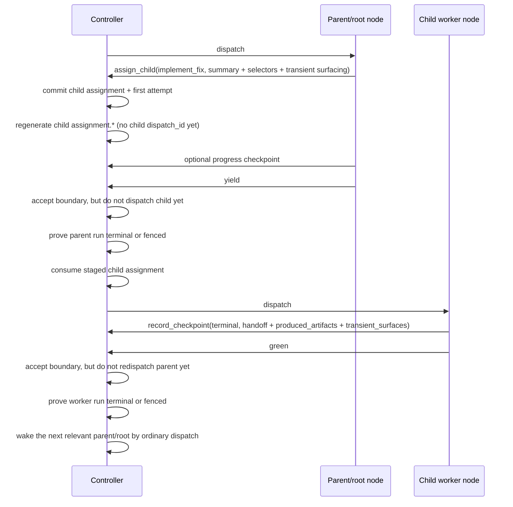

# Runtime boundary and controller loop contract

Status: Target

This page defines the canonical v1 controller loop, public runtime boundaries, parent/root control tools, and the exact split between checkpoints, tool success, and boundary returns.

## Core rule

The controller is the only owner of runtime truth.

It owns:

- current node selection
- assignment and attempt lineage
- structural currentness
- checkpoint recording
- artifact currentness
- dispatch delivery, continuity, and watchdog state
- the dispatch-to-Gateway session/run binding used for controlled execution
- any private callback-write binding used for the current dispatch

Nodes advance runtime truth only through the explicit controller-facing lanes documented here.

## Public boundary model

The only canonical public runtime boundaries in v1 are:

- ingress: `dispatch`
- egress: `yield | green | retry | blocked`

Rules:

- `dispatch` is controller -> node ingress only.
- `dispatch` is a public cross-system boundary, not an internal waiting, staged, continuity, watchdog, or delivery state.
- `yield` is the non-terminal end of a current parent/root dispatch.
- `green | retry | blocked` are terminal attempt outcomes and terminal egress boundaries.
- worker nodes do not use `yield`.
- parent/root do not close with `retry` in v1.

## Exact boundary meanings

| Boundary   | Exact meaning                                                                                                                                                        |
| ---------- | -------------------------------------------------------------------------------------------------------------------------------------------------------------------- |
| `dispatch` | The controller has given one current node a turn now.                                                                                                                |
| `yield`    | A current parent/root dispatch has ended non-terminally and the controller may now consume the one already-committed staged child assignment for that open dispatch. |
| `green`    | The current node attempt completed its current assignment and the required terminal checkpoint and release/publication basis already exist.                          |
| `retry`    | The current node requests another attempt on the same assignment after publishing a terminal retry checkpoint.                                                       |
| `blocked`  | The current node cannot complete the current assignment as assigned and has already published a terminal blocked checkpoint.                                         |

## Parent/root control tool model

During an open parent/root `dispatch`, the only canonical public control tools are:

- `assign_child`
- `add_child`
- `update_child`
- `remove_child`
- `release_green`
- `release_blocked`

Rules:

- tool success mutates controller-owned runtime truth but does not close the current dispatch
- `assign_child` stages a fresh child assignment, commits the child `assignment_key` and first `attempt_id`, and may materialize child `assignment.*`
- the child definition owns the baseline durable assignment contract
- parent/root may add only assignment-local wording, supplemental durable artifact/criteria slot selectors, and explicit transient surfacing
- runtime resolves `consumes` and projects `produces` as requirements only
- successful `assign_child` does not create a child `dispatch_id` and does not create child dispatch-local monitoring projections yet
- `release_green` and root `release_blocked` are terminal-close preconditions only; they are not boundaries and not continuation outcomes
- parent/root must later emit `yield` for non-terminal closure
- parent/root must later emit `green` or `blocked` for terminal closure
- retry is node-self only; parent/root do not issue public child retry, reassignment, or replacement control
- for v1 static `node MCP`, caller supplies `session_key` + `task_id`; the controller resolves the current bound dispatch context from runtime truth rather than from manifest or ack fields

## Checkpoint, tool, and boundary split

The controller-facing lanes are distinct and must not be collapsed:

- `record_checkpoint` durable handoff publication of what happened, what should happen next, which produce slots matter, and which transient files are surfaced
- parent/root control tools dispatch-local runtime mutations
- `yield | green | retry | blocked` public dispatch-closure facts

Rules:

- a checkpoint is not a boundary
- tool success is not a boundary
- a boundary return is not a tool success body
- parent -> child context comes from assignment
- child -> parent and same-node retry context comes from checkpoint plus surfaced refs
- `record_checkpoint` uses `handoff` plus optional reduced durable artifact claims and explicit transient surfaces; `control_effects` is not part of the live checkpoint contract

## One-continuation rule

One open parent/root dispatch may own at most one post-`yield` continuation outcome.

That continuation outcome is exactly:

- one staged child assignment from `assign_child`

Rules:

- checkpoint publication is not a continuation outcome
- tool success is not a continuation outcome
- `release_green` and `release_blocked` are terminal preconditions, not continuation outcomes
- zero staged child assignments makes `yield` illegal
- more than one staged child assignment makes `yield` illegal
- once one staged child assignment exists, no second child assignment may be committed on that same open dispatch
- parent/root may still publish a progress checkpoint if it does not replace or mutate the already-committed staged child assignment

## Boundary matrix

| Caller kind     | Legal non-terminal close                                      | Legal terminal close                                                                                                                          |
| --------------- | ------------------------------------------------------------- | --------------------------------------------------------------------------------------------------------------------------------------------- |
| `root / parent` | `yield` only after exactly one staged child assignment exists | `green` after committed `release_green`; `blocked` after committed root `release_blocked` when that whole-flow blocked close is applicable    |
| `worker`        | none                                                          | `green                                                                                                                     / retry / blocked` |

Parent/root later turns on the same assignment happen by ordinary `redispatch_same_attempt`, not by a parent/root `retry` boundary.

## Boundary precondition and reject split

Use `boundary_precondition_failed` for:

- `yield` without exactly one staged child assignment
- `green` without the required terminal checkpoint or required `release_green` basis
- `retry` without the required terminal retry checkpoint basis
- `blocked` without the required terminal blocked checkpoint basis
- root `blocked` without already committed `release_blocked` when required

Use ordinary legality/currentness failure, not `boundary_precondition_failed`, for:

- attempted parent/root `retry`
- attempting to commit a second child assignment on one open dispatch
- stale dispatch or stale structural/currentness guards

## Controller loop and post-boundary advance

Every mutating controller step uses this exact loop:

1. parse the request or trigger through canonical schema objects
2. reread controller-owned current truth
3. derive a candidate next state without mutating truth in place
4. validate authority, currentness, dependency legality, and evidence basis
5. atomically commit authoritative rows only
6. reread committed truth
7. regenerate required projections from committed truth
8. stop at an owed boundary, emit `dispatch` for the one eligible current node, or wait on recomputed controller state

Short form:

- semantic facts
- controller validates
- runtime truth rows commit
- projections regenerate

Core controller advance actions are:

- `redispatch_same_attempt`
- semantic `create_new_attempt`
- `escalate`

Rules:

- parent/root `yield` with one staged child assignment consumes that staged child assignment and prepares the child's first dispatch
- worker `retry` always maps to semantic `create_new_attempt`
- a later parent/root turn on the same assignment after child work or review progress is ordinary `redispatch_same_attempt`
- transport send mode never renames the controller action family
- v1 keeps at most one open dispatch turn per flow at a time
- many tasks may execute concurrently in v1, but each task flow lineage still keeps one live execution slot at a time
- before a recovery or redispatch opens a new dispatch, the older dispatch must already be closed or superseded in controller truth
- a truthfully recorded failed or ambiguous dispatch row is tolerable; a second live dispatch for the same current execution slot is not
- parent/root same-attempt later turns keep the same durable Gateway `sessionKey` and always open a fresh live Gateway run
- worker retry and new-attempt recovery open a fresh Gateway `sessionKey` and a fresh live Gateway run
- accepted `yield`, `green`, `retry`, or `blocked` is not by itself enough to open the next live run
- the controller must also prove the prior run is inactive:
    - natural terminal completion already confirmed, or
    - explicit abort completed and the prior dispatch is `fenced`
- if the prior run is still live after boundary acceptance, the controller must wait or abort before dispatching the next run
- node/callback write authority must resolve from the supplied v1 `session_key` + `task_id` against runtime currentness truth and must be rejected once that session is no longer current, live, or legal for write commit

## Worked parent -> child sequence

Concrete file effects in that sequence:

- parent/root may reread `_runtime/workflow-manifest.md`
- the committed child attempt may already expose `_runtime/attempts/<attempt_id>/assignment.md` before `yield`
- no child `latest-checkpoint.*` exists until the child records a real checkpoint
- no child dispatch monitoring files exist until the child `dispatch_id` exists

The key high-level safety rule is unchanged: neither the child dispatch nor the later parent/root redispatch may open until the prior live run is naturally terminal or fenced.

## Dispatch preparation rule

The controller prepares a dispatch only when:

- exactly one current node is eligible to run now
- no higher-precedence public boundary must be returned first
- the current assignment and attempt for that node are current and legal
- no pause, stale-currentness, or recovery rule forbids dispatch now

Sibling nodes do not dispatch concurrently in v1.

Parallel-task note:

- sibling nodes inside one task flow do not dispatch concurrently in v1
- different tasks may still dispatch and execute concurrently because each task has separate flow/assignment/attempt/dispatch lineage

## Retry rule

Retry is node-self only.

Rules:

- retry keeps the same assignment
- retry always mints a new attempt
- retry always uses `full_prompt`
- the retrying node rereads the same assignment, the prior terminal checkpoint, and the current surfaced durable and transient refs for that assignment
- retry opens a fresh Gateway session and a fresh live Gateway run

## Structural mutation rule

`add_child`, `update_child`, and `remove_child` act on already-running runtime truth.

Rules:

- runtime CRUD does not invoke the launch compiler
- the runtime validator still owns semantic graph validation, role/policy compatibility, dependency legality, runtime currentness, and evidence/release legality
- candidate-graph dependency legality must be checked before commit
- after successful commit, the runtime materializer/projector regenerates stable projections such as `_runtime/workflow-manifest.*`

## Removed from the live v1 model

This page no longer teaches or owns:

- `parent_gate`
- gate-era boundary subtype families
- `BoundaryAction`
- parent-facing callback decision envelopes
- public child retry control
- public reassignment control
- child replacement control
- manifest/session/ack-field callback naming in the target contract

## Related contracts

- [Glossary and boundaries](glossary-and-boundaries.md)
- [Runtime records and lifecycle](runtime-records-and-lifecycle.md)
- [Runtime database and object contract](runtime-database-and-object-contract.md)
- [Assignment contract](assignment-contract.md)
- [Checkpoint contract](checkpoint-contract.md)
- [Runtime observability and boundary log](runtime-observability-and-boundary-log.md)
- [Worker context contract](worker-context-contract.md)
