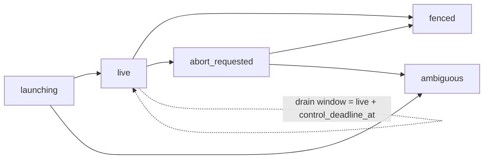

# Runtime Database And Object Contract

Status: Target

This page defines the canonical persisted object families for the v1 runtime as a controller-first relational system.

It freezes:

- controller/DB truth ownership
- the canonical runtime and registry table families
- explicit currentness owners
- the relational workflow tree and dependency graph
- the split between authoritative rows and generated projections
- immutable durable artifact publication plus explicit current pointers
- authoritative dispatch observability rows plus observability-only file projections

It does not freeze:

- raw SQL column types
- physical indexes and table-tuning choices
- ORM class names
- route exposure or public definition-upload response carriers
- prompt assembly or generated prompt-validator behavior

## Controller-first closure

Controller/DB state is the only authoritative runtime truth.

Rules:

- generated files under `_runtime/` and `outputs/artifacts/<owner_node_key>/<slot>/current.json` are controller-derived runtime projections
- durable artifact bodies under `outputs/artifacts/` are published outputs, but their existence and currentness are still governed by controller rows
- prompt renders, operator summaries, examples, tutorials, and raw provider transcripts are downstream read surfaces only
- if raw provider payloads are persisted at all, they are debug/support material attached to controller rows; they are never authoritative rebuild inputs
- `ContextManifest`, if retained temporarily, is implementation-private packaging or debug support only and is outside the canonical runtime truth model

The runtime therefore keeps these roles separate:

- launch-time compiler
  - reads current workflow, role, and policy definitions plus task-start input
  - writes the normalized compiled plan and initial runtime graph only at task start
- runtime validator
  - rereads current authoritative rows
  - validates authority, currentness, compatibility, dependency legality, and budget/recovery rules
- runtime materializer/projector
  - regenerates manifest, assignment, checkpoint, artifact, and observability projections from committed controller truth only

Runtime CRUD does not re-open the launch compiler.

Structured document snapshots may still exist for support and projection efficiency:

- definition/revision rows may retain the exact authored definition body
- `compiled_plans` may retain a normalized-plan structured snapshot
- `flow_revisions` may retain an adopted-graph structured snapshot

Those stored documents remain secondary to the canonical relational runtime model described below.

## Canonical table set

The v1 table constitution is closed to the following families. If a table family is not named here, it is not part of the canonical node-facing runtime truth model.

| Family                         | Canonical meaning                                                                                                           | Concrete table closure                                                                                                                           |
| ------------------------------ | --------------------------------------------------------------------------------------------------------------------------- | ------------------------------------------------------------------------------------------------------------------------------------------------ |
| registry definitions           | current and historical authored definitions                                                                                 | `workflow_definitions`, `workflow_revisions`, `role_definitions`, `role_revisions`, `policy_definitions`, `policy_revisions`                     |
| task/launch support            | task identity and root binding                                                                                              | `tasks`, `workspace_roots`, `context_spaces`, `manifest_roots`, `task_resource_bindings`, `task_composes`                                        |
| compiled plan                  | launch-time normalized plan                                                                                                 | `compiled_plans`, `compiled_plan_nodes`, `compiled_plan_edges`                                                                                    |
| runtime graph                  | active runtime execution object and adopted graph history                                                                   | `flows`, `flow_revisions`, `flow_nodes`, `flow_edges`, `node_plan_revisions`                                                                     |
| execution                      | current mission contracts, execution tries, checkpoint history, consumed/produced refs, and controller ingress/egress turns | `assignments`, `assignment_criteria_refs`, `attempts`, `attempt_checkpoints`, `attempt_consumed_refs`, `attempt_produced_refs`, `dispatch_turns` |
| artifacts                      | durable publication lineage and explicit slot currentness                                                                   | `artifact_publications`, `artifact_current_pointers`                                                                                             |
| dispatch observability/control | normalized provider chronology plus delivery, continuity, and watchdog truth                                                | `provider_event_records`, `dispatch_delivery_states`, `dispatch_continuity_states`, `dispatch_watchdog_states`                                   |
| support/control                | context, node-session authority, workspace-root lease, and budget-counter rows                                             | `context_items`, `node_sessions`, `workspace_root_leases`, `budget_counters`                                                                   |

Compiled-plan normalization note:

- node-owned criteria declarations remain on `compiled_plan_nodes.criteria`
- there is no separate canonical `compiled_plan_criteria_slots` table family
- there is no separate canonical `compiled_plan_artifact_slots` table family
- artifact slot declarations remain node-owned authored contract on `compiled_plan_nodes.produces`
- criteria slot declarations remain node-owned authored contract on `compiled_plan_nodes.criteria`
- artifact slots become first-class runtime truth only when publication/currentness exists through `artifact_publications` and `artifact_current_pointers`

Implementation-name alignment rules:

- `flows` is the concrete table for canonical `RuntimeFlow`
- `flow_revisions` is the concrete table for canonical `StructuralRevision`
- `flow_nodes` is the concrete table for canonical `RuntimeNode`
- `flow_edges` is the concrete table for canonical `RuntimeDependencyEdge`
- `openclaw_dispatches`, if still present during transition, is an implementation-era name for canonical `dispatch_turns` only
- `openclaw_dispatch_events`, if still present during transition, is an implementation-era name for canonical `provider_event_records` only
- exact authored workflow/role/policy bodies may be stored on the relevant definition-revision rows as structured document columns
- `compiled_plans` may store one normalized-plan snapshot/cache beside the canonical relational compiled-plan rows
- `flow_revisions` may store one adopted-graph snapshot/cache beside the canonical relational runtime graph rows
- `flows` should keep active-revision/currentness pointers rather than become the canonical structured-snapshot truth owner

What is explicitly not part of the canonical runtime truth model:

- provider-stream files as authoritative history
- filesystem scan order as a currentness owner
- prompt text as a runtime truth surface
- `ContextManifest` as a public runtime object family
- a generic skill-registry family as live target runtime truth
- a single-table mutable version-column history model for workflow, role, or policy definitions

## Registry definition persistence closure

Workflow, role, and policy registry truth uses split identity tables plus immutable revision tables.

Canonical closure:

- `workflow_definitions`, `role_definitions`, and `policy_definitions` store one stable logical-definition row per key
- `workflow_revisions`, `role_revisions`, and `policy_revisions` store append-only revision history rows
- identity rows own the stable logical key plus the current revision pointer
- revision rows own:
  - `revision_no`
  - immutable authored content snapshot
  - actor/audit fields when recorded
  - recorded and updated timestamps
- a changed guarded upload appends a new revision row and atomically advances the current revision pointer
- concurrent uploads are serialized in DB and may both succeed as distinct revisions
- the current revision pointer advances in DB commit order
- API list, history, and detail reads are projections over this identity-plus-revision-row model

Not canonical:

- one row per definition with a mutable `version` column as the only history model
- in-place overwrite of current definition content
- filesystem import order as a definition currentness owner
- a draft/publish definition state machine

## Runtime currentness closure

The closed v1 currentness model is:

1. one immutable `task_composes` row per task run
2. one active structural revision per flow
3. one current assignment per current runtime node
4. one current attempt per current assignment
5. one latest recorded checkpoint pointer per attempt
6. one explicit current durable artifact pointer per `(owner_node_key, slot)` pair
7. at most one open dispatch turn per flow at a time in v1

### Currentness owner matrix

| Currentness fact                                               | Canonical owner                                                                              |
| -------------------------------------------------------------- | -------------------------------------------------------------------------------------------- |
| active structural revision                                     | `flows.active_flow_revision_id`                                                              |
| current assignment for one current runtime node                | `flow_nodes.current_assignment_id`                                                           |
| current attempt for one current assignment                     | `assignments.current_attempt_id`                                                             |
| latest recorded checkpoint for one attempt                     | `attempts.latest_checkpoint_id`                                                              |
| current durable artifact for one `(owner_node_key, slot)` pair | one mutable `artifact_current_pointers` row keyed by `(owner_node_key, slot)`                |
| current open dispatch turn for one flow                        | `flows.current_open_dispatch_id` or an equivalent explicit one-open-dispatch uniqueness rule |

Rules:

- `TaskCompose` is immutable after launch; it is not a current/superseded family in v1
- `ContextManifest` is not a currentness owner
- there is no transient current-pointer family
- delivery, continuity, watchdog, and provider-event rows do not own assignment, attempt, checkpoint, manifest, or artifact currentness
- generated files are current only because their backing rows are current
- currentness must never be inferred from mtime, lexical filename ordering, prompt renders, raw provider chronology, or session memory

Gateway session/run note:

- if implementation keeps Gateway session/run support rows or fields, those are support/control identities below the core runtime currentness model
- they do not become additional runtime currentness owners beside assignment, attempt, checkpoint, artifact, and dispatch truth

Workspace-root concurrency note:

- default task-root placement is naturally concurrent because each task gets its own task folder
- any custom `workspace.host_path` exclusivity rule is enforced through support/control lease truth, not by filename guessing

## Relational graph closure

The workflow tree and the dependency graph are relational DB structures. Generated manifests render them; manifests do not own them.

### Parent/child tree

Use explicit relational parent pointers:

- launch-time tree:
  - `compiled_plan_nodes.parent_node_key`
- adopted runtime tree:
  - `flow_nodes.parent_flow_node_id`

Rules:

- the parent/child tree is an adjacency relation in DB rows
- every adopted runtime node row belongs to exactly one `flow_revision_id`
- `node_path` and similar display helpers are derived navigation aids only
- generated `_runtime/workflow-manifest.*` renders the adopted relational tree and does not become the authoritative tree model
- structural CRUD updates revision truth atomically through revision rows plus node/edge rows and active-revision currentness; it is not "just update the node table"

### Dependency graph

Use explicit relational edge rows:

- launch-time dependency/control edges:
  - `compiled_plan_edges`
- adopted runtime dependency/control edges:
  - `flow_edges`

Rules:

- dependency legality is validated from edge rows plus node rows
- every adopted runtime edge row belongs to exactly one `flow_revision_id`
- a `flow_edge` may connect only `flow_nodes` in that same `flow_revision_id`
- execution-lineage rows such as `assignments`, `attempts`, `artifact_publications`, `budget_counters`, and `node_sessions` attach to relational runtime ownership through `flow_node_id`, not bare `node_key`
- dependency structure is not canonical when embedded inside JSON payloads, prompt sections, or `ContextManifest`

## Shared surfaced ref families

The runtime uses the shared ref taxonomy frozen by the runtime closure and ref taxonomy locks. Do not collapse all file refs into one generic path object.

```yaml
node_runtime_file_ref:
  kind: manifest | assignment | checkpoint | artifact_index | transient_index
  path: string
  description: string

support_runtime_file_ref:
  kind: delivery_state | continuity_state | watchdog_state | provider_events
  path: string
  description: string

evidence_ref:
  kind: artifact | criteria | doc | wiki | transient
  slot: string | null
  version: integer | null
  path: string
  description: string
```

Rules:

- `node_runtime_file_ref` points at controller-generated runtime projections that may be surfaced in ordinary node-visible carriers
- `support_runtime_file_ref` points at controller-generated observability-only projections
- `support_runtime_file_ref` kinds are legal only on observability/operator carriers; they are not ordinary node-visible runtime context
- `evidence_ref` points at durable evidence/support material or explicit surfaced transient carryover
- `artifact` is the only `evidence_ref` kind that carries `version`
- ordinary surfaced artifact refs stay compact: `slot`, `version`, `path`, `description`
- `owner_node_key` remains persisted in controller truth and storage paths but is not widened into ordinary agent-visible artifact refs

## Projection parity closure

Generated runtime files are DB-derived materializations and nothing else.

| Backing DB truth                                                                                | Generated projection                                              | Existence rule                                                                             |
| ----------------------------------------------------------------------------------------------- | ----------------------------------------------------------------- | ------------------------------------------------------------------------------------------ |
| `tasks` + immutable `task_composes` + active `flows`/`flow_revisions`/`flow_nodes`/`flow_edges` | `_runtime/workflow-manifest.json` and `.md`                       | required after successful launch commit or structural adopt commit                         |
| current `assignments` row for an attempt                                                        | `_runtime/attempts/<attempt_id>/assignment.json` and `.md`        | required once that attempt exists                                                          |
| latest `attempt_checkpoints` row for an attempt                                                 | `_runtime/attempts/<attempt_id>/latest-checkpoint.json` and `.md` | exists only after at least one checkpoint is recorded                                      |
| attempt-local `artifact_publications` history                                                   | `_runtime/attempts/<attempt_id>/artifact-index.json`              | exists when publication history exists; eager empty-file policy is secondary               |
| surfaced transient handoff rows if any                                                          | `_runtime/attempts/<attempt_id>/transient-index.json`             | exists when surfaced transient entries exist; eager empty-file policy is secondary         |
| `artifact_current_pointers`                                                                     | `outputs/artifacts/<owner_node_key>/<slot>/current.json`          | exists only after a current durable publication exists                                     |
| `dispatch_delivery_states`                                                                      | `_runtime/dispatch/<dispatch_id>/delivery-state.json`             | exists only after delivery-state truth exists                                              |
| `dispatch_continuity_states`                                                                    | optional `_runtime/dispatch/<dispatch_id>/continuity-state.json`  | may be materialized as an observability-only projection when continuity-state truth exists |
| `dispatch_watchdog_states`                                                                      | `_runtime/dispatch/<dispatch_id>/watchdog-state.json`             | exists only after watchdog-state truth exists                                              |
| `provider_event_records`                                                                        | `_runtime/dispatch/<dispatch_id>/provider-events.ndjson`          | exists only after normalized provider events exist                                         |

Rules:

- hand-editing a projected file never changes runtime truth
- raw streamed provider dumps are not substitutes for `provider_event_records`
- absent backing rows mean the corresponding projection should stay absent
- public definition-upload response carriers are not runtime projections and are out of scope for this page
- the order is semantic facts -> controller validation -> committed runtime truth rows -> generated projections

## Rebuild-from-authority rule

Rebuild and reconciliation always run from controller/DB truth.

Implementation rule:

1. reread authoritative rows and explicit current pointers
2. determine which projections should exist from those rows
3. regenerate the required projections from those rows
4. leave absent any projection whose backing rows do not exist yet
5. treat unsupported files as stale projections or debug leftovers, not as runtime truth

That means:

- rebuild `_runtime/workflow-manifest.*` from `tasks`, `task_composes`, `flows`, `flow_revisions`, `flow_nodes`, and `flow_edges`
- rebuild `assignment.*` from `assignments`
- rebuild `latest-checkpoint.*` from `attempt_checkpoints`
- rebuild `artifact-index.json` from `artifact_publications`
- rebuild `current.json` from `artifact_current_pointers`
- rebuild dispatch monitoring files from `dispatch_delivery_states`, `dispatch_continuity_states`, `dispatch_watchdog_states`, and `provider_event_records`
- never rebuild runtime truth from old generated files, prompt renders, raw provider dumps, or `ContextManifest`

## Canonical persisted objects

The sections below name the canonical semantic objects and the minimum semantic fields each object family must carry. Field spelling may vary in implementation, but the meaning is fixed.

### `Task`

Top-level task identity and user/business description.

Required semantic fields:

- `task_id`
- `task_key`
- `title`
- `summary`
- `created_at`

### `TaskCompose`

The immutable launch-binding record for one task run.

Required semantic fields:

- `task_id`
- `workflow_key`
- `workflow_revision_no`
- `compiled_plan_id`
- `workspace_root_path`
- `context_root_path`
- `outputs_root_path`
- `runtime_root_path`
- `created_at`

Rules:

- `POST /tasks/start` creates exactly one `TaskCompose` for the task run
- any later root CLI task-compose wrapper is a front door into the same canonical task-start handler
- runtime structural CRUD, retry, redispatch, checkpoint publication, durable publication, and projection rebuild do not mutate or supersede it
- no `TaskCompose` current/superseded family exists in v1

### `NodeSession`

Internal support/control authority row for one trusted node/callback execution context.

Required semantic fields:

- `flow_node_id`
- `dispatch_id`
- `attempt_id`
- `assignment_id`
- `session_key`
- `session_status`
- `opened_at`
- `closed_at` | nullable

Rules:

- one trusted current node/callback authority row exists per live execution context
- this object is internal support/control truth only
- trusted `session_key` resolves the current node/callback authority context server-side
- callback route task scope may remain as external scoping/consistency input, but trusted `session_key` is the primary authority input
- same-attempt parent/root redispatch may keep the same `session_key` while opening a fresh `dispatch_id` and a fresh `runId`
- worker retry, new attempt, and fresh child assignment mint a fresh `session_key`
- prompt-visible runtime context does not surface callback token material or transport-binding secrets
- revocation or closure must happen when the session is no longer live, current, legal for write commit, or bound to the current execution slot

### `WorkspaceRootLease`

Internal support/control lease for a custom workspace host path.

Required semantic fields:

- `normalized_workspace_root_path`
- `task_id`
- `flow_id`
- `lease_status`
- `leased_at`
- `released_at` | nullable

Rules:

- concurrent live tasks must not hold the same live workspace-root lease
- default per-task roots do not require this lease family
- shared `context` roots are outside this lease family because they remain read-mostly source/reference material in v1

### `CompiledPlan`

Launch-time normalized plan produced by the compiler.

Required semantic fields:

- `compiled_plan_id`
- `workflow_key`
- `workflow_revision_no`
- `compiler_version`
- `created_at`

### `CompiledPlanNode`

Normalized launch-time node contract before runtime mutation.

Required semantic fields:

- `compiled_plan_id`
- `node_key`
- `parent_node_key`
- `node_kind`
- `role`
- `role_revision_no`
- `policy`
- `policy_revision_no` | nullable
- `description`
- `consumes`
- `produces`
- `criteria`
- `order_index`

Rules:

- `role` and `policy` are logical keys
- `role_revision_no` and `policy_revision_no` pin the exact registry revisions resolved at launch
- later registry uploads do not mutate an already committed compiled plan node

### `CompiledPlanEdge`

Normalized launch-time dependency relation.

Required semantic fields:

- `compiled_plan_id`
- `consumer_node_key`
- `provider_node_key`
- `kind`
- `slot`
- `description`
- `order_index`

### `RuntimeFlow`

Top-level runtime execution object for one task run.

Required semantic fields:

- `flow_id`
- `task_id`
- `compiled_plan_id`
- `active_flow_revision_id`
- `current_open_dispatch_id` | nullable
- `status`
- `created_at`
- `updated_at`

Closed enum for `RuntimeFlow.status`:

- `pending`
- `running`
- `blocked`
- `paused`
- `succeeded`
- `failed`
- `cancelled`

### `StructuralRevision`

Authoritative runtime graph revision after launch or structural mutation.

Required semantic fields:

- `flow_revision_id`
- `flow_id`
- `revision_no`
- `parent_flow_revision_id` | nullable
- `source_compiled_plan_id`
- `cause` as `launch | add_child | update_child | remove_child`
- `created_by_dispatch_id` | nullable
- `adopted_at`

Rules:

- every structural CRUD commit creates a new structural revision
- if current assignments or current attempts stay alive across adopt, the
  controller rebinds their live `flow_node_id` lineage rows to the adopted
  runtime nodes before post-commit projection regeneration
- that live-lineage rebind includes the current assignment, the current
  attempt, any checkpoints and durable publication/current-pointer rows on that
  current attempt, the current open dispatch when it stays on the same
  assignment, and the current assignment-scoped budget or live node-session
  rows that still describe the adopted runtime node
- the controller adopts the new structural truth before projection regeneration
- old revisions remain auditable

### `RuntimeNode`

Node row for one structural revision.

Required semantic fields:

- `flow_node_id`
- `flow_id`
- `flow_revision_id`
- `parent_flow_node_id` | nullable
- `node_key`
- `node_kind`
- `role`
- `role_revision_no`
- `policy`
- `policy_revision_no` | nullable
- `description`
- `state`
- `current_assignment_id` | nullable

Closed enum for `RuntimeNode.state`:

- `ready`
- `running`
- `waiting`
- `paused`
- `done`
- `failed`
- `superseded`
- `cancelled`

Rules:

- runtime nodes pin the exact role/policy revisions that govern later assignment generation and dispatch teaching for that node
- later registry uploads do not mutate an already committed runtime node
- runtime structural adopt may resolve newer current role/policy revisions for newly added or updated nodes, but it must pin those exact revisions in the adopted runtime truth it commits

### `RuntimeDependencyEdge`

Dependency relation for one structural revision.

Required semantic fields:

- `flow_edge_id`
- `flow_revision_id`
- `consumer_flow_node_id`
- `provider_flow_node_id`
- `kind` as `artifact | criteria`
- `slot`
- `description`

### `Assignment`

Forward-looking mission contract for one node.

Required semantic fields:

- `assignment_id`
- `assignment_key`
- `flow_id`
- `flow_revision_id`
- `flow_node_id`
- `node_key`
- `summary`
- `instruction` | nullable
- `criteria`
- `consumes`
- `produces`
- `transient_refs` | optional
- `task_memory_search_hints` | optional
- `current_attempt_id` | nullable
- `created_at`
- `superseded_at` | nullable

Rules:

- the child definition owns the baseline durable semantics for `criteria`, `consumes`, and `produces`
- parent/root may add only assignment-local wording, supplemental durable artifact/criteria slot selectors, explicit `transient_refs`, and optional search hints
- runtime resolves `consumes` from controller truth after validation
- runtime projects `produces` as requirements only; assignment rows do not invent final durable ref metadata for outputs

Preferred v1 model:

- `Assignment` currentness, not a second mutable status, owns which assignment is live

If an explicit mutable `Assignment.status` remains in v1, freeze it to:

- `staged`
- `dispatchable`
- `running`
- `waiting`
- `succeeded`
- `blocked`
- `superseded`
- `cancelled`

### `Attempt`

One execution try of one assignment.

Required semantic fields:

- `attempt_id`
- `assignment_id`
- `assignment_key`
- `flow_node_id`
- `node_key`
- `retry_of_attempt_id` | nullable
- `status`
- `opened_at`
- `closed_at` | nullable
- `latest_checkpoint_id` | nullable

Closed enum for `Attempt.status`:

- `pending`
- `running`
- `blocked`
- `failed`
- `succeeded`
- `cancelled`
- `aborted`

Rules:

- retry keeps the same assignment and creates a new attempt
- same-attempt redispatch never mutates the attempt id

### `AttemptCheckpoint`

Durable attempt summary used for later parent, root, reviewer, and agent handoff.

Required semantic fields:

- `checkpoint_id`
- `assignment_id`
- `assignment_key`
- `attempt_id`
- `flow_node_id`
- `node_key`
- `checkpoint_kind` as `progress | terminal`
- `outcome` as `green | retry | blocked | null`
- `handoff.summary`
- `handoff.next_step`
- `handoff.blockers` | optional
- `handoff.risks` | optional
- `produced_artifacts` as reduced durable artifact claims (`kind`, `slot`, `path`) | optional
- `artifact_refs` as controller-resolved shared `evidence_ref` values | optional
- `transient_refs` as shared `evidence_ref` values with `kind: transient` | optional
- `task_memory_search_hints` | optional
- `recorded_at`

Rules:

- progress checkpoints keep `outcome: null`
- terminal checkpoints use `green | retry | blocked`
- `yield` is boundary-only and never a checkpoint outcome
- nodes author reduced `produced_artifacts` claims (`kind`, `slot`, `path`) only; they do not author final durable ref metadata
- exact artifact publication truth still comes from `artifact_publications` plus `artifact_current_pointers`
- `control_effects` is not part of the live checkpoint contract

### `DispatchTurn`

One controller -> node ingress turn plus its later closure.

Required semantic fields:

- `dispatch_id`
- `flow_id`
- `flow_revision_id`
- `flow_node_id`
- `node_key`
- `assignment_id`
- `assignment_key`
- `attempt_id`
- `phase`
- `status`
- `control_state`
- `gateway_session_key`
- `gateway_run_id` | nullable
- `control_state_reason` | nullable
- `control_deadline_at` | nullable
- `abort_requested_at` | nullable
- `fenced_at` | nullable
- `ingress_boundary` as `dispatch`
- `closed_by_boundary` as `yield | green | retry | blocked | null`
- `staged_continuation_kind` as `child_assignment | null`
- `opened_at`
- `closed_at` | nullable

Closed enum for `DispatchTurn.phase`:

- `bootstrap`
- `execution`

Closed enum for `DispatchTurn.status`:

- `prepared`
- `accepted`
- `provider_completed`
- `provider_failed`
- `transport_failed`
- `transport_ambiguous`
- `superseded`
- `closed`

Closed enum for `DispatchTurn.control_state`:

- `launching`
- `live`
- `abort_requested`
- `ambiguous`
- `fenced`

Rules:

- callback routes are semantic action lanes only; `DispatchTurn` is the authoritative ingress/egress lineage row
- one open parent/root dispatch may stage at most one continuation outcome
- `status` and `control_state` are different:
  - `status` captures dispatch transport/lifecycle observation
  - `control_state` captures controller-owned launch/abort/fencing truth for safe replacement decisions
- `release_green` and `release_blocked` persist on `release_precondition_*`;
  they are not continuation kinds
- the eventual terminal release turn may also persist exact descendant
  checkpoint and current durable artifact refs on
  `release_precondition_descendant_refs` so historical rereads can explain the
  exact basis that was still current when the release boundary closed
- `gateway_session_key`, if retained, is an optional denormalized support/readback field for the Gateway session associated with this dispatch turn; it is not the canonical authority root
- `gateway_run_id` identifies the one live Gateway run for this dispatch when that run is known
- `launching` means the dispatch exists but live-run confirmation is not yet proven
- `live` means one live run is confirmed for this dispatch
- `abort_requested` means abort was requested but terminal confirmation is still pending
- `ambiguous` means the controller cannot prove whether the run is still live or already dead
- `fenced` means the controller has proved this dispatch can no longer produce live work, so replacement is allowed
- replacement dispatch is illegal while the prior dispatch remains `launching`, `live`, `abort_requested`, or `ambiguous`
- replacement dispatch is legal only when the prior dispatch is `fenced` or stronger terminal truth already proves no live work can continue
- the bounded drain window does not add a second persisted enum in this lock; it is represented as `control_state = live` plus `control_deadline_at` and the foreground drain semantics documented elsewhere



### `ArtifactPublication`

One immutable durable artifact version for one `(owner_node_key, slot)` pair.

Required semantic fields:

- `flow_node_id`
- `owner_node_key`
- `slot`
- `version`
- `path`
- `description`
- `assignment_key`
- `attempt_id`
- `published_at`
- `supersedes_version` | nullable
- `supersedes_path` | nullable

Rules:

- durable outputs live under `outputs/artifacts/<owner_node_key>/<slot>/`
- every successful republish gets a new immutable version
- `version` is the canonical stored machine field
- `vNN` filename/display forms are derived from `version`
- `description` comes from the authored produce-slot meaning only
- `flow_node_id` records the exact relational runtime node that published that immutable version

### `ArtifactCurrentPointer`

Explicit current pointer for one durable `(owner_node_key, slot)` pair.

Required semantic fields:

- `flow_node_id`
- `owner_node_key`
- `slot`
- `current_version`
- `current_path`
- `description`
- `assignment_key`
- `attempt_id`
- `published_at`

Rules:

- exactly one current durable publication exists per `(owner_node_key, slot)` pair
- currentness is an explicit controller mutation
- currentness does not come from mtime, lexical filename ordering, or prompt text
- `current.json` is the authoritative generated currentness projection for that durable pair
- `flow_node_id` on the pointer must match the current publication row it surfaces

### `ProviderEventRecord`

Normalized provider or adapter event for one dispatch path.

Required semantic fields:

- `event_no`
- `dispatch_id`
- `attempt_id`
- `event_source` as `provider | adapter`
- `event_kind` as `accepted | first_data | output_delta | tool_event | response_completed | response_failed | transport_timeout | transport_failed`
- `provider_event_name` | nullable
- `summary`
- `observed_at`
- `provider_occurred_at` | nullable
- `detail` | nullable

Rules:

- raw provider event names may survive only as bounded debug detail
- normalized `event_kind` is the canonical persisted monitoring enum
- raw payload transcripts are not authoritative runtime history

### `DispatchDeliveryState`

Controller-owned support truth for one dispatch path.

This row freezes the exact controller-side field family mirrored into `delivery-state.json`.

- `dispatch_id`
- `attempt_id`
- `assignment_key` | nullable
- `node_key`
- `transport_family`
- `transport_state`
- `controller_observation_state`
- `last_provider_event_kind` | nullable
- `provider_final_status` | nullable
- `provider_error` | nullable
- `send_mode`
- `previous_dispatch_id` | nullable
- `superseded_by_dispatch_id` | nullable
- `prepared_at`
- `accepted_at` | nullable
- `last_provider_signal_at` | nullable
- `last_controller_progress_at` | nullable
- `last_controller_terminal_at` | nullable
- `updated_at`

Example support enum values when retained include:

- `prepared`
- `accepted`
- `provider_signal_seen`
- `provider_completed`
- `provider_failed`
- `transport_failed`
- `transport_ambiguous`
- `superseded`

Rules:

- this row is support truth for observability and recovery, not a new assignment or checkpoint owner
- `delivery-state.json` is an observability projection over this row
- provider terminal success does not imply assignment success
- accepted-boundary waiting is controller-derived from dispatch truth plus inactivity proof;
  current raw `delivery-state.json` projections stay `transport_state: accepted` and
  `controller_observation_state: live` while that wait remains open

Exact readback shape:

```json
{
  "dispatch_id": "dispatch.parent.01",
  "attempt_id": "attempt.parent.01",
  "assignment_key": "parent.assign-01",
  "node_key": "implementation_subtree",
  "transport_family": "openclaw_gateway_ws_rpc",
  "transport_state": "accepted",
  "controller_observation_state": "live",
  "last_provider_event_kind": "output_delta",
  "provider_final_status": null,
  "provider_error": null,
  "send_mode": "full_prompt",
  "previous_dispatch_id": null,
  "superseded_by_dispatch_id": null,
  "prepared_at": "2026-05-03T10:00:00Z",
  "accepted_at": "2026-05-03T10:00:01Z",
  "last_provider_signal_at": "2026-05-03T10:00:12Z",
  "last_controller_progress_at": "2026-05-03T10:00:15Z",
  "last_controller_terminal_at": null,
  "updated_at": "2026-05-03T10:00:15Z"
}
```

### `DispatchContinuityState`

Controller-owned support truth for continuity and transport reuse hints on one dispatch path.

This row freezes the exact controller-side field family mirrored into `continuity-state.json`.

- `dispatch_id`
- `attempt_id`
- `assignment_key` | nullable
- `node_key`
- `continuity_state`
- `previous_response_id` | nullable
- `session_key_present`
- `invalidation_reason` | nullable
- `updated_at`

Example support enum values when retained include:

- `none`
- `candidate`
- `legal_same_session`
- `illegal_same_session`
- `rebound`
- `expired`

Rules:

- this row is support truth only
- `continuity-state.json` is an observability-only projection over this row
- continuity state is distinct from retry lineage
- continuity state does not widen the canonical session/run recovery contract
- `session_key_present` is support-only readback detail and not a second authority owner

Exact readback shape:

```json
{
  "dispatch_id": "dispatch.parent.01",
  "attempt_id": "attempt.parent.01",
  "assignment_key": "parent.assign-01",
  "node_key": "implementation_subtree",
  "continuity_state": "candidate",
  "previous_response_id": "resp_abc123",
  "session_key_present": true,
  "invalidation_reason": null,
  "updated_at": "2026-05-03T10:00:15Z"
}
```

### `DispatchWatchdogState`

Controller-owned support truth for watchdog classification and recovery on one dispatch path.

This row freezes the exact controller-side field family mirrored into `watchdog-state.json`.

- `dispatch_id`
- `attempt_id`
- `assignment_key` | nullable
- `node_key`
- `watchdog_state`
- `current_watchdog_kind` | nullable
- `current_watchdog_reason` | nullable
- `recovery_action` | nullable
- `recovery_reason` | nullable
- `recovery_dispatch_id` | nullable
- `previous_dispatch_id` | nullable
- `superseded_by_dispatch_id` | nullable
- `classified_at`
- `updated_at`

Example support enum values when retained include:

- `clear`
- `blocked`
- `recovery_dispatched`
- `escalated`

Rules:

- this row is support truth only
- `watchdog-state.json` is an observability projection over this row
- same-attempt redispatch and new-attempt retry remain different controller actions
- exact support-state enums here do not define the whole core v1 watchdog state machine

Exact readback shape:

```json
{
  "dispatch_id": "dispatch.parent.01",
  "attempt_id": "attempt.parent.01",
  "assignment_key": "parent.assign-01",
  "node_key": "implementation_subtree",
  "watchdog_state": "clear",
  "current_watchdog_kind": null,
  "current_watchdog_reason": null,
  "recovery_action": null,
  "recovery_reason": null,
  "recovery_dispatch_id": null,
  "previous_dispatch_id": null,
  "superseded_by_dispatch_id": null,
  "classified_at": "2026-05-03T10:00:15Z",
  "updated_at": "2026-05-03T10:00:15Z"
}
```

### `BudgetCounter`

Canonical mutable runtime family for controller-owned remaining budget state.

Required semantic fields:

- `budget_family`
- `scope_kind`
- `flow_id` | null
- `assignment_id` | null
- `attempt_id` | null
- `initial_limit`
- `remaining`
- `updated_at`
- `exhausted_at` | null
- `lock_version`

Rules:

- `child_assignment_limit` is keyed to the caller `assignment_id`
- `retry_limit` is keyed to the current `assignment_id`
- any same-attempt redispatch counter is an internal controller recovery/continuity budget keyed to the current `attempt_id`, not an authored policy field
- rejected or stale mutations do not consume budget

## Removed from the live persisted contract

Do not treat these as canonical authoritative runtime families anymore:

- `ParentGateBoundarySubtype`
- generic `WaitReason` record families
- `BoundarySummary` as the main persisted runtime truth
- `HandoffPacket` as the canonical cross-agent contract
- `ResultRecord` separate from the checkpoint model
- `ReplanRecord` as the canonical structural mutation owner
- `ScopeManifestSnapshot` as a required agent-visible workflow surface
- `WorkerContextSnapshot` as authoritative runtime truth
- `ContextManifest` as a public runtime owner or currentness carrier

## Related contracts

- [Runtime records and lifecycle](runtime-records-and-lifecycle.md)
- [Runtime boundary and controller loop contract](runtime-boundary-and-controller-loop-contract.md)
- [Assignment contract](assignment-contract.md)
- [Checkpoint contract](checkpoint-contract.md)
- [Manifest contract](manifest-contract.md)
- [Worker context contract](worker-context-contract.md)
- [Artifact ref and storage contract](artifact-ref-and-storage-contract.md)
- [Task root layout and generated files](task-root-layout-and-generated-files.md)
