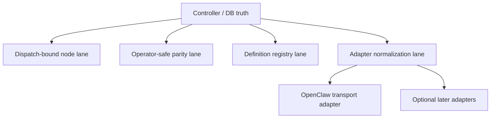

# Runtime lane separation rationale

Status: Target

This page explains why the redesign separates controller truth, node runtime work, operator-safe access, and adapter normalization.

Figure: The v1 split keeps runtime truth, node work, operator parity, registry authority, and provider transport normalization separate.

## Why this split is safer

- nodes get a bounded execution surface based on `dispatch`, checkpoints, boundaries, and explicit parent/root tools
- operators get flow-safe read/control tools without inheriting dispatch-bound node powers
- definition registry reads and writes stay explicitly guarded
- OpenClaw can remain the primary worker adapter without becoming the control plane or truth owner
- transport, continuity, and watchdog projections stay in the monitoring lane instead of leaking into ordinary assignment semantics

## Exact separation to preserve

- controller/DB state owns runtime truth
- generated monitoring files are observability projections only
- `tool` is the canonical runtime term
- `plugin` is adapter-specific terminology only
- worker and parent/root prompts do not expose provider-routing or skill-selection planning surfaces
- provider event names are normalized before they become canonical monitoring enums

## What this split removes

The live v1 model should not drift back to:

- worker callback families as the main runtime lane
- operator plugin surfaces as the owner of runtime truth
- skill-schema framing for the canonical runtime model
- packet/bundle/gate-era completion semantics
