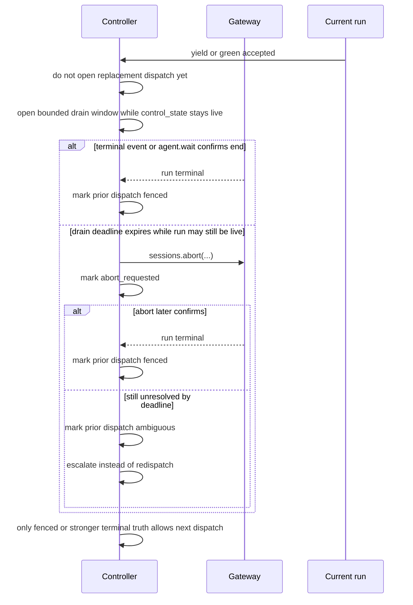

# Runtime lifecycle overview

Status: Reference

This page explains the frozen v1 lifecycle at a high level using the live runtime model from the current redesign.

```mermaid
flowchart LR
    A["Workflow definition + task compose"] --> B["Launch-time compiler"]
    B --> C["Initial runtime graph + active flow revision"]
    C --> D["Controller emits dispatch"]
    D --> E["Current node reads manifest + assignment + latest checkpoint"]
    E --> F["Parent/root uses control tools OR worker does assignment work"]
    F --> G["Node records checkpoint"]
    G --> H["Node returns yield | green | retry | blocked"]
    H --> I["Controller validates, commits, and advances truth"]
    I --> J["Materializer/projector regenerates runtime projections"]
    J --> K["Next dispatch only after prior run is terminal or fenced, or whole-flow completion"]
```

## Core rule

Controller/DB state is the runtime ground truth. Generated manifests, assignments, checkpoints, artifact indexes, and monitoring files are deterministic projections from that truth.

## Lifecycle stages

### 1. Launch

- Current workflow definition, role/policy definitions, and task compose are launch-time input only.
- The launch-time compiler produces the initial compiled plan and runtime graph.
- Compiler is launch-time only. Runtime structural CRUD later does not invoke compiler.

### 2. Dispatch

- The controller emits `dispatch` for exactly one current node.
- `dispatch` is controller -> node ingress only.
- The dispatched node reads the stable visible surfaces:
    - `_runtime/workflow-manifest.*`
    - `_runtime/attempts/<attempt_id>/assignment.*`
    - `_runtime/attempts/<attempt_id>/latest-checkpoint.*`
    - referenced durable artifacts, criteria, and optional transient refs

### 3. In-dispatch work

- Parent/root nodes may use explicit control tools during the open dispatch:
    - `assign_child`
    - `add_child`
    - `update_child`
    - `remove_child`
    - `release_green`
    - `release_blocked`
- Worker/leaf nodes do ordinary assignment work.
- Tool success does not close the dispatch.

### 4. Checkpoint publication

- If the node must tell later parents, reviewers, or retry attempts what happened and what should happen next, it publishes that in checkpoint and referenced files rather than relying on transcript memory.
- Parent -> child context comes from assignment.
- Child -> parent, parent -> parent, and same-node retry context comes from checkpoint.

### 5. Boundary closure

- Public egress boundaries are:
    - `yield`
    - `green`
    - `retry`
    - `blocked`
- `yield` is non-terminal parent/root closure after exactly one continuation outcome is already staged for that open dispatch.
- `green | retry | blocked` are terminal attempt outcomes and terminal egress boundaries for the current node.
- Worker/leaf nodes normally close with `green`, `retry`, or `blocked`, not `yield`.

### 6. Controller advance

- The controller validates authority, currentness, dependency legality, and boundary preconditions.
- Runtime structural CRUD uses:
    - parse
    - validate
    - commit/adopt current truth
    - materialize/project runtime views
- Kahn's topological sort is the dependency legality algorithm for candidate structural graphs.
- Boundary acceptance alone is not enough to open the next live run.
- After accepted `yield`, `green`, `retry`, or `blocked`, the controller still requires the prior run to be naturally terminal or fenced before replacement dispatch is legal.
- Ordinary post-boundary progression is internal controller work once that fencing proof exists; external operator resume is not part of the normal yielded, terminal, or retry lifecycle.

### 7. Regeneration and next step

- After successful structural or control mutation, the runtime materializer/projector regenerates stable projections such as:
    - `_runtime/workflow-manifest.json`
    - `_runtime/workflow-manifest.md`
    - attempt-local assignment/checkpoint/artifact/transient indexes
    - dispatch-local monitoring projections
- If the node ended with `retry`, the controller mints a new attempt on the same assignment and does a full prompt.
- If the node ended with `green` or `blocked`, the controller wakes the next relevant parent/root or terminates the whole flow when legally complete, but only after the prior run is naturally terminal or fenced.
- If the flow is paused, the controller does not advance ordinary boundary progression until operator resume reopens the dispatch from paused truth.
- External `continue` is therefore pause-resume only, not the ordinary path for child handoff, parent wake, or retry redispatch.
- Target pause timing is an async hard stop: pause commits paused truth, write revocation, and abort-owned dispatch control first, then lifecycle fencing or ambiguity resolution completes asynchronously.
- Resume target precedence stays normalized in controller truth:
  - paused after `yield` -> reopen child dispatch
  - paused after `retry` -> reopen retry-attempt dispatch
  - paused during ordinary live attempt -> reopen same-attempt dispatch

## Boundary-to-next-dispatch gate

This is the high-level guardrail: boundary acceptance closes the semantic lane, but run termination or fencing still gates the next live dispatch.

When the flow is not paused and more work is still legal, the controller opens that next dispatch internally after the fencing gate clears. External operator `continue` is reserved for paused-flow resume only.

## Worked file-oriented example

Assume the current node is `review_findings` and the task root is `C:/tasks/task_2026_0042/`.

1. Controller dispatches `review_findings`.
2. The node reads:
    - `C:/tasks/task_2026_0042/_runtime/workflow-manifest.md`
    - `C:/tasks/task_2026_0042/_runtime/attempts/attempt.review_findings.02/assignment.md`
    - `C:/tasks/task_2026_0042/_runtime/attempts/attempt.review_findings.02/latest-checkpoint.md`
3. The node validates against:
    - `C:/tasks/task_2026_0042/context/criteria/review_findings_delivery_criteria.v01.md`
    - `C:/tasks/task_2026_0042/outputs/artifacts/review_findings/findings_report/findings_report.v02.md`
4. The node publishes a terminal checkpoint.
5. The node closes with `green`.
6. Controller commits the result and, if needed, updates:
    - `_runtime/attempts/attempt.review_findings.02/latest-checkpoint.md`
    - `outputs/artifacts/review_findings/findings_report/current.json`
    - `_runtime/dispatch/dispatch.review_findings.02/delivery-state.json`
7. The controller later dispatches the next relevant parent/root internally and that node rereads the stable surfaced files instead of inferring result from provider delivery logs.

## Why this lifecycle is safer

- launch-time compilation and runtime truth are separate
- controller/DB state stays authoritative over generated files
- parent/root decisions use explicit tools rather than callback envelopes
- review and release work use assignment, checkpoint, criteria, and artifact surfaces rather than packet/bundle families
- runtime structural changes are revision-safe validator + commit + materializer/projector work, not hidden recompilation or `parent_gate` advancement

## Removed from the live lifecycle model

The following are not live lifecycle concepts in v1:

- worker or parent decision callback
- parent evidence bundle as the core handoff surface
- `parent_gate`
- packet or bundle completion flow
- public callback-era decision envelopes
