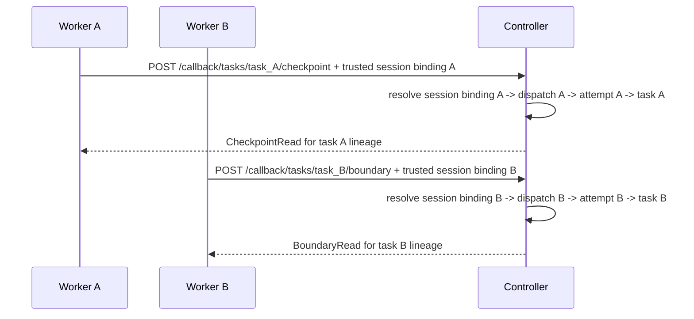

# API Surface And Trust-Lane Map

Status: Target

This page freezes the v1 route families, lane boundaries, and caller model for the redesign interface surface.

It also freezes how the HTTP route families map under the two canonical MCP tool surfaces.

Use this page to answer:

- which canonical prefixes exist
- which caller owns each lane
- which request and response carriers belong to each route family
- which stale-write guards are legal
- which old aliases are removed from the canonical surface

Exhaustive payload shapes live in [api-schema-appendix.md](api-schema-appendix.md).

Exact machine-readable query, filter, sort, and tool-alias definitions live in [api-machine-catalog.yaml](api-machine-catalog.yaml).

## Canonical lane map

The frozen v1 lanes are:

| Lane                  | Canonical prefix | Allowed caller                                            | Primary purpose                                                                |
| --------------------- | ---------------- | --------------------------------------------------------- | ------------------------------------------------------------------------------ |
| definition registry   | `/definitions`   | operator, CLI, trusted automation                         | definition reads and guarded upload writes                                     |
| task start            | `/tasks`         | operator, CLI, trusted automation                         | launch one task run                                                            |
| public runtime        | `/runtime`       | operator, trusted automation                              | task-scoped runtime reads and task control                                     |
| operator read/control | `/operator`      | operator, trusted automation                              | richer operator snapshots and traces                                           |
| callback              | `/callback`      | current dispatched node for the bound execution context   | checkpoint write, boundary return, parent/root tool call over implicit binding |
| observability         | `/observability` | operator, support tooling, optional controller automation | task-scoped delivery, continuity, watchdog, and provider-event inspection      |

Rules:

- `tool` is the canonical runtime term.
- `plugin` is packaging or parity-wrapper terminology only.
- `dispatch` is controller -> node ingress only and remains an internal runtime identifier.
- `record_checkpoint` is the semantic attempt-handoff write lane.
- `yield | green | retry | blocked` are node -> controller boundary returns.
- `DispatchContextRead` is not a canonical live callback operation in v1.
- parent/root mutations remain explicit callback-lane tool calls.
- `support_runtime_file_ref` is the shared family name for observability-only runtime-file refs.
- observability refs and observability-derived read models are legal only on `/operator/...` and `/observability/...` surfaces.
- `task_id` is the stable external runtime identifier on operator/public surfaces.
- `flow_id` and `dispatch_id` remain internal lineage/correlation identifiers unless an implementation documents a private transport binding.
- many `task_id`s may run concurrently in v1.
- callback concurrency is task-scoped in route and binding-scoped in server-side authorization.
- v1 keeps one live execution slot per current flow lineage; it does not dispatch sibling nodes concurrently inside the same task flow.
- operator identity is an external caller fact, not canonical runtime DB truth
- no canonical shared MCP catalog or session may mix operator-safe and dispatch-bound tools

## Shared definition-service split

One controller-owned internal definition service sits behind the public/operator definition and task-start surfaces plus the internal current-only lookup path used by live runtime structural edits.

Surface rules:

- the public/operator surface family collectively exposes search, get current detail, revision history, guarded upload, and task start through `/definitions`, `/tasks/start`, and the Phase 5A `operator MCP` tools, while the root CLI reuses the same service for the local upload/start subset only
- the callback lane does not expose generic registry browsing or revision-history reads
- callback-lane parent/root structural edits submit chosen names and rely on internal current-only lookup plus commit-time validation and revision pinning
- revision history remains an operator/trusted-automation surface and does not become normal live parent/root planning context

## Canonical MCP attachment map

| MCP surface | Bound route families | Trust boundary |
| --- | --- | --- |
| `operator MCP` | Phase 4B: `/runtime`, `/operator`, and any explicitly allowed task-scoped `/observability` reads. Phase 5A adds `/definitions` and `/tasks/start` from the shared definition service to that same surface. | external operator-safe and task-scoped |
| `node MCP` | `/callback` semantic operations plus the internal current-only `role` / `policy` lookup path surfaced for live structural edits | private, internal, and dispatch-bound |

Rules:

- `operator MCP` is the standard external parity surface
- `node MCP` is the private node surface for the currently bound execution context
- `operator MCP` uses external `streamable-http` as the canonical MCP transport
- `node MCP` uses private internal HTTP/`streamable-http` as the canonical MCP
  transport
- observability reads do not create a third canonical MCP surface
- if one OpenClaw package carries both MCP surfaces, canon still treats them as separate tool inventories and separate trust boundaries
- config writes alone are not proof; runtime-effective tool inventory evidence such as `tools.effective` must prove that the two surfaces stay separate

## Canonical route families

### Definition registry

| Method | Route                                                      | Request contract                      | Success response                    |
| ------ | ---------------------------------------------------------- | ------------------------------------- | ----------------------------------- |
| `GET`  | `/definitions/roles`                                       | query `q`, `limit`, `cursor`, `sort`, `allowed_node_kind` | `DefinitionSummaryListResponse`     |
| `GET`  | `/definitions/policies`                                    | query `q`, `limit`, `cursor`, `sort`, `applies_to`       | `DefinitionSummaryListResponse`     |
| `GET`  | `/definitions/workflows`                                   | query `q`, `limit`, `cursor`, `sort`  | `DefinitionSummaryListResponse`     |
| `GET`  | `/definitions/{kind}/{key}`                                | path `kind`, `key`                    | `DefinitionRevisionDetailResponse`  |
| `GET`  | `/definitions/{kind}/{key}/versions`                       | path `kind`, `key`; query `limit`, `cursor`, `sort` | `DefinitionRevisionHistoryResponse` |
| `POST` | `/definitions`                                             | `DefinitionUploadRequest`             | `DefinitionRevisionDetailResponse`  |

Definition-registry rules:

- these routes are the operator/public search/get/history/upload surface over the shared internal definition service
- `/definitions/{kind}/{key}/versions` is revision-history read for operator, audit, provenance, and trusted automation investigation
- callback/node lanes do not gain generic definition search/detail/history routes from this family

### Task start

| Method | Route          | Request contract   | Success response    |
| ------ | -------------- | ------------------ | ------------------- |
| `POST` | `/tasks/start` | `TaskStartRequest` | `TaskStartResponse` |

Task-start rules:

- `/tasks/start` reuses the same shared definition service current-truth resolution as the definition routes
- task start remains an operator/public surface and, when mirrored through MCP, stays on `operator MCP`

### Public runtime

| Method | Route                               | Request contract                         | Success response                 |
| ------ | ----------------------------------- | ---------------------------------------- | -------------------------------- |
| `GET`  | `/runtime/tasks`                    | query `q`, `limit`, `cursor`, `sort`, `status` | `RuntimeFlowSummaryListResponse` |
| `GET`  | `/runtime/tasks/{task_id}`          | path `task_id`                           | `RuntimeFlowRead`                |
| `POST` | `/runtime/tasks/{task_id}/continue` | query `expected_active_flow_revision_id` | `RuntimeFlowRead`                |
| `POST` | `/runtime/tasks/{task_id}/pause`    | query `expected_active_flow_revision_id` | `RuntimeFlowPauseResponse`       |
| `POST` | `/runtime/tasks/{task_id}/cancel`   | query `expected_active_flow_revision_id` | `RuntimeFlowRead`                |

Public runtime rules:

- public runtime routes are task-scoped externally even when runtime lineage keeps an internal flow object
- they do not expose dispatch-local steering, callback envelopes, internal dispatch identifiers, or observability-only refs as ordinary runtime context
- when mirrored through MCP, they belong to `operator MCP`

### Operator read/control

| Method | Route                                | Request contract                           | Success response               |
| ------ | ------------------------------------ | ------------------------------------------ | ------------------------------ |
| `GET`  | `/operator/tasks/{task_id}/snapshot` | path `task_id`                             | `OperatorFlowSnapshotResponse` |
| `GET`  | `/operator/tasks/{task_id}/trace`    | query `scope`, `q`, `limit`, `cursor`, `sort` | `OperatorFlowTraceResponse`    |

Operator rules:

- `/operator/...` may surface `operator_support_surface_ref`
- `/operator/...` may surface observability-derived `delivery_status` and advisory `suggested_action`
- those fields do not widen `/runtime/...` or `/callback/...`
- when exposed through MCP, these reads stay on `operator MCP`

### Callback

The callback lane exists so the currently running node can publish a checkpoint, return a boundary, or call a legal parent/root tool.

This lane is the canonical private HTTP/`streamable-http` binding example for `node MCP`.

In v1, callback is write-only, task-scoped, and binding-scoped:

- the caller targets one `task_id` in the route
- the controller/runtime resolves the bound current execution context privately from trusted OpenClaw session binding
- one live callback authority exists per dispatch
- stale, superseded, aborted, cancelled, or fenced callback authority must be rejected
- callback authority is transport/runtime-private and not part of prompt-visible semantic context
- route task scope separates task A from task B
- trusted session binding separates current live authority from stale authority inside one task

Canonical semantic operations:

| Semantic operation  | Internal adapter-binding example              | Request contract  | Success response    |
| ------------------- | --------------------------------------------- | ----------------- | ------------------- |
| `record_checkpoint` | `POST /callback/tasks/{task_id}/checkpoint`   | `CheckpointWrite` | `CheckpointRead`    |
| `return_boundary`   | `POST /callback/tasks/{task_id}/boundary`     | `BoundaryWrite`   | `BoundaryRead`      |
| `call_parent_tool`  | `POST /callback/tasks/{task_id}/tools/{tool}` | `ParentToolCall`  | `ParentToolSuccess` |

Callback-lane rules:

- callback routes are semantic action lanes only
- callback routes are write-only in v1
- callback payloads may carry semantic runtime content only
- `record_checkpoint` writes summary/next-step handoff plus optional explicit `transient_surfaces`; controller-managed checkpoint refs and surfaced durable rereads come back through read projections
- callback payloads do not expose:
  - `manifest_id`
  - `manifest_hash`
  - `node_session_key`
  - `ack_checkpoint_id`
- callback routes are not a worker-event bus, callback binding envelope, or generic transport tunnel
- caller identity is implicit from trusted session binding plus the bound current execution context
- canonical node-facing semantics do not require caller-visible `dispatch_id`
- if an implementation retains `dispatch_id` in transport, that is an internal adapter-binding detail only
- callback routes do not act as context-discovery helpers; workers read surfaced filesystem projections instead
- callback routes do not expose generic definition search/detail/history reads; parent/root structural edits rely on surfaced current names plus internal current-only lookup at commit time
- `tool_name` is limited to:
  - `assign_child`
  - `add_child`
  - `update_child`
  - `remove_child`
  - `release_green`
  - `release_blocked`

Concurrent callback resolution example:

Figure: multiple tasks may callback concurrently because route task scope separates task lineage and trusted session binding separates live vs stale authority within that task.

### Observability

These routes exist for operator investigation and watchdog inspection over controller-owned truth and derived projections.

| Method | Route                                             | Request contract | Success response       |
| ------ | ------------------------------------------------- | ---------------- | ---------------------- |
| `GET`  | `/observability/tasks/{task_id}/delivery-state`   | path `task_id`   | `delivery_state_ref`   |
| `GET`  | `/observability/tasks/{task_id}/continuity-state` | path `task_id`   | `continuity_state_ref` |
| `GET`  | `/observability/tasks/{task_id}/watchdog-state`   | path `task_id`   | `watchdog_state_ref`   |
| `GET`  | `/observability/tasks/{task_id}/provider-events`  | path `task_id`   | `provider_events_ref`  |

Observability rules:

- delivery, continuity, watchdog, and provider-event refs remain observability-only
- the frozen support-state readback family is `delivery-state.json`,
  `continuity-state.json`, `watchdog-state.json`, and
  `provider-events.ndjson`; all four remain support-only derived projections
- generated files under `_runtime/dispatch/<dispatch_id>/...` are derived projections, not callback-lane context
- public/operator callers use `task_id`; runtime resolves any internal dispatch chronology privately
- watchdog inspection is read-only on observability surfaces
- watchdog recovery is internal controller behavior, not a callback-lane action or canonical API control path
- if observability reads are surfaced as tools, they attach to `operator MCP`

## Canonical write guards

Use these stale-write guards in v1:

- `expected_active_flow_revision_id` for `/runtime/tasks/{task_id}/continue`, `/pause`, and `/cancel`
- `expected_structural_revision_id` on callback-lane parent/root tool calls

Rules:

- these are controller-minted echo facts
- guarded definition upload uses DB serialization and append-only revision history rather than a caller-supplied stale-write token
- callback and observability transports may privately bind internal dispatch identifiers, but callers do not submit them in the canonical v1 semantics
- callers do not invent `caller`, `assignment_key`, `attempt_id`, `manifest_id`, `manifest_hash`, `node_session_key`, or ad hoc `expected_*` families

## Carrier placement rules

- `CheckpointRead`, `BoundaryRead`, and `ParentToolSuccess` stay free of callback binding fields.
- `support_runtime_file_ref` aliases such as `delivery_state_ref`,
  `continuity_state_ref`, `watchdog_state_ref`, and `provider_events_ref`
  are the frozen support-state family and are legal only on
  `/operator/...` and `/observability/...`.
- `/runtime/...`, `TaskStartResponse`, and callback carriers do not surface observability-only refs.

## Removed canonical aliases

The following are not canonical live v1 route names:

- `/registry/*`
- `/flows/*`
- `/tasks/composes/start`
- `/runtime/flows/*`
- `/operator/flows/*`
- dispatch-keyed callback route families
- dispatch-keyed observability route families
- `/internal/runtime/dispatches/*`
- `/internal/support/dispatches/*`
- `/support/*`
- `/internal/flows/*`
- worker-bundle route families
- one shared mixed MCP catalog or session over operator-safe and dispatch-bound
  tools
- context-manifest acknowledgement route families
- callback binding create/write families that depend on `manifest_id`, `manifest_hash`, `node_session_key`, or `ack_checkpoint_id`

If implementation retains any of those paths during migration, they are controller-private compatibility only.

## Related contracts

- [MCP, plugin, and CLI boundary](mcp-plugin-and-cli-boundary.md)
- [API schema appendix](api-schema-appendix.md)
- [Definition registry and upload contract](definition-registry-and-upload-contract.md)
- [MCP tool reference](plugin-tool-reference.md)
- [Human and operator control surface](human-and-operator-control-surface.md)
