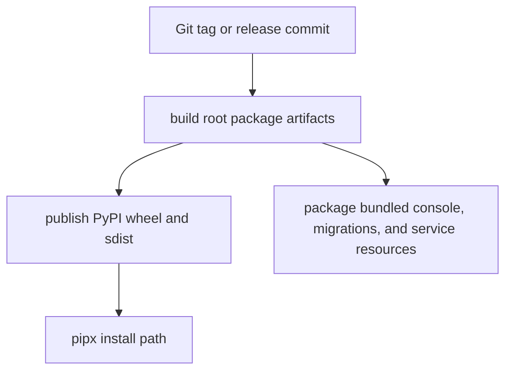

# Release and install strategy

Status: Target

This page defines the frozen v1 install and release posture.

## Firm v1 commitment

The only normative v1 install path is:

1. publish root package artifacts to PyPI
2. install with `pipx`

The root package remains the canonical release artifact.

## Canonical local install stories

### Default local lane

```bash
pipx install autoclaw
autoclaw init
autoclaw doctor
autoclaw serve
```

### Canonical Postgres lane

```bash
pipx install "autoclaw[postgres]"
autoclaw init
autoclaw doctor
autoclaw serve
```

Use the Postgres extra together with the Postgres runtime guidance from [../how-to/use-postgres.md](../how-to/use-postgres.md).

## Release architecture



Figure: v1 release truth is the packaged root Python distribution plus bundled runtime resources needed by the supported install path.

## Support matrix boundary

Shipped v1 support includes:

- PyPI wheel and sdist
- `pipx install autoclaw`
- `pipx install "autoclaw[postgres]"`
- SQLite local-first smoke lane
- Postgres plus Docker strong verification lane

See [distribution-and-database-support-matrix.md](distribution-and-database-support-matrix.md) for the frozen support matrix.

## Future or non-canonical lanes

These are future or non-canonical in this docs freeze:

- standalone binaries
- npm shim package
- Homebrew or other convenience installer

They must not be taught as supported v1 install paths until they gain explicit support and tests.

## Release rule

Publish only from the canonical root packaging surface.

Convenience channels, if added later, must wrap the canonical release artifacts rather than becoming the source of truth.

## Related contracts

- [CLI, API, and package shape](cli-api-and-package-shape.md)
- [CLI surface and operator workflows](cli-surface-and-operator-workflows.md)
- [Distribution and database support matrix](distribution-and-database-support-matrix.md)
- [Testing and release checklist](testing-and-release-checklist.md)
