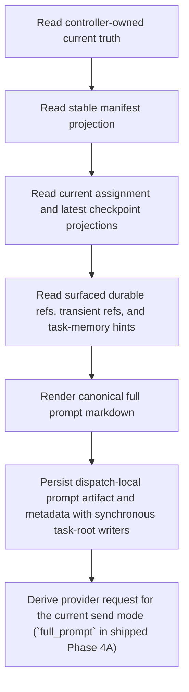

# Prompt Render And Persistence

Status: Target

This page defines prompt rendering flow and persistence for the frozen v1 contract.

## Render Flow



## Render Rule

The renderer always rebuilds the full canonical prompt from current projections. It loads exact static wording from app-owned packaged text assets under `apps/api/app/runtime/prompt/assets/` and treats the prompt-pack docs as mirrors, not as the shipped runtime source.

It does not:

- patch an older rendered prompt in place
- depend on flow/scope manifest splits
- depend on writable-root rules
- treat monitoring files as the prompt's normal source of truth
- rely on a queued refresh path to make the dispatch-local prompt artifact current after commit

## Persisted Dispatch Prompt Record

Every dispatch should persist enough metadata to reconstruct what was rendered for that dispatch.

Minimum persisted fields:

- `dispatch_id`
- `node_key`
- `attempt_id`
- `assignment_key`
- `prompt_name`
- `rendered_markdown`
- `content_hash`
- `rendered_at`

Implementation may persist more metadata, but the rendered prompt artifact must remain reconstructible from canonical runtime projections.

Example:

```yaml
persisted_dispatch_prompt:
  dispatch_id: dispatch.implement_fix.11
  node_key: implement_fix
  attempt_id: attempt.implement_fix.11
  assignment_key: implement_fix.assign-03
  prompt_name: worker_dispatch_prompt
  rendered_markdown_path: C:/tasks/task_2026_0042/_runtime/dispatch/dispatch.implement_fix.11/prompt.md
  content_hash: sha256:9a3d...
  rendered_at: 2026-05-01T12:40:11Z
```

## Current Full-Prompt Behavior And Reserved Continuity Shape

Rules:

- shipped Phase 4A dispatch control emits `full_prompt` for every live dispatch
- `full_prompt` sends the full prompt package inline:
  - static provider-side `instructions`
  - plus dynamic rendered `input`
- persisted prompt artifacts still keep the whole full prompt body for every
  dispatch, including any current compatibility/send-mode debt the code still
  persists today.
- send mode differences must not redefine section meaning or runtime truth.

Current code still reserves `same_session_continue` plus
`previous_response_id`, but canonical parent/root same-session redispatch
still uses `full_prompt` and a full regenerated resend on the Gateway `agent`
path. `same_session_continue` must not be described as the live canonical
redispatch transport.

The persisted `prompt.md` artifact still contains the full canonical prompt, not only the reduced wrapper. The sibling `prompt-request.json` artifact is the send-mode-specific transport request envelope for that same dispatch; it does not replace `prompt.md` as the full canonical prompt readback.

The v1 static `node MCP` bridge may surface `task_id` and `session_key` in the
dispatch-local prompt body and dispatch-local prompt-request documentation, but
those values must not be promoted into stable `_runtime` projections such as
manifest, assignment, or checkpoint files.

## Exact Prompt Readback Routes

Use these pages when you need the concrete prompt body, not only the persistence rules:

- shipped exact asset registry: `apps/api/app/runtime/prompt/assets/`
- exact shared system/provider blocks: [prompt-pack/system-and-provider-block.md](prompt-pack/system-and-provider-block.md)
- exact worker/parent legality blocks: [prompt-pack/runtime-rule-blocks.md](prompt-pack/runtime-rule-blocks.md)
- exact rendered worker and parent/root prompt bodies: [generated/rendered-examples.md](generated/rendered-examples.md)
- exact generated section inventory: [generated/inventory.md](generated/inventory.md)

Use this page when the question is "what gets persisted and how transport-request shape may differ from the full prompt artifact?"

## Path-Only Surfaced Ref Rule

All surfaced refs rendered into the prompt are path-only in v1.

Runtime must localize any external resource into the task root before surfacing it to the prompt.
Imported external files should surface from `tmp/transfers/localized/` under the task root rather than from a host-bound `context/` path.

Ordinary prompt rendering should keep surfaced refs compact:

- artifact refs: `slot`, `version`, `path`, `description`
- other durable refs: kind/slot when relevant, `path`, `description`
- transient refs: `path`, `description`

Good render:

```text
- slot: verification_report
- version: 2
- path: C:/tasks/task_2026_0042/outputs/artifacts/implement_fix/verification_report/verification_report.v02.md
- description: scoped verification evidence for the current fix assignment
```

## Monitoring Rule

`_runtime/dispatch/<dispatch_id>/delivery-state.json`, `continuity-state.json`, `watchdog-state.json`, and `provider-events.ndjson` are not normal prompt sources.

They may be surfaced only when:

- an incident handoff explicitly requires them
- a failure/debug flow intentionally sends the next agent there

Even then, they remain observability projections over controller/DB truth.

When `delivery-state.json` is present, treat it as a raw delivery/transport rollup for observability. It must not become a Phase 2 prompt-layer carrier for parent/root boundary-wait interpretation or controller control-state meaning.

Ordinary node-facing prompt sections do not render internal route ids such as `dispatch_id`.

## Validation Adjacency

Render/persistence rules must remain compatible with:

- [prompt-pack/validation-and-reject-blocks.md](prompt-pack/validation-and-reject-blocks.md) for exact prompt-layer reject wording examples
- [../architecture/runtime-boundary-and-controller-loop-contract.md](../architecture/runtime-boundary-and-controller-loop-contract.md) for exact closure legality
- [../interfaces/api-schema-appendix.md](../interfaces/api-schema-appendix.md) for exact checkpoint, boundary, and error payload carriers

This page does not own the reject envelope. If a resend or boundary attempt is rejected, the exact machine reject shape is owned by the API/validation docs, not by the transport wrapper.

## Removed From The Live Render Model

- flow manifest + scope manifest dual regeneration
- flow brief and scope brief regeneration as prompt dependencies
- wrapper-owned legality semantics
- current prompt truth derived from provider/session state

## Related Contracts

- [Prompt contract](contract.md)
- [Prompt source and sections](source-and-sections.md)
- [OpenClaw continuity and send modes](../architecture/openclaw-continuity-and-send-modes.md)
