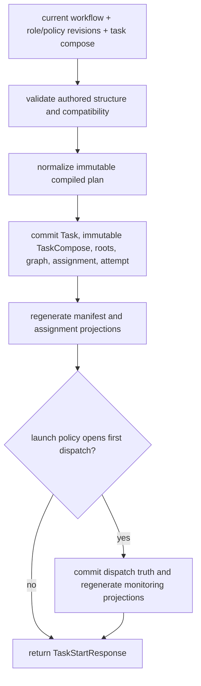

# Compiler contract and launch materialization

Status: Target

This page defines the launch-time compiler contract and the exact split between launch compilation and post-launch runtime mutation.

## Core rule

The compiler owns deterministic workflow normalization from:

- current workflow definitions
- current role and policy definitions

into:

- one validated normalized plan preview

At `POST /tasks/start`, the controller uses that same resolution law plus the task-compose launch input to create:

- one persisted compiled plan
- one deterministic initial runtime graph materialization
- one first generated current assignment for the root/current node

The compiler is launch-time only. Runtime structural CRUD does not invoke the compiler. Guarded definition upload, task start, and runtime structural adopt share one internal validation law, but only task start and runtime structural adopt commit runtime truth.

Internal validator placement rule:

- validation is internal only
- it is not a public API or plugin surface
- guarded definition upload uses it before current registry truth moves
- task start uses it before launch materialization commits
- runtime structural adopt uses it before a new structural revision is committed
- validation therefore does not live only "after compile" inside runtime execution

## `NormalizedCompiledPlanContract`

`normalized_plan` must include:

- `workflow_key`
- `definition_revision_no`
- `compiler_version`
- normalized authored nodes
- normalized dependency edges

Each normalized node must include:

- `node_key`
- `parent_node_key`
- structural node kind
- `role`
- `role_revision_no`
- `policy`
- `policy_revision_no | null`
- normalized `consumes`
- normalized `produces`
- normalized `criteria`
- normalized `child_defaults`

### Concrete normalized node fragment

```yaml
normalized_node:
  node_key: implement_change
  parent_node_key: implementation_subtree
  structural_kind: worker
  role: engineer
  role_revision_no: 4
  policy: standard-worker
  policy_revision_no: 2
  consumes:
    artifacts:
      - slot: findings_report
        required: true
  produces:
    artifacts:
      - slot: change_patch
        description: Patch for the scoped change.
        file_hint: change_patch.diff
      - slot: verification_report
        description: Verification evidence for the scoped change.
        file_hint: verification_report.md
  criteria:
    - slot: implement_change_delivery_criteria
      description: Delivery criteria for the implementation step.
```

The normalized plan is still authored-contract-derived. It is not yet a live assignment or live checkpoint surface.

Pinned-definition rule:

- the compiled plan pins the exact workflow revision used at launch
- every compiled plan node pins the exact role revision and policy revision used for that node
- later registry uploads do not mutate an already committed compiled plan

## Launch materialization sequence

Internal launch and materialization occur in this exact order:

1. parse `TaskStartRequest`
2. resolve the current workflow revision for `workflow.key`
3. resolve required role and policy definitions from the registry
4. validate workflow, role/policy compatibility, and task compose
5. normalize the authored workflow into one immutable compiled plan with pinned workflow, role, and policy revision numbers
6. atomically commit:
   - `Task`
   - one immutable `TaskCompose`
   - bound task roots
   - the initial active structural revision and runtime graph
   - the first generated current assignment
   - the first current attempt
7. reread committed truth
8. materialize stable `_runtime/workflow-manifest.json` and `_runtime/workflow-manifest.md`
9. materialize `_runtime/attempts/<attempt_id>/assignment.json` and `_runtime/attempts/<attempt_id>/assignment.md`
10. materialize eager empty attempt-local indexes only if the implementation keeps them; do not fabricate `latest-checkpoint.*`
11. if launch policy opens the first dispatch synchronously:
   - create the dispatch in `launching`
   - move it to `live` only after run creation is confirmed
   - commit that `dispatch_id` truth
   - only then materialize dispatch-local monitoring projections
12. return `TaskStartResponse`

The launch compiler stops at committed launch truth plus projections backed by that truth. Later runtime mutation uses validator + commit/adopt + materializer/projector.



Figure: launch commits authoritative rows first, regenerates only record-backed projections second, and opens the first dispatch only when policy chooses to do so.

## `TaskCompose` launch binding

`TaskCompose` is the launch-binding record for one task run.

V1 rules:

- `POST /tasks/start` creates exactly one `TaskCompose`
- that record binds workflow revision, compiled-plan identity, and root placement for that task run
- `TaskCompose` is immutable after start
- runtime structural CRUD, checkpoint writes, retry, redispatch, monitoring updates, durable publication, and projection rebuild do not mutate, replace, or supersede it
- no `TaskCompose` current/superseded family exists in v1

## Task-start contract summary

Successful `POST /tasks/start` returns `TaskStartResponse` with:

- `task_id`
- `compiled_plan_id`
- `active_flow_revision_id`
- `flow_status`
- `workflow_manifest_ref`

Additional rules:

- task-root placement is derived from `workflow_manifest_ref.path`; it is not a separate response field
- no public `dispatch_id` field appears in `TaskStartResponse`, even when launch opens the first dispatch synchronously
- operator/public follow-up reads should key by `task_id`; `flow_id` remains internal runtime lineage unless another owner freezes public exposure later
- if launch does not open the first dispatch before returning, the response is still valid as long as the launch-binding commit and initial assignment surfaces already exist
- the initial attempt may already have `assignment.*` while `latest-checkpoint.*` is still absent

## First/root assignment generation

Launch creates the first/root assignment through runtime/system assembly, not authored parent staging.

Generation inputs are:

- task-wide identity from task compose
- launch-selected current node purpose and node-definition semantics
- resolved role description and optional role instruction from the pinned role revision
- resolved policy description and optional policy instruction from the pinned policy revision

Rules:

- workflow YAML does not contain an `initial_assignment`
- launch-generated root `summary` and `instruction` are normal assignment fields
- the first assignment is the same contract family later nodes read under `_runtime/attempts/<attempt_id>/assignment.*`
- later `assignment_intent` belongs only to parent/root -> child staging
- later registry uploads do not change the role/policy basis already pinned into this launched task

Do not teach launch as "advance until the next boundary summary." The live public boundary model remains:

- `dispatch` ingress
- `yield | green | retry | blocked` egress

## Validation boundary

Preview and start share the same workflow, role/policy, and dependency-legality resolution law. Task-compose compatibility is validated only at `POST /tasks/start`.

Validation must fail before runtime launch when:

- authored workflow structure is illegal
- node ids are duplicated
- artifact or criteria slots are duplicated within their kind
- authored consume selectors do not resolve to legal producer slots
- the authored dependency graph is cyclic
- `root.consumes` appears in the payload
- role/policy compatibility is invalid
- forbidden authored fields such as `edges`, `inputs`, handoff families, or provider-selection fields appear in the payload
- task-compose launch input fails normalization

## Post-launch split

After launch:

- the validator owns semantic graph checks, runtime currentness, and evidence legality
- commit/adopt owns authoritative controller truth change
- the materializer/projector regenerates `_runtime/workflow-manifest.*`, assignment/checkpoint projections, artifact projections, and monitoring projections only from committed truth
- structural adopt commits first and regenerates second
- generated projections do not own currentness
- launch/start/adopt must not fabricate:
  - `latest-checkpoint.*` before a real checkpoint row exists
  - dispatch-local monitoring projections before a real `dispatch_id` and its backing rows exist

Runtime structural edits, assignment staging, and release decisions therefore belong to runtime control, not compiler reuse.

## What the compiler does not own

After launch, the compiler does **not** own:

- `assign_child`
- `add_child`, `update_child`, or `remove_child`
- `release_green` or `release_blocked`
- checkpoint recording
- boundary validation for `yield | green | retry | blocked`
- artifact republishing and current-pointer advancement

## Related contracts

- [Workflow definition schema](workflow-definition-schema.md)
- [Task compose schema](task-compose-schema.md)
- [Runtime database and object contract](../architecture/runtime-database-and-object-contract.md)
- [Runtime records and lifecycle](../architecture/runtime-records-and-lifecycle.md)
- [Runtime structural replan](runtime-structural-replan.md)
