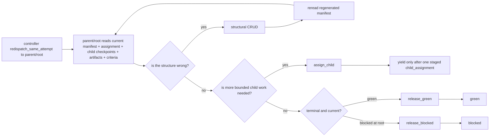

# Parent/Root Release And Closure

Status: Target

This page owns parent/root review, explicit control-tool decisions, upward release, and final root closure under the current dispatch model.

## Parent/root definition

Any node with `children` is a parent/root-style coordinator node.

That means:

- every non-leaf is a parent
- a parent may itself be a child of a higher parent
- parenthood is structural, not a separate authored gate type
- parent/root decision work happens during an ordinary open `dispatch`

## What parent/root owns

Parent/root work is coordination and verification work:

- read current manifest, assignment, child checkpoints, artifacts, and criteria
- stage the next child assignment with `assign_child`
- edit owned structure with `add_child`, `update_child`, or `remove_child`
- publish parent/root checkpoints when later agents must understand the decision basis
- commit upward release with `release_green`
- root-only whole-flow terminal block with `release_blocked`

Review, QA, compliance, release, and closure are authored as ordinary child assignments, not gate subtypes.

## Runtime flow

Figure: parent/root release is a terminal close path on an ordinary dispatch. There is no separate `parent_gate` callback stage.

## Parent/root review rule

Parent/root review is summary-first with conditional drilldown.

Parent/root should:

- inspect child checkpoint summaries first
- inspect referenced artifacts and current criteria when summaries are insufficient
- inspect raw workspace state only when surfaced durable/transient refs still leave a material evidence gap
- explain later-sensitive decisions in checkpoints rather than relying on transcript memory

No child, reviewer, or audit worker may force final `green` by itself.

### Worked release decision example

Assume root has been redispatched on the same assignment after `release_closure` finished. Root now sees:

- a terminal `release_closure` checkpoint summary
- `closure_report` version `1`
- current `change_patch`, `verification_report`, `review_report`, and `qa_report`
- current root closure criteria

Root should decide in this order:

1. read the `release_closure` checkpoint summary
2. confirm `closure_report` matches the current artifact versions it cites
3. confirm no later republish invalidated those exact refs
4. commit `release_green`
5. emit `green`

If any relied-on artifact or criteria basis moved, root must not release from historical success memory alone.

## Release precondition algorithms

### `release_green`

Use `release_green` only when the current parent/root assignment is actually complete and the current evidence basis is sufficient.

The controller-side precondition check is:

1. reread the current parent/root assignment, latest relevant child checkpoints, current artifacts, current criteria, and current continuation slot
2. validate that no staged `child_assignment` already exists on this open dispatch
3. validate that the current parent/root assignment is complete under current truth
4. validate that required child work is current
5. validate that required produced artifacts are current
6. validate that relied-on criteria are current
7. validate that no critical evidence gap remains for this release decision
8. commit `release_green`
9. keep the dispatch open
10. let the caller emit `green`

`release_green` commits upward green readiness, but it does not itself close the dispatch.

When the later `green` boundary is accepted after preconditions are revalidated,
the controller may stage the exact descendant checkpoint refs and current
durable artifact refs that were still current on that release turn onto the
dispatch row for historical reread and audit. Those staged refs are turn-local
evidence only; they do not become new currentness owners.
When later read surfaces materialize that release turn, they should consume
those staged descendant refs directly instead of rebuilding a smaller
direct-child-only view.

### `release_blocked`

`release_blocked` is root-only.

The controller-side precondition check is:

1. reread the current root assignment, current whole-flow blocked basis, current criteria, and current continuation slot
2. validate that no staged `child_assignment` already exists on this open dispatch
3. validate that the current root assignment has a current terminal blocked checkpoint basis
4. validate that every currently assigned descendant basis needed for the flow decision is terminal under current truth and that at least one current blocked basis still remains
5. commit `release_blocked`
6. keep the dispatch open
7. let root emit `blocked`

`release_blocked` commits whole-flow blocked truth, but root later still emits `blocked` to close the dispatch.

When the later `blocked` boundary is accepted after preconditions are
revalidated, the controller may likewise stage the exact descendant checkpoint
refs and current durable artifact refs that grounded that whole-flow blocked
close. Those staged refs remain dispatch-local evidence, not new continuation
state.
When later read surfaces materialize that blocked release turn, they should
consume those staged descendant refs directly instead of rebuilding a
direct-child-only view.

## Boundary split rule

Release tools are terminal preconditions, not continuation outcomes.

That means:

- `assign_child` stages the only legal parent/root continuation outcome
- `yield` is for non-terminal close after exactly one staged child assignment
- `release_green` and `release_blocked` do not justify `yield`
- a dispatch must choose between child continuation and terminal release; it does not stack both on the same open turn

## Parent/root-owned artifacts

Parent and root may publish ordinary durable artifacts if the workflow declares those produce slots.

Examples:

- curated review summary
- release summary
- final findings consolidation

These are ordinary durable artifacts under the same `produces` model as any other node. They are not packet families or bundle-only surfaces.

## Final closure algorithm

Root always decides final closure.

Task closure is legal only after this exact sequence:

1. root is redispatched on the same assignment by ordinary `redispatch_same_attempt`
2. root rereads current whole-flow checkpoints, artifacts, and criteria
3. root confirms any required ordinary review/release child work is complete
4. root commits `release_green`
5. root emits `green`
6. the controller closes the dispatch and advances to whole-flow success

Whole-flow blocked closure is the analogous root-only sequence:

1. root is dispatched with current blocked basis in view
2. root commits `release_blocked`
3. root emits `blocked`
4. the controller closes the dispatch and advances to whole-flow blocked

If root needs more bounded work first, it should stage ordinary child work or make legal structural edits during its open dispatch. Parent/root semantic self-retry is illegal; a later parent/root turn remains ordinary `redispatch_same_attempt`.

Semantic `create_new_attempt` stays reserved for legal worker retry lineage,
and `escalate` is the controller/operator path when safe redispatch is not
legal.

## Removed from the live v1 model

- runtime `parent_gate`
- `ParentEvidenceBundle`
- gate subtypes such as `needs_parent_decision` or `replan_escalation`
- child retry, retry-child, or reassignment as parent/root control verbs
- packet/bundle-first release semantics

## Related contracts

- [Parent review and replan](parent-review-and-replan.md)
- [Runtime structural replan](runtime-structural-replan.md)
- [Runtime boundary and controller loop contract](../architecture/runtime-boundary-and-controller-loop-contract.md)
- [Runtime records and lifecycle](../architecture/runtime-records-and-lifecycle.md)
