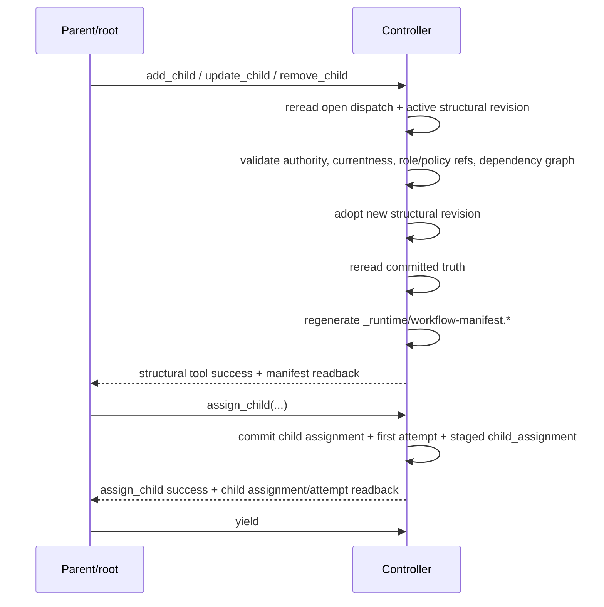

# Runtime Structural Replan

Status: Target

This page defines runtime local replan as structural CRUD performed during an open parent/root dispatch.

Runtime structural replan is a controller-side runtime mutation. It is not authored-YAML recompilation, and runtime CRUD does not reuse the launch compiler.

## Core controller law

Structural CRUD uses this exact controller sequence:

1. reread current controller truth for the open parent/root dispatch and the active structural revision
2. build a candidate child-structure change without mutating live truth in place
3. validate authority, currentness, role/policy resolution, and dependency legality against that candidate
4. atomically adopt one new structural revision and rebind any live current assignment or attempt lineage that stays on surviving nodes
5. reread committed truth
6. regenerate `_runtime/workflow-manifest.*` and any other projections backed by records changed in that commit
7. return success readback from committed truth

Rules:

- runtime CRUD does not invoke the launch compiler
- structural adopt happens before projection regeneration
- structural tool success does not itself stage continuation and does not close the dispatch



Figure: structural replan keeps the parent/root dispatch open. The child's first dispatch is created only after the later accepted `yield`.

## Structural edit surface

During one open parent/root dispatch, the live structural edit surface is:

- `add_child`
- `update_child`
- `remove_child`

`assign_child` is not a structural edit. It is the separate continuation-staging step that may follow structural replan after the structure is acceptable.

The live v1 model has no public:

- reassignment family
- retry-child family
- replace-child family
- reorder-child family
- gate-era `parent_gate` or `replan_escalation` boundary

## Authority rule

- non-root parent/root may edit only its current direct-child set and owned subtree contract
- root may edit the whole workflow because the root-owned subtree is the whole tree
- no node may mutate non-owned descendants by pretending they are direct children

## Child baseline durable contract rule

Structural CRUD edits the current child definition itself. The baseline durable contract for that child still comes from the candidate child draft plus any legal direct-parent `child_defaults` expansion after adopt. Runtime assignment surfaces may later merge supplemental durable sharing, but they do not repair or replace the child's authored `consume_selector`, `produce_slot`, or criteria ownership.

## Structural CRUD algorithm

The controller validates structural replan in this exact order:

1. reread the current open parent/root dispatch, active structural revision, current direct-child set, and current continuation slot
2. validate caller authority and direct-child scope
3. reject if a continuation outcome is already staged on that open dispatch
4. validate operation-specific rules:
   - `add_child` requires a new semantic `node_key`
   - `update_child` must preserve child identity
   - `remove_child` must not silently destroy open current child work
5. resolve any changed role/policy references against controller-owned definition registry truth during validation; do not assume a separate callback-side registry-read lane
6. pin the exact resolved role/policy revision numbers onto the candidate adopted nodes
7. build the candidate adopted dependency graph
8. validate dependency legality with the deterministic Kahn topological-sort rule
9. atomically adopt one new structural revision/currentness step and rebind the live surviving lineage rows to the adopted `flow_node_id`s
10. reread committed truth
11. regenerate `_runtime/workflow-manifest.*` and any other projections whose backing records changed in the adopt commit
12. keep the current parent/root dispatch open

Successful structural CRUD returns the regenerated manifest readback the parent/root should inspect before making the next control decision.

### Worked `add_child` example

A parent currently owns:

- `investigate_issue`
- `implement_change`
- `review_change`

The parent decides review is not enough and adds:

```yaml
node_key: qa_sweep
role: architect
description: Run a bounded QA sweep over current implementation evidence.
consumes:
  artifacts:
    - slot: change_patch
    - slot: verification_report
    - slot: review_report
produces:
  artifacts:
    - slot: qa_report
      description: QA findings for the subtree.
      file_hint: qa_report.md
```

The controller validates the new child against current authority, current registry definitions, and the candidate adopted dependency graph. If legal, it adopts one new structural revision, rereads committed truth, and regenerates the stable manifest before the parent chooses the next action.

The `consumes` entries in that structural draft are authored `consume_selector`s. They stay slot-only here; runtime resolves them to exact current refs only when a later assignment for `qa_sweep` is materialized.

## Dependency preservation rule

Local replan must preserve the workflow's legal durable contract surface.

That means the candidate adopted graph must still have:

- all dependency targets resolving
- no cycles
- no silently broken external consumer relationship
- no orphaned required produce slot
- no reliance on future supplemental runtime sharing to satisfy a missing required selector target
- no stale or non-resolving role/policy references

The validator decides this from controller-owned truth and the candidate graph, not from prompt memory or folder scans.

Selector-resolution note:

- runtime must first prove which producer node owns a selector target on the adopted graph
- `required: false` relaxes only the absence of a current durable publication
- `required: false` does not legalize a missing selector target or an unresolved provider edge

## `assign_child` after replan

Once the structure is acceptable, the parent/root may stage the next bounded child assignment.

The controller-side `assign_child` sequence is:

1. validate the current open parent/root dispatch, target direct-child scope, one-continuation availability, and open-work overwrite rules
2. mint a fresh child `assignment_key`
3. mint the first child `attempt_id`
4. atomically commit the child assignment, the first child attempt, and the staged continuation outcome as one `child_assignment`
5. reread committed truth
6. regenerate child `assignment.*`
7. regenerate eager empty attempt-local indexes only if the runtime keeps them
8. do not create child `dispatch_id`, child `latest-checkpoint.*`, or any child dispatch-local monitoring files yet
9. keep the parent/root dispatch open

Consequences:

- `assign_child` commits the new child assignment and first attempt before `yield`
- the open parent/root dispatch may own at most one staged `child_assignment`
- after that continuation is staged, the parent/root may publish a checkpoint if needed, but it may not commit another structural CRUD operation or a second `assign_child` on the same open dispatch
- the child's first `dispatch_id` is born only when the controller later consumes that staged continuation after accepted `yield`
- the returned child assignment surfaces exact current refs for resolved `consumes` and `criteria`, while `produces` remains requirement-only until publication

## Parent/root operating rule

While no continuation outcome is staged, the parent/root may choose exactly one of these classes of next action:

- another legal structural edit
- `assign_child`
- `release_green`
- root-only `release_blocked`
- checkpoint publication

Once exactly one `child_assignment` is staged, the dispatch is in the post-staging state:

- `yield` becomes the only legal non-terminal close
- checkpoint publication may still occur only if it does not replace the committed continuation basis
- structural CRUD, second-child staging, and terminal release are no longer legal on that same open dispatch

## What replaces escalation

There is no live public `replan_escalation` boundary.

If the current parent/root cannot legally apply the needed change inside its authority:

- it should record the gap in checkpoint/evidence surfaces
- it should not synthesize a fake local success
- the higher parent/root later receives that context through ordinary upward flow and is dispatched again by ordinary controller advance

Controller recovery vocabulary stays separate from parent/root tool semantics:

- `redispatch_same_attempt` is the ordinary later-turn path for a parent/root returning on the same assignment
- `create_new_attempt` is for legal worker retry lineage on the same assignment
- `escalate` is the controller/operator path when safe redispatch or new attempt creation is not legal

## Related contracts

- [Workflow definition schema](workflow-definition-schema.md)
- [Parent/root release and closure](parent-root-release-and-closure.md)
- [Runtime boundary and controller loop contract](../architecture/runtime-boundary-and-controller-loop-contract.md)
- [Runtime records and lifecycle](../architecture/runtime-records-and-lifecycle.md)
