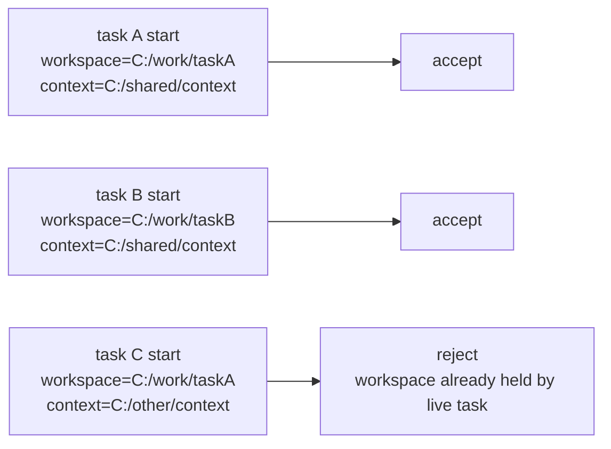
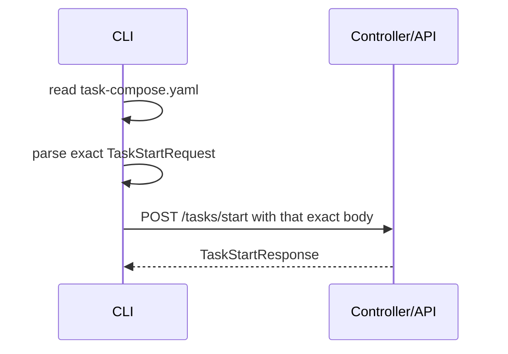

# Task compose schema

Status: Target

This page defines the frozen v1 user-authored launch spec for one concrete task.

Task compose is the launch spec for one concrete task. It is not a runtime state dump and it is not a definition-edit surface.

## `TaskStartRequest`

The canonical public task-start route is:

- `POST /tasks/start`

The canonical root CLI entrypoint is:

- `autoclaw task-compose start --file <task_compose_path>`

The CLI file entrypoint is a front door into the same canonical backend task-start handler as `POST /tasks/start`.

The HTTP body is the authored launch spec itself rather than a wrapper object. Task-compose compatibility and launch binding belong only to `POST /tasks/start`.

Standard task start resolves the current workflow revision for `workflow.key`.

Concurrency rules:

- many task runs may start and execute concurrently in v1
- public and operator follow-up routes stay partitioned by `task_id`
- internal runtime lineage still uses `flow_id`, `assignment_id`, `attempt_id`, and `dispatch_id`
- one task flow lineage keeps one live execution slot at a time in v1

## Default runnable example

```yaml
task:
  key: auth-refresh-hardening
  title: Harden auth refresh flow
  summary: Investigate and fix the auth refresh regression.
workflow:
  key: normal-parent-first-release
roots:
  workspace:
    mode: ensure_task_default
  context:
    mode: ensure_task_default
```

This is the smallest launch input that still names:

- a concrete task identity
- a human-readable title and summary
- one current workflow to launch
- default filesystem binding for `workspace` and `context`

## Exact shape

```yaml
task:
  key: string
  title: string
  summary: string
  instruction: string | optional
workflow:
  key: string
roots:
  workspace:
    mode: ensure_task_default | ensure_host_path | use_existing_host
    host_path: string | required_for_host_modes
  context:
    mode: ensure_task_default | ensure_host_path | use_existing_host
    host_path: string | required_for_host_modes
```

`roots` may omit either authored root and accept the documented default.

If `roots.workspace` is omitted, it defaults to `ensure_task_default`. If `roots.context` is omitted, it defaults to `ensure_task_default`.

## Root-binding model

Canonical authored roots are:

- `workspace`
- `context`

Generated roots are not human-authored root bindings:

- `outputs`
- `tmp`
- `_runtime`

## `TaskCompose` launch binding

On successful start, this authored request becomes exactly one immutable `TaskCompose` launch-binding record for that task run.

That record binds:

- `workflow.key`
- the current workflow revision chosen at start
- the launch-time `compiled_plan_id`
- `workspace` and `context` root placement
- controller-owned generated-root placement under the task root

V1 rules:

- `TaskCompose` is created once at `POST /tasks/start`
- `TaskCompose` is immutable after start
- no `TaskCompose` current/superseded family exists in v1
- runtime structural CRUD, retry, checkpoint writes, redispatch, monitoring updates, and durable publication do not mutate or supersede it

## Root mode semantics

### `ensure_task_default`

- the controller materializes the root under the canonical task folder
- authored `host_path` is invalid

### `ensure_host_path`

- `host_path` is required
- the controller creates the path if missing
- the path becomes the bound root for that task

### `use_existing_host`

- `host_path` is required
- the path must already exist
- start fails if the path does not already exist

## Custom host example

```yaml
task:
  key: auth-refresh-hardening
  title: Harden auth refresh flow
  summary: Investigate and fix the auth refresh regression.
  instruction: Stay scoped to the auth refresh failure path and publish patch, verification, and closure evidence only through declared produce slots.
workflow:
  key: normal-parent-first-release
roots:
  workspace:
    mode: ensure_host_path
    host_path: C:/work/autoclaw-auth-refresh
  context:
    mode: ensure_task_default
```

## Required rules

- `task.key` is required
- `task.title` is required
- `task.summary` is required
- `workflow.key` is required
- task acceptance criteria do not live in task compose
- user-authored task intent enters only through:
  - `task.summary`
  - optional `task.instruction`
  - files or materialized supporting context under the bound `context` root
- task compose remains a narrow launch spec rather than a rich notes/details document
- `task.title`, `task.summary`, and optional `task.instruction` project through the manifest into prompt `task_identity` for every node, not into provider `instructions`
- node-definition purpose belongs in the current-node system/static instruction layer for every node
- the first/root assignment is generated at launch from task identity plus the launch-selected current node purpose and resolved role/policy wording; task compose does not author an `initial_assignment`

## Public route must reject

- missing `task.key`
- missing `task.title`
- missing `task.summary`
- missing `workflow.key`
- extra root keys outside `workspace` and `context`
- authored fields named `inputs`
- authored fields named `context_refs`
- authored fields named `notes`, `details`, `description`, or `constraints`
- authored generated roots such as `outputs`, `tmp`, or `_runtime`
- `host_path` on `ensure_task_default`
- host-bound modes without `host_path`

## Root creation rule

Controller-owned task roots are created idempotently only where the selected mode allows creation.

That means:

- the canonical task folder always exists
- generated roots always materialize under that task folder
- `workspace` and `context` use `ensure_task_default` or `ensure_host_path` to create the bound root when needed
- `use_existing_host` never creates the path and rejects if it is missing
- custom host placement is canonical only for `workspace` and `context`

## Root host-path concurrency rule

- `ensure_task_default` roots are naturally concurrent because each task gets its own task folder
- concurrent live tasks must not share the same `workspace.host_path`
- concurrent live tasks may share the same `context.host_path` when it is treated as read-mostly source/reference material
- start rejects when a new live task attempts to bind a `workspace.host_path` already held by another live task
- cancel and terminal close release that workspace lease for later reuse
- pause keeps the workspace lease held

Host-path policy example:



Figure: shared `context` is legal in v1 when treated as read-mostly material, but `workspace` remains exclusive across live tasks.

## `TaskStartResponse` guarantees

Successful `POST /tasks/start` returns `TaskStartResponse` and guarantees:

- one committed `Task`
- one committed immutable `TaskCompose`
- one committed launch-time `CompiledPlan`
- one active structural revision
- one first generated current assignment and one first current attempt
- one `workflow_manifest_ref`

Additional rules:

- task-root placement is derived from `workflow_manifest_ref.path`; it is not a separate response field
- no public `dispatch_id` field is part of `TaskStartResponse`
- operator/public follow-up reads use `task_id`; internal `flow_id` remains runtime lineage rather than a required external handle
- the response is still valid if launch has not opened the first dispatch yet

CLI/API equivalence example:



Figure: the root CLI task-compose path is a local file-reading front door over the same backend task-start semantics as the HTTP route.

## Expected generated surfaces after successful start

Required immediately after successful start:

- `_runtime/workflow-manifest.json`
- `_runtime/workflow-manifest.md`
- `_runtime/attempts/<attempt_id>/assignment.json`
- `_runtime/attempts/<attempt_id>/assignment.md`

Optional eager-empty projections, only if the implementation keeps them:

- `_runtime/attempts/<attempt_id>/artifact-index.json`
- `_runtime/attempts/<attempt_id>/transient-index.json`

These projections must remain absent until their backing truth exists:

- `_runtime/dispatch/<dispatch_id>/prompt.md`
- `_runtime/dispatch/<dispatch_id>/prompt-request.json`
- `_runtime/attempts/<attempt_id>/latest-checkpoint.json`
- `_runtime/attempts/<attempt_id>/latest-checkpoint.md`
- `_runtime/dispatch/<dispatch_id>/delivery-state.json`
- `_runtime/dispatch/<dispatch_id>/continuity-state.json`
- `_runtime/dispatch/<dispatch_id>/watchdog-state.json`
- `_runtime/dispatch/<dispatch_id>/provider-events.ndjson`

`outputs/`, `tmp/`, and `_runtime/` are generated roots. Only `workspace` and `context` are user-authored root bindings in task compose.

Projection rules:

- `latest-checkpoint.*` appears only after the attempt records a real checkpoint
- dispatch-local prompt files appear only after a real `dispatch_id` and the
  controller has rendered that dispatch prompt
- dispatch-local monitoring files appear only after a real `dispatch_id` and its backing rows exist
- generated files are derived from committed runtime truth and do not own currentness

Important distinction:

- `_runtime/dispatch/<dispatch_id>/delivery-state.json`
- `_runtime/dispatch/<dispatch_id>/continuity-state.json`
- `_runtime/dispatch/<dispatch_id>/watchdog-state.json`
- `_runtime/dispatch/<dispatch_id>/provider-events.ndjson`

are dispatch-local observability projections only. They are useful for operator/debug/recovery inspection, but they are not normal task truth and they are not the first files a parent/root should use to decide ordinary work.

## Compile rule

Task compose is a launch input to task start and launch materialization. Guarded definition upload and task start both validate workflow legality, but only task start resolves task-compose binding and commits runtime materialization.

V1 compilation:

- resolves the current workflow revision
- normalizes that workflow into an immutable compiled plan
- commits launch truth before regenerating any runtime projection
- materializes flow revision and runtime state from that compiled plan
- recompiles on every task start

V1 does not rely on compiled-plan cache reuse as a core contract.

Runtime structural replan does not invoke the launch compiler. It uses runtime validation, commit/adopt, and materializer/projector flow instead.

## Root launch assignment rule

The first/root assignment is a normal generated assignment, not a special authored YAML block.

Generation inputs are:

- task-wide `task_identity` from `task.title`, `task.summary`, and optional `task.instruction`
- the launch-selected current node purpose and node-definition semantics
- resolved role description and optional role instruction
- resolved policy description and optional policy instruction

Generation rules:

- runtime/system assembles the first/root assignment `summary` and `instruction`
- workflow YAML does not author `initial_assignment`
- parent/root `assignment_intent` exists only for later parent/root -> child staging
- every later node still sees the same task identity; root launch does not get a private task summary model

Successful start returns `TaskStartResponse`. Field-level response coverage lives in [../interfaces/api-schema-appendix.md](../interfaces/api-schema-appendix.md).

## What a new reader should inspect next

After start succeeds, the fastest way to understand the live task is:

1. open `_runtime/workflow-manifest.md`
2. open `_runtime/attempts/<attempt_id>/assignment.md`
3. watch `_runtime/attempts/<attempt_id>/latest-checkpoint.md` once the first checkpoint exists
4. inspect published durable outputs under `outputs/artifacts/...`
5. inspect `tmp/transfers/...` only when surfaced through `transient_refs`
6. treat `_runtime/dispatch/<dispatch_id>/...` monitoring files, when present, as observability projections for delivery/recovery only, not as ordinary task truth

## Graph-affecting versus prompt-only fields

| Field                                           | Contract class               | Compiler impact               |
| ----------------------------------------------- | ---------------------------- | ----------------------------- |
| `task.key`                                      | task identity                | no compiled-plan change       |
| `task.title`                                    | label only                   | no compiled-plan change       |
| `task.summary`                                  | prompt-only task text        | no compiled-plan change       |
| `task.instruction`                              | prompt-only task text        | no compiled-plan change       |
| `workflow.key`                                  | current workflow selection | changes compiled-plan content |
| `roots.workspace.mode`                          | launch-binding semantics     | no compiled-plan change       |
| `roots.context.mode`                            | launch-binding semantics     | no compiled-plan change       |
| `roots.workspace.host_path`                     | launch placement only        | no compiled-plan change       |
| `roots.context.host_path`                       | launch placement only        | no compiled-plan change       |
| preexisting or newly bound `workspace` contents | runtime content only         | no compiled-plan change       |
| preexisting or newly bound `context` contents   | runtime content only         | no compiled-plan change       |

## Related contracts

- [Workflow schema appendix](workflow-schema-appendix.md)
- [Prompt contract](../prompt-layer/contract.md)
- [Compiler contract and launch materialization](compiler-contract-and-launch-materialization.md)
- [Task compose root binding and host placement](../architecture/task-compose-root-binding-and-host-placement.md)
- [API schema appendix](../interfaces/api-schema-appendix.md)
