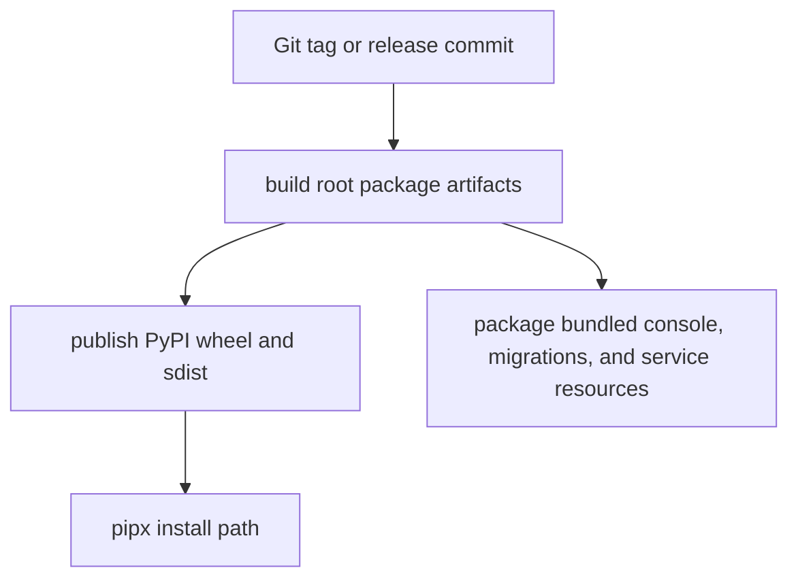

# Release and install strategy

Status: Reference

This page defines the supported v1 install and release posture.

## Primary v1 path

The only supported v1 install path is:

1. publish root package artifacts to PyPI
2. install with `pipx`

The root package remains the primary release artifact.

## Supported local install stories

### Default local lane

```bash
pipx install autoclaw
autoclaw onboard --install-daemon
autoclaw doctor
autoclaw openclaw check
autoclaw service status
```

### Supported Postgres lane

```bash
pipx install "autoclaw[postgres]"
autoclaw onboard --install-daemon
autoclaw doctor
autoclaw openclaw check
autoclaw service status
```

Use the Postgres extra together with [Use Postgres](use-postgres.md).

## Release architecture



Figure: v1 release truth is the packaged root Python distribution plus bundled runtime resources needed by the supported install path.

## Support matrix boundary

Shipped v1 support includes:

- PyPI wheel and sdist
- `pipx install autoclaw`
- `pipx install "autoclaw[postgres]"`
- SQLite local-first smoke lane
- Postgres plus Docker strong verification lane
- guided first-run through `autoclaw onboard`
- platform-native managed service lifecycle through `autoclaw service install|start|stop|restart|status`

Service manager support follows OpenClaw's UX model:

- Linux: `systemd --user` by default
- macOS: `launchd`
- Windows: Scheduled Task

See [Distribution and database support matrix](distribution-and-database-support-matrix.md) for the supported matrix.

## Not currently supported

These are not part of the supported v1 install story:

- standalone binaries
- npm shim package
- Homebrew or other convenience installer

They must not be taught as supported v1 install paths until they gain explicit support and tests.

## Release rule

Publish only from the root packaging surface.

Convenience channels, if added later, must wrap the primary release artifacts rather than becoming the source of truth.

## Related contracts

- [Distribution and database support matrix](distribution-and-database-support-matrix.md)
- [Testing and release checklist](testing-and-release-checklist.md)
