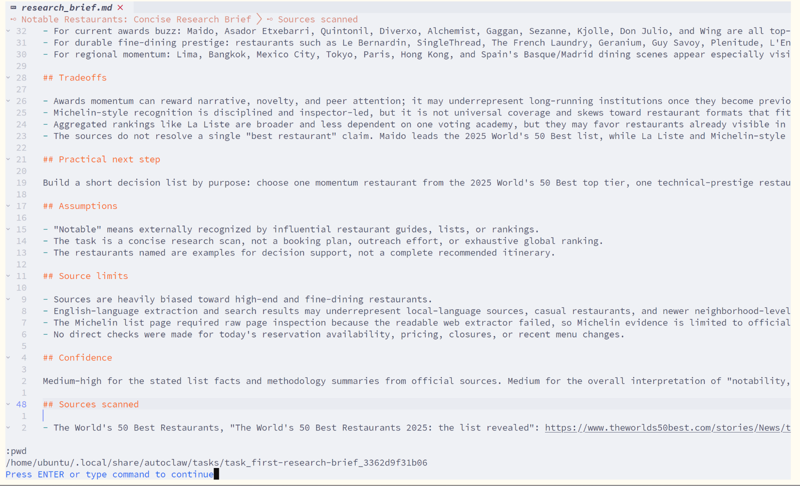

# Inspect a task

After a task starts, inspect the console task detail page first. Use generated files and operator read surfaces when you need exact evidence or diagnostics.

## Console

Find the port:

```bash
autoclaw config show --json
```

Open:

```text
http://127.0.0.1:<server.port>/tasks/<task_id>
```

The task detail page shows the current node, execution graph, and event stream. A successful first research task publishes the `research_brief` artifact from `workspace/research_brief.md`.



## Task directory

`autoclaw config show --json` also prints `paths.data_dir`. Per-task directories live under:

```text
<data_dir>/tasks/<task_id>/
```

For the first research task, check the task-owned workspace file at:

```text
<data_dir>/tasks/<task_id>/workspace/research_brief.md
```

On Linux with defaults:

```text
~/.local/share/autoclaw/tasks/<task_id>/workspace/research_brief.md
```

## Generated task files

AutoClaw materializes these files under the task directory:

- `_runtime/workflow-manifest.md`
- `_runtime/attempts/<attempt_id>/assignment.md`
- `_runtime/attempts/<attempt_id>/latest-checkpoint.md`
- `outputs/artifacts/`

The workflow manifest explains the current workflow shape. The assignment file shows the current node mission. The latest checkpoint records durable progress or terminal handoff. `outputs/artifacts/` holds published outputs.

## What to check

- the task used the workflow you expected
- the current assignment has explicit scope and evidence requirements
- the assigned node published the outputs the workflow declared
- the latest checkpoint matches the work that actually happened
- artifacts and surfaced evidence are consistent with runtime state
- any wait is a real human request or command run, not an absence of output

## Observability-only files

Dispatch-local support files can help debug transport and recovery, but they are not ordinary task truth:

- `_runtime/dispatch/<dispatch_id>/delivery-state.json`
- `_runtime/dispatch/<dispatch_id>/continuity-state.json`
- `_runtime/dispatch/<dispatch_id>/watchdog-state.json`

Use them after reading generated task evidence and operator readbacks.

## Operator read surfaces

Use the operator reference when you need controller readbacks beyond generated files:

- [Runtime read models and operator surfaces](../reference/operator/runtime-read-models-and-operator-surfaces.md)
- [Inspect approvals and watchdog state](../reference/operator/inspect-approvals-and-watchdog.md)

For the concept behind these files and read models, see the [runtime model](../concepts/runtime-model.md).

## Next step

If the seeded topic-research workflow makes sense, continue by writing your own [role](../guides/write-a-role.md), [policy](../guides/write-a-policy.md), or [workflow](../guides/write-a-workflow.md).
